# 1. Document Information

| Field | Value |
| --- | --- |
| Project | Portal Informasi Desa Bendung |
| Document | User Flows |
| Version | 1.0 |
| Status | FROZEN FOR MVP |
| IA Source | Sitemap v1.0 — FROZEN FOR MVP |
| Product Source | PRD v1.0 — FROZEN FOR MVP |
| Requirement Source | Requirements Baseline v1.0 — FROZEN FOR MVP |

User Flows v1.0 telah melalui human review. Tidak ditemukan Sitemap Change Request, PRD Change Request, maupun Requirements Baseline Change Request. Jika perubahan flow pada masa berikutnya membutuhkan perubahan struktur IA atau behavior produk, perubahan harus terlebih dahulu mengikuti Change Request terhadap source FROZEN yang terkait.

# 2. Document Purpose

Dokumen ini menerjemahkan Sitemap v1.0 dan PRD v1.0 menjadi tujuan pengguna, titik masuk, langkah konseptual, keputusan atau branch, conditional state, dan hasil akhir setiap flow. User Flow menjelaskan hubungan perilaku antarnode yang sudah tersedia pada Sitemap tanpa menambahkan PAGE, DETAIL, role, atau kemampuan produk baru.

Dokumen ini belum menentukan:

- layout atau visual design;
- label tombol, exact copy, atau struktur form final;
- navbar, bottom navigation, modal, drawer, atau tab;
- exact URL, path, slug, atau anchor;
- database, schema, API, framework, provider, library, atau implementasi teknis.

Jika kebutuhan flow memerlukan perubahan struktur IA, hal tersebut harus dicatat sebagai `SITEMAP CHANGE REQUEST`. Jika kebutuhan flow memerlukan perubahan behavior produk, hal tersebut harus dicatat sebagai `PRD CHANGE REQUEST` dan/atau `BASELINE CHANGE REQUEST` sesuai source yang terdampak. Perubahan tidak diselesaikan diam-diam dalam dokumen ini.

# 3. User Flow Principles

1. **Goal-oriented.** Setiap flow berakhir ketika actor mencapai tujuan atau terminal result yang relevan.
2. **Mobile-first.** Flow publik mengutamakan konteks penggunaan smartphone tanpa menetapkan layout perangkat.
3. **Simple public access.** Public User tidak memerlukan login.
4. **Minimal unnecessary steps.** Flow hanya memuat tindakan dan branch yang berdampak pada tujuan.
5. **Scoped administration.** Admin Dusun selalu berada pada satu konteks Dusun; Super Admin mempunyai konteks global.
6. **Source-aligned conditions.** Conditional state mengikuti Sitemap, PRD, dan Requirements Baseline.
7. **Small readable diagrams.** Satu diagram mewakili satu tujuan utama; conditional notes digunakan agar diagram tidak menjadi raksasa.

# 4. User Flow Legend and Format

## 4.1 Flow ID

- `UF-PUB-xxx`: Public User.
- `UF-AD-xxx`: Admin Dusun.
- `UF-SA-xxx`: Super Admin.

## 4.2 Mermaid Symbols

| Syntax | Meaning |
| --- | --- |
| `[ ]` | Page, view, action, atau state konseptual. |
| `{ }` | Decision atau conditional branch. |
| `(( ))` | External destination atau terminal result. |

Diagram menggunakan `flowchart TD` atau `flowchart LR`. Label diagram bersifat konseptual dan bukan exact UI copy.

# 5. Flow Index

| Flow ID | Actor | Priority | Goal | Entry Point | End State |
| --- | --- | --- | --- | --- | --- |
| `UF-PUB-001` | Public | PRIMARY CRITICAL | Mencapai informasi Dusun dari QR | QR utama | Halaman Dusun aktif tersedia |
| `UF-PUB-002` | Public | SUPPORTING | Memperoleh informasi tingkat Desa | Homepage | Informasi Desa ditemukan |
| `UF-PUB-003` | Public | SUPPORTING | Mencapai section pada Halaman Dusun | Halaman Dusun | Section tujuan terlihat |
| `UF-PUB-004` | Public | PRIMARY CRITICAL | Menemukan lokasi dan arah eksternal | Peta Desa/Dusun | Detail/konteks ditemukan atau handoff Google Maps |
| `UF-PUB-005` | Public | PRIMARY CRITICAL | Menghubungi Kontak Pelayanan | Halaman Dusun | Handoff WhatsApp |
| `UF-PUB-006` | Public | SUPPORTING | Melihat UMKM dan tindakan tersedia | Section UMKM/marker | Informasi dibaca atau handoff eksternal |
| `UF-PUB-007` | Public | SUPPORTING | Melihat fasilitas dan lokasi/kontak | Section Fasilitas/marker | Informasi dibaca atau handoff eksternal |
| `UF-PUB-008` | Public | SUPPORTING | Melihat detail Agenda/Kegiatan | Agenda Desa/Dusun | Detail kegiatan terbaca |
| `UF-PUB-009` | Public | SUPPORTING | Membaca Pengumuman aktif/arsip | Konteks Pengumuman | Detail Pengumuman terbaca |
| `UF-PUB-010` | Public | SUPPORTING | Melanjutkan navigasi saat data kosong | Section tanpa data | Section lain tetap dapat diakses |
| `UF-AD-001` | Admin Dusun | SUPPORTING | Masuk ke Dashboard Dusun sendiri | Login Admin | Dashboard Dusun tersedia |
| `UF-AD-002` | Admin Dusun | SUPPORTING | Membuat dan memublikasikan data | Dashboard Dusun | Data tersimpan dan tersedia sesuai state |
| `UF-AD-003` | Admin Dusun | SUPPORTING | Memperbarui data Dusun | Management area | Perubahan langsung berlaku |
| `UF-AD-004` | Admin Dusun | SUPPORTING | Menyembunyikan data operasional | Management area | Data Soft Deleted dan tidak public |
| `UF-AD-005` | Admin Dusun | SUPPORTING | Memperbarui Profil Dusun | Dashboard Dusun | Profil publik diperbarui |
| `UF-AD-006` | Admin Dusun | SUPPORTING | Tetap mengelola saat Dusun inactive | Login Admin | Dashboard tetap tersedia |
| `UF-SA-001` | Super Admin | SUPPORTING | Masuk ke dashboard global | Login Admin | Super Admin Dashboard tersedia |
| `UF-SA-002` | Super Admin | SUPPORTING | Mengelola data lintas Dusun | Super Admin Dashboard | Perubahan data tersimpan |
| `UF-SA-003` | Super Admin | SUPPORTING | Memulihkan data Soft Deleted | Management area | Data dipulihkan sesuai state |
| `UF-SA-004` | Super Admin | SUPPORTING | Menghapus permanen data selain Dusun | Management area | Data terhapus permanen |
| `UF-SA-005` | Super Admin | SUPPORTING | Menonaktifkan Dusun | Kelola Dusun | Dusun berstatus INACTIVE |
| `UF-SA-006` | Super Admin | SUPPORTING | Mengaktifkan kembali Dusun | Kelola Dusun | Dusun berstatus ACTIVE |
| `UF-SA-007` | Super Admin | SUPPORTING | Mengelola akun Admin Dusun | Kelola Admin Dusun | Akun dikelola sesuai scope |
| `UF-SA-008` | Super Admin | SUPPORTING | Mereset password Admin Dusun | Kelola Admin Dusun | Credential hasil reset dapat digunakan |
| `UF-SA-009` | Super Admin | SUPPORTING | Memperbarui sumber Homepage | Super Admin Dashboard | Homepage mengambil data terbaru |

# 6. Primary Critical and Supporting Flows

## 6.1 PRIMARY CRITICAL

Tiga flow berikut mewakili tiga critical product capabilities:

1. `UF-PUB-001` — QR → Homepage → Dusun.
2. `UF-PUB-004` — Peta → Marker → Informasi / Google Maps.
3. `UF-PUB-005` — Kontak Pelayanan → WhatsApp.

## 6.2 SUPPORTING

Seluruh flow lain berlabel `SUPPORTING`. Label priority tidak mengubah status requirement dan tidak menentukan ordering UI.

# 7. Public User Flows

## UF-PUB-001 — Scan QR → Homepage → Dusun

**Actor:** Public User

**Priority:** PRIMARY CRITICAL

**Goal:** Membuka portal dari QR dan mencapai informasi Dusun aktif.

**Entry Point:** QR utama pada papan Desa Bendung.

**Preconditions:** QR utama mengarah ke Homepage Desa Bendung; Dusun tujuan berstatus `ACTIVE` agar muncul pada pilihan publik.

**Main Flow:**

1. Pengunjung memindai QR utama.
2. Portal menampilkan Homepage Desa Bendung.
3. Pengunjung melihat Pilihan Dusun aktif.
4. Pengunjung memilih satu Dusun.
5. Portal menampilkan Halaman Dusun single page/scroll beserta informasi yang tersedia.

**Alternative / Conditional Flow:** Dusun `INACTIVE` tidak tampil pada Pilihan Dusun sehingga tidak dapat dipilih melalui picker publik normal.

**End State:** Halaman Dusun aktif tersedia dan pengunjung dapat melihat informasi Dusun.

**Traceability:** Sitemap: Homepage Desa Bendung, Pilihan Dusun, Halaman Dusun; PRD Bagian 2, 10–12, 19, 22; Baseline: `BR-003`, `BR-005`, `FR-002`, `FR-005`–`FR-007`, `FR-022`, `OPS-001`.

**Diagram:**

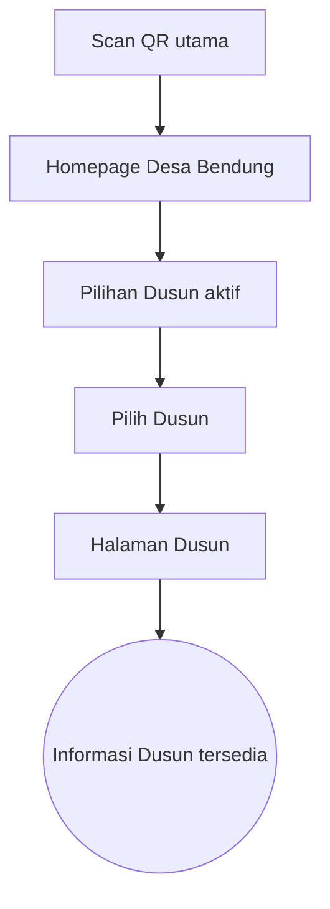
```mermaid
flowchart TD
    A[Scan QR utama] --> B[Homepage Desa Bendung]
    B --> C[Pilihan Dusun aktif]
    C --> D[Pilih Dusun]
    D --> E[Halaman Dusun]
    E --> F((Informasi Dusun tersedia))
```

## UF-PUB-002 — Homepage → Informasi Desa

**Actor:** Public User

**Priority:** SUPPORTING

**Goal:** Memperoleh informasi tingkat Desa tanpa membuka Halaman Dusun.

**Entry Point:** Homepage Desa Bendung.

**Preconditions:** Homepage dapat diakses tanpa login.

**Main Flow:**

1. Pengguna membuka Homepage.
2. Pengguna meninjau identitas dan kontak Desa.
3. Pengguna menuju section data-driven yang relevan: Pengumuman terbaru, Agenda/Kegiatan terbaru, atau Peta Desa.
4. Pengguna membaca informasi yang tersedia pada konteks Desa.

**Alternative / Conditional Flow:** Section tanpa data tetap tersedia dengan empty state; pengguna dapat melanjutkan ke section lain.

**End State:** Informasi tingkat Desa yang dibutuhkan ditemukan atau kondisi data kosong diketahui.

**Traceability:** Sitemap: Homepage dan child sections; PRD Bagian 10–11; Baseline: `FR-001`–`FR-004`, `FR-009`, `FR-016`–`FR-018`, `DATA-001`–`DATA-003`, `MAP-002`.

**Diagram:**

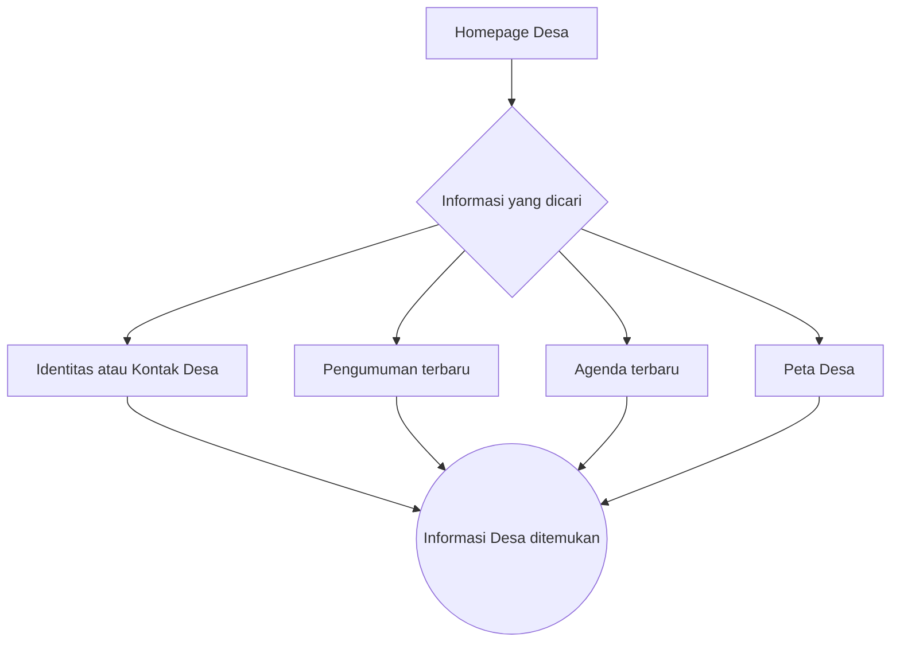
```mermaid
flowchart TD
    A[Homepage Desa] --> B{Informasi yang dicari}
    B --> C[Identitas atau Kontak Desa]
    B --> D[Pengumuman terbaru]
    B --> E[Agenda terbaru]
    B --> F[Peta Desa]
    C --> G((Informasi Desa ditemukan))
    D --> G
    E --> G
    F --> G
```

## UF-PUB-003 — Halaman Dusun → Navigasi Cepat → Section

**Actor:** Public User

**Priority:** SUPPORTING

**Goal:** Mencapai informasi spesifik di dalam Halaman Dusun single page/scroll.

**Entry Point:** Halaman Dusun aktif.

**Preconditions:** Dusun berstatus `ACTIVE` dan Halaman Dusun menampilkan konten publik normal.

**Main Flow:**

1. Pengguna berada pada Halaman Dusun.
2. Pengguna menggunakan navigasi cepat atau menelusuri halaman.
3. Pengguna menuju section Kontak Pelayanan, UMKM, Fasilitas, Agenda & Kegiatan, Pengumuman, atau Peta Dusun.
4. Section tujuan tetap berada dalam page yang sama.

**Alternative / Conditional Flow:** Jika section tidak mempunyai data, empty state ditampilkan tanpa menyembunyikan navigasi ke section lain.

**End State:** Section tujuan terlihat pada Halaman Dusun.

**Traceability:** Sitemap: Halaman Dusun dan child sections; PRD Bagian 12; Baseline: `FR-005`–`FR-007`, `FR-009`, `DATA-005`.

**Diagram:**

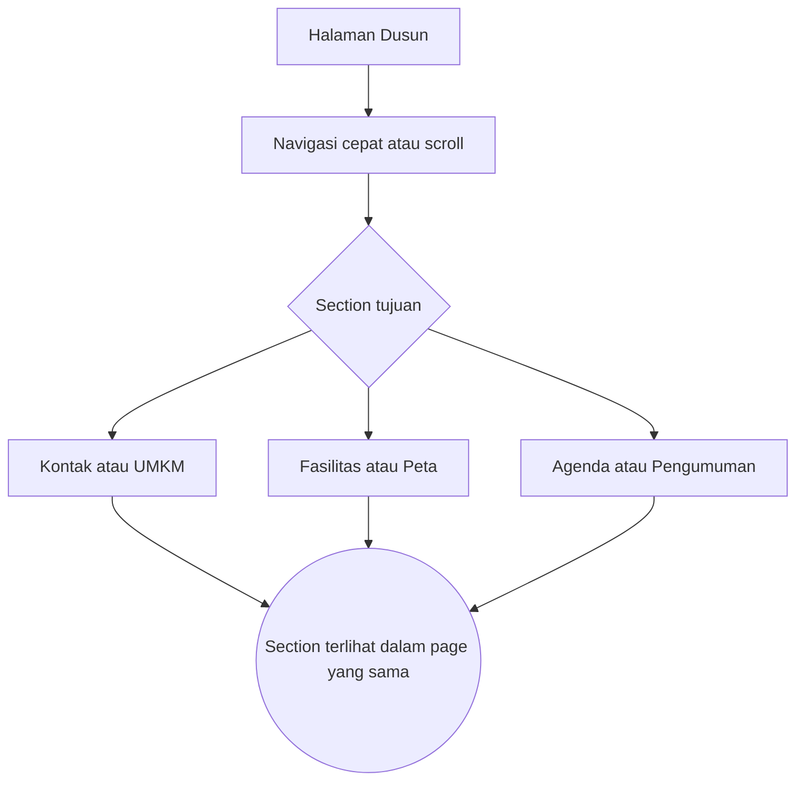
```mermaid
flowchart TD
    A[Halaman Dusun] --> B[Navigasi cepat atau scroll]
    B --> C{Section tujuan}
    C --> D[Kontak atau UMKM]
    C --> E[Fasilitas atau Peta]
    C --> F[Agenda atau Pengumuman]
    D --> G((Section terlihat dalam page yang sama))
    E --> G
    F --> G
```

## UF-PUB-004 — Peta → Marker → Informasi / Google Maps

**Actor:** Public User

**Priority:** PRIMARY CRITICAL

**Goal:** Menemukan lokasi dan, bila dipilih, membuka arah pada layanan eksternal.

**Entry Point:** Section Peta Desa atau Peta Dusun.

**Preconditions:** Peta menampilkan data/titik aktif yang memenuhi aturan koordinat dan izin publikasi.

**Main Flow:**

1. Pengguna membuka Peta Desa atau Peta Dusun.
2. Pengguna dapat menerapkan filter Dusun/kategori yang tersedia sesuai konteks.
3. Pengguna memilih marker.
4. Popup marker menampilkan informasi ringkas dan tindakan konseptual.
5. Pengguna memilih informasi detail atau arah eksternal.
6. Marker UMKM menuju Detail UMKM; marker Fasilitas menuju Detail Fasilitas/Lokasi; marker pelayanan menuju informasi Kontak Pelayanan atau konteks pelayanan terkait pada Dusun.

**Alternative / Conditional Flow:** Jika pengguna memilih arah, portal melakukan handoff ke Google Maps. Peta Dusun sudah scoped otomatis ke Dusun terkait. Tidak ada Detail Kontak Pelayanan baru dan tidak ada routing internal.

**End State:** Informasi lokasi ditemukan atau flow berhenti pada handoff ke Google Maps.

**Traceability:** Sitemap: Peta Desa, Peta Dusun, Detail UMKM, Detail Fasilitas/Lokasi, Marker Pelayanan; PRD Bagian 18; Baseline: `BR-006`, `MAP-001`–`MAP-010`, `PRIV-001`.

**Diagram:**

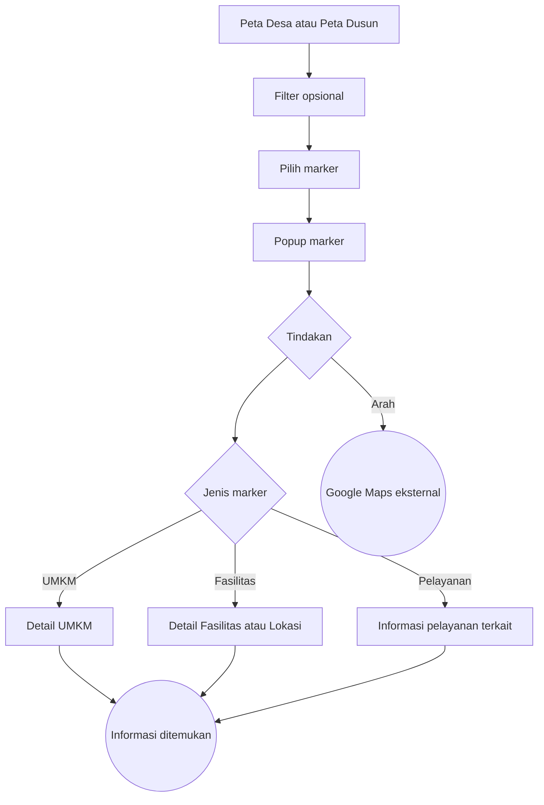
```mermaid
flowchart TD
    A[Peta Desa atau Peta Dusun] --> B[Filter opsional]
    B --> C[Pilih marker]
    C --> D[Popup marker]
    D --> E{Tindakan}
    E --> F{Jenis marker}
    F -->|UMKM| G[Detail UMKM]
    F -->|Fasilitas| H[Detail Fasilitas atau Lokasi]
    F -->|Pelayanan| I[Informasi pelayanan terkait]
    E -->|Arah| J((Google Maps eksternal))
    G --> K((Informasi ditemukan))
    H --> K
    I --> K
```

## UF-PUB-005 — Kontak Pelayanan → WhatsApp

**Actor:** Public User

**Priority:** PRIMARY CRITICAL

**Goal:** Menghubungi Kontak Pelayanan yang dipublikasikan.

**Entry Point:** Section Kontak Pelayanan pada Halaman Dusun.

**Preconditions:** Kontak berstatus aktif, telah memperoleh izin publikasi administratif/offline, dan mempunyai nomor WhatsApp.

**Main Flow:**

1. Pengguna membuka Section Kontak Pelayanan.
2. Pengguna memilih kontak yang relevan.
3. Pengguna memilih tindakan WhatsApp.
4. Portal melakukan handoff ke WhatsApp dengan template pesan awal.

**Alternative / Conditional Flow:** Exact copy template tetap `OPEN-002 — NON-BLOCKING` dan tidak ditetapkan pada User Flow.

**End State:** Flow portal berhenti pada handoff ke WhatsApp eksternal.

**Traceability:** Sitemap: Halaman Dusun, Kontak Pelayanan; PRD Bagian 13; Baseline: `BR-007`, `FR-010`, `DATA-006`–`DATA-008`, `PRIV-001`, `OPEN-002`.

**Diagram:**

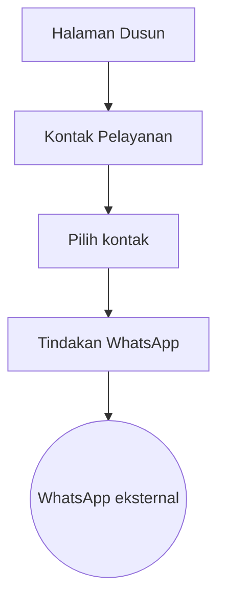
```mermaid
flowchart TD
    A[Halaman Dusun] --> B[Kontak Pelayanan]
    B --> C[Pilih kontak]
    C --> D[Tindakan WhatsApp]
    D --> E((WhatsApp eksternal))
```

## UF-PUB-006 — UMKM → Detail → WhatsApp / Lokasi

**Actor:** Public User

**Priority:** SUPPORTING

**Goal:** Membaca informasi UMKM dan menggunakan tindakan yang tersedia.

**Entry Point:** Section UMKM pada Halaman Dusun atau marker UMKM.

**Preconditions:** Data UMKM aktif dan layak dipublikasikan; data privat telah memperoleh izin administratif/offline.

**Main Flow:**

1. Pengguna memilih UMKM dari section atau marker.
2. Portal menampilkan Detail UMKM.
3. Pengguna membaca informasi usaha, produk, kontak, media opsional, dan lokasi bila tersedia.
4. Pengguna dapat memilih tindakan WhatsApp.
5. Jika koordinat tersedia, pengguna dapat menggunakan konteks lokasi/Peta. Navigasi eksternal dari flow Peta mengikuti `UF-PUB-004`.

**Alternative / Conditional Flow:** UMKM tanpa koordinat tetap dapat dilihat tetapi tidak mempunyai marker terkait. Detail UMKM tidak diwajibkan mempunyai direct Google Maps CTA; presentation pattern lokasi ditentukan pada UI/UX. Flow tidak menyediakan transaksi, pemesanan, atau pembayaran.

**End State:** Informasi UMKM terbaca, flow berhenti pada handoff WhatsApp, atau pengguna mencapai konteks lokasi/Peta untuk melanjutkan flow arah melalui `UF-PUB-004`.

**Traceability:** Sitemap: UMKM, Detail UMKM, Peta; PRD Bagian 14 dan 18; Baseline: `FR-011`, `FR-012`, `DATA-009`, `MAP-006`, `MAP-007`, `MAP-009`, `MEDIA-003`, `PRIV-001`.

**Diagram:**

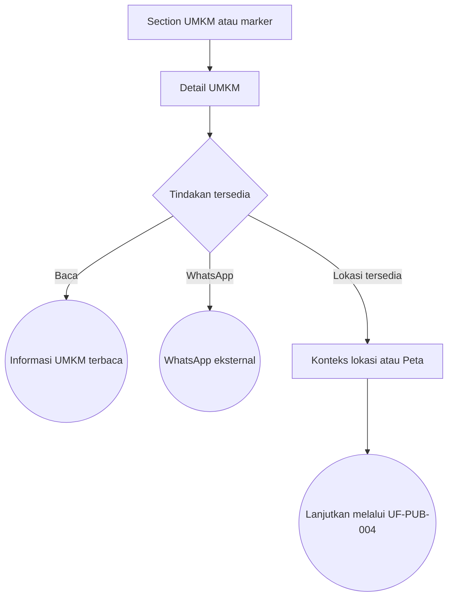
```mermaid
flowchart TD
    A[Section UMKM atau marker] --> B[Detail UMKM]
    B --> C{Tindakan tersedia}
    C -->|Baca| D((Informasi UMKM terbaca))
    C -->|WhatsApp| E((WhatsApp eksternal))
    C -->|Lokasi tersedia| F[Konteks lokasi atau Peta]
    F --> G((Lanjutkan melalui UF-PUB-004))
```

## UF-PUB-007 — Fasilitas → Detail → WhatsApp / Arah

**Actor:** Public User

**Priority:** SUPPORTING

**Goal:** Melihat informasi Fasilitas dan memperoleh lokasi atau kontak bila tersedia.

**Entry Point:** Section Fasilitas pada Halaman Dusun atau marker Fasilitas.

**Preconditions:** Fasilitas aktif dan mempunyai koordinat.

**Main Flow:**

1. Pengguna memilih Fasilitas dari section atau marker.
2. Portal menampilkan Detail Fasilitas/Lokasi.
3. Pengguna membaca nama, kategori, deskripsi, alamat, media/placeholder, dan lokasi.
4. Pengguna dapat membuka arah ke Google Maps.
5. Jika nomor kontak tersedia, pengguna juga dapat melakukan handoff ke WhatsApp.

**Alternative / Conditional Flow:** Jika nomor kontak tidak tersedia, tindakan WhatsApp tidak tersedia; akses informasi dan arah tetap ada.

**End State:** Informasi Fasilitas terbaca atau flow berhenti pada handoff eksternal.

**Traceability:** Sitemap: Fasilitas, Detail Fasilitas/Lokasi, Peta; PRD Bagian 15 dan 18; Baseline: `FR-013`, `DATA-010`–`DATA-013`, `MAP-006`–`MAP-008`, `MEDIA-001`, `MEDIA-002`.

**Diagram:**

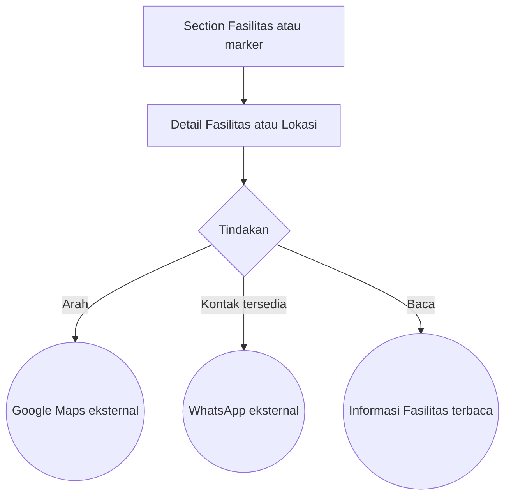
```mermaid
flowchart TD
    A[Section Fasilitas atau marker] --> B[Detail Fasilitas atau Lokasi]
    B --> C{Tindakan}
    C -->|Arah| D((Google Maps eksternal))
    C -->|Kontak tersedia| E((WhatsApp eksternal))
    C -->|Baca| F((Informasi Fasilitas terbaca))
```

## UF-PUB-008 — Agenda & Kegiatan → Detail

**Actor:** Public User

**Priority:** SUPPORTING

**Goal:** Melihat informasi Agenda/Kegiatan beserta status lifecycle yang berlaku.

**Entry Point:** Agenda terbaru pada Homepage atau Section Agenda & Kegiatan pada Halaman Dusun.

**Preconditions:** Item Agenda/Kegiatan tersedia pada konteks Desa atau Dusun.

**Main Flow:**

1. Pengguna memilih Agenda/Kegiatan.
2. Portal menampilkan Detail Agenda/Kegiatan.
3. Pengguna membaca informasi utama dan status `Akan Datang`, `Berlangsung`, atau `Selesai`.
4. Media opsional ditampilkan jika tersedia.
5. Kegiatan `Selesai` dapat menampilkan dokumentasi jika tersedia.

**Alternative / Conditional Flow:** Jam dan tanggal selesai dapat kosong sesuai aturan; lifecycle tetap dihitung sesuai baseline. Tidak ada status tambahan.

**End State:** Detail Agenda/Kegiatan terbaca.

**Traceability:** Sitemap: Agenda/Kegiatan dan Detail Agenda/Kegiatan; PRD Bagian 16; Baseline: `FR-014`–`FR-016`, `DATA-014`, `DATA-015`, `DATA-017`, `MEDIA-007`.

**Diagram:**

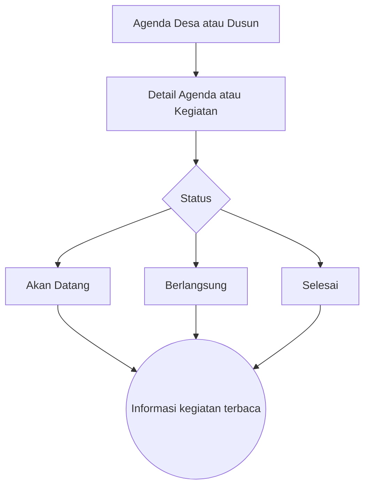
```mermaid
flowchart TD
    A[Agenda Desa atau Dusun] --> B[Detail Agenda atau Kegiatan]
    B --> C{Status}
    C --> D[Akan Datang]
    C --> E[Berlangsung]
    C --> F[Selesai]
    D --> G((Informasi kegiatan terbaca))
    E --> G
    F --> G
```

## UF-PUB-009 — Pengumuman Aktif → Detail / Arsip

**Actor:** Public User

**Priority:** SUPPORTING

**Goal:** Membaca Pengumuman aktif atau Pengumuman kedaluwarsa pada Arsip Pengumuman public.

**Entry Point:** Konteks Pengumuman pada Homepage atau Halaman Dusun.

**Preconditions:** Konteks Pengumuman tersedia; daftar dapat berisi data aktif, arsip, atau empty state.

**Main Flow:**

1. Pengguna membuka konteks Pengumuman.
2. Untuk Pengumuman aktif, pengguna memilih item dan membuka Detail Pengumuman.
3. Untuk data kedaluwarsa, pengguna mengakses child PAGE Arsip Pengumuman dari parent context.
4. Pengguna memilih Pengumuman kedaluwarsa.
5. Portal menampilkan Detail Pengumuman yang sama secara konseptual.

**Alternative / Conditional Flow:** Arsip Pengumuman tetap public dan bukan navigasi utama. Data Soft Deleted tidak masuk Arsip Pengumuman dan tidak tampil public.

**End State:** Detail Pengumuman aktif atau arsip terbaca.

**Traceability:** Sitemap: Pengumuman, Arsip Pengumuman, Detail Pengumuman; PRD Bagian 17; Baseline: `FR-008`, `FR-017`, `FR-018`, `DATA-016`, `ROLE-006`.

**Diagram:**

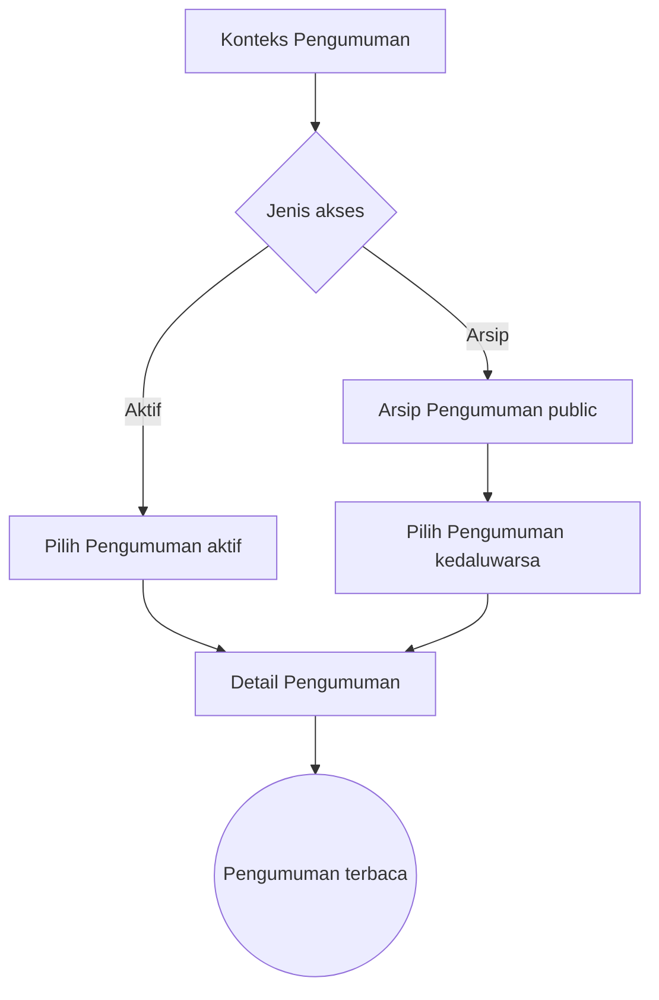
```mermaid
flowchart TD
    A[Konteks Pengumuman] --> B{Jenis akses}
    B -->|Aktif| C[Pilih Pengumuman aktif]
    C --> D[Detail Pengumuman]
    B -->|Arsip| E[Arsip Pengumuman public]
    E --> F[Pilih Pengumuman kedaluwarsa]
    F --> D
    D --> G((Pengumuman terbaca))
```

## UF-PUB-010 — Empty State

**Actor:** Public User

**Priority:** SUPPORTING

**Goal:** Memahami bahwa suatu section belum mempunyai data dan tetap melanjutkan navigasi.

**Entry Point:** Section publik apa pun yang datanya kosong.

**Preconditions:** Section merupakan bagian scope produk tetapi belum mempunyai data aktif.

**Main Flow:**

1. Pengguna mencapai section.
2. Sistem mendeteksi tidak ada data aktif.
3. Section tetap tersedia dan menampilkan empty state “Belum ada data”.
4. Pengguna melanjutkan ke section lain.

**Alternative / Conditional Flow:** Tidak dibuat diagram terpisah untuk setiap modul kosong karena behavior konseptualnya sama.

**End State:** Kondisi kosong dipahami dan navigasi publik tetap dapat dilanjutkan.

**Traceability:** Sitemap: conditional data kosong; PRD Bagian 10 dan 12; Baseline: `FR-009`.

**Diagram:**

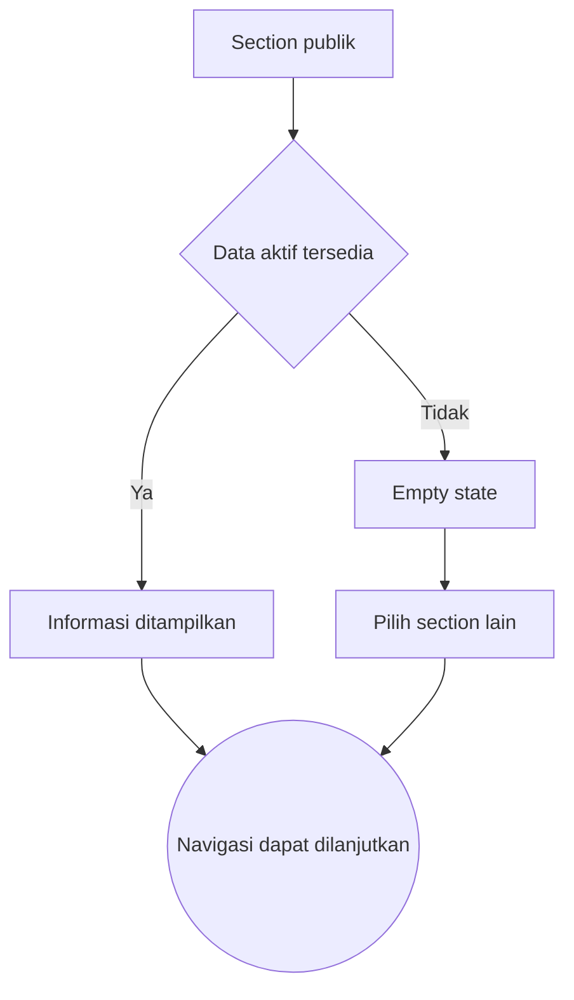
```mermaid
flowchart TD
    A[Section publik] --> B{Data aktif tersedia}
    B -->|Ya| C[Informasi ditampilkan]
    B -->|Tidak| D[Empty state]
    D --> E[Pilih section lain]
    C --> F((Navigasi dapat dilanjutkan))
    E --> F
```

# 8. Admin Dusun User Flows

## UF-AD-001 — Login Admin Dusun

**Actor:** Admin Dusun

**Priority:** SUPPORTING

**Goal:** Masuk ke Dashboard Dusun yang terikat pada akun.

**Entry Point:** Login Admin.

**Preconditions:** Akun Admin Dusun tersedia dan terikat pada satu Dusun.

**Main Flow:**

1. Admin Dusun membuka Login Admin.
2. Admin memasukkan username dan password.
3. Sistem melakukan autentikasi.
4. Sistem mengenali role Admin Dusun dan konteks Dusunnya.
5. Sistem menampilkan Dashboard Dusun milik Admin.

**Alternative / Conditional Flow:** Login yang tidak berhasil tidak memberikan akses dashboard. Tidak ada selector untuk berpindah Dusun dan tidak ada akses ke dashboard Dusun lain.

**End State:** Dashboard Dusun sendiri tersedia.

**Traceability:** Sitemap: Login Admin, Dashboard Dusun; PRD Bagian 20 dan 23; Baseline: `ROLE-002`, `ROLE-004`, `SEC-001`–`SEC-003`, `SEC-008`.

**Diagram:**

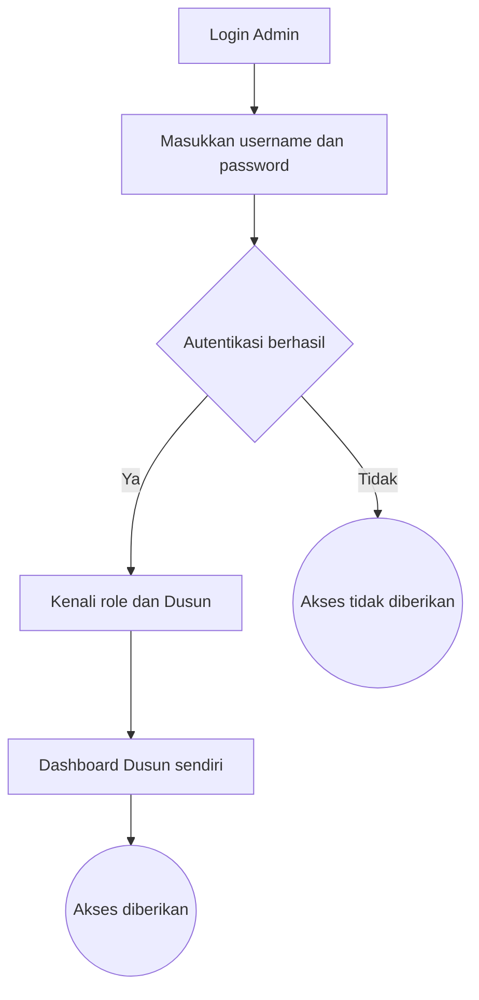
```mermaid
flowchart TD
    A[Login Admin] --> B[Masukkan username dan password]
    B --> C{Autentikasi berhasil}
    C -->|Ya| D[Kenali role dan Dusun]
    D --> E[Dashboard Dusun sendiri]
    E --> F((Akses diberikan))
    C -->|Tidak| G((Akses tidak diberikan))
```

## UF-AD-002 — Create Data → Publish

**Actor:** Admin Dusun

**Priority:** SUPPORTING

**Goal:** Membuat data operasional dan memublikasikannya sesuai visibility/status tanpa approval Super Admin.

**Entry Point:** Dashboard Dusun.

**Preconditions:** Admin telah login; management area adalah Kontak Pelayanan, UMKM, Fasilitas, Agenda/Kegiatan, atau Pengumuman pada Dusunnya sendiri. Izin publikasi administratif/offline telah diperoleh sebelum data privat dimasukkan.

**Main Flow:**

1. Admin memilih management area.
2. Admin memulai create item.
3. Admin mengisi data yang diperlukan sesuai jenis modul.
4. Admin menyimpan item.
5. Data langsung tersedia sesuai visibility dan state yang berlaku tanpa approval Super Admin.

**Alternative / Conditional Flow:** Fasilitas memerlukan koordinat; koordinat UMKM opsional; foto bersifat opsional; jam Agenda/Kegiatan opsional. Data privat tidak dimasukkan sebelum izin offline diperoleh.

**End State:** Item tersimpan dan tersedia sesuai scope/status pada Dusun Admin.

**Traceability:** Sitemap: Dashboard Dusun dan lima management areas; PRD Bagian 20, 24–25; Baseline: `FR-019`, `ROLE-003`, `MAP-008`, `MAP-009`, `MEDIA-001`, `DATA-017`, `PRIV-001`.

**Diagram:**

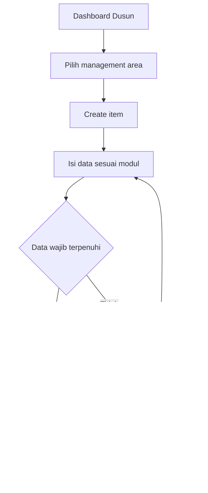
```mermaid
flowchart TD
    A[Dashboard Dusun] --> B[Pilih management area]
    B --> C[Create item]
    C --> D[Isi data sesuai modul]
    D --> E{Data wajib terpenuhi}
    E -->|Ya| F[Simpan]
    F --> G((Tersedia sesuai visibility dan state))
    E -->|Tidak| H[Lengkapi data wajib]
    H --> D
```

## UF-AD-003 — Edit Data → Publish Update

**Actor:** Admin Dusun

**Priority:** SUPPORTING

**Goal:** Memperbarui data dalam scope Dusun sendiri dan memberlakukan perubahan langsung.

**Entry Point:** Management area pada Dashboard Dusun.

**Preconditions:** Admin telah login dan item berada pada Dusun yang terikat pada akunnya.

**Main Flow:**

1. Admin membuka management area.
2. Admin memilih item milik Dusunnya.
3. Admin mengubah data yang diperlukan.
4. Admin menyimpan perubahan.
5. Perubahan langsung berlaku sesuai visibility/status tanpa approval Super Admin.

**Alternative / Conditional Flow:** Admin tidak dapat memilih atau mengubah item dari Dusun lain. Aturan data wajib/opsional tetap mengikuti jenis modul.

**End State:** Perubahan item tersimpan dan langsung berlaku pada scope Dusun sendiri.

**Traceability:** Sitemap: management areas Dashboard Dusun; PRD Bagian 20; Baseline: `ROLE-003`, `ROLE-004`, `FR-019`, `SEC-003`.

**Diagram:**

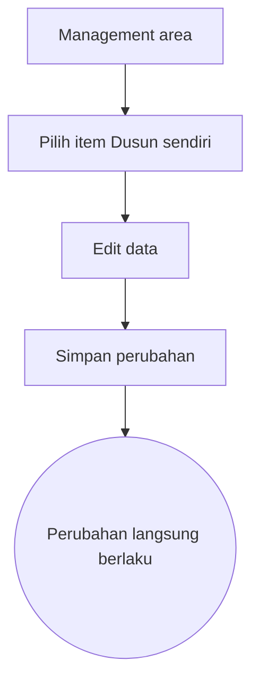
```mermaid
flowchart TD
    A[Management area] --> B[Pilih item Dusun sendiri]
    B --> C[Edit data]
    C --> D[Simpan perubahan]
    D --> E((Perubahan langsung berlaku))
```

## UF-AD-004 — Soft Delete / Nonaktif

**Actor:** Admin Dusun

**Priority:** SUPPORTING

**Goal:** Menyembunyikan data operasional dari public tanpa hard delete.

**Entry Point:** Management area pada Dashboard Dusun.

**Preconditions:** Admin telah login dan item berada pada Dusunnya sendiri.

**Main Flow:**

1. Admin membuka management area.
2. Admin memilih data operasional.
3. Admin menjalankan tindakan Nonaktif / Soft Delete.
4. Data tidak lagi tampil public.
5. Data tetap tersimpan.

**Alternative / Conditional Flow:** Admin Dusun tidak mempunyai tindakan restore atau hard delete; Super Admin dapat melakukan restore. User Flow tidak menentukan apakah record Soft Deleted tetap terlihat, disembunyikan, atau direpresentasikan melalui filter/tab tertentu di Dashboard Admin Dusun. Presentation internal dashboard ditentukan kemudian.

**End State:** Data berstatus Nonaktif / Soft Deleted, tidak tampil pada website public, tetap tersimpan, dan dapat di-restore oleh Super Admin.

**Traceability:** Sitemap: Soft Delete/Nonaktif IA dan management areas; PRD Bagian 20 dan 26; Baseline: `ROLE-006`, `SEC-009`.

**Diagram:**

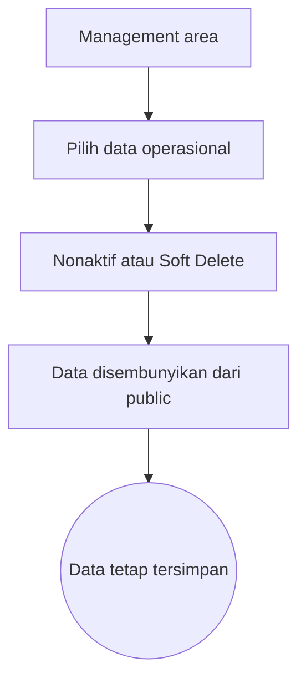
```mermaid
flowchart TD
    A[Management area] --> B[Pilih data operasional]
    B --> C[Nonaktif atau Soft Delete]
    C --> D[Data disembunyikan dari public]
    D --> E((Data tetap tersimpan))
```

## UF-AD-005 — Kelola Profil Dusun

**Actor:** Admin Dusun

**Priority:** SUPPORTING

**Goal:** Memperbarui informasi Profil Dusun sendiri.

**Entry Point:** Dashboard Dusun.

**Preconditions:** Admin telah login dan hanya mempunyai scope pada Dusun yang terikat pada akunnya.

**Main Flow:**

1. Admin membuka Kelola Profil Dusun.
2. Admin mengubah informasi profil yang didukung.
3. Admin menyimpan perubahan.
4. Informasi publik Dusun diperbarui.

**Alternative / Conditional Flow:** Media profil bersifat opsional. Admin tidak dapat mengedit profil Dusun lain atau mengubah status ACTIVE/INACTIVE entitas Dusun.

**End State:** Profil Dusun sendiri tersimpan dan informasi public diperbarui.

**Traceability:** Sitemap: Kelola Profil Dusun; PRD Bagian 12 dan 20; Baseline: `DATA-005`, `ROLE-003`, `ROLE-004`, `FR-019`.

**Diagram:**

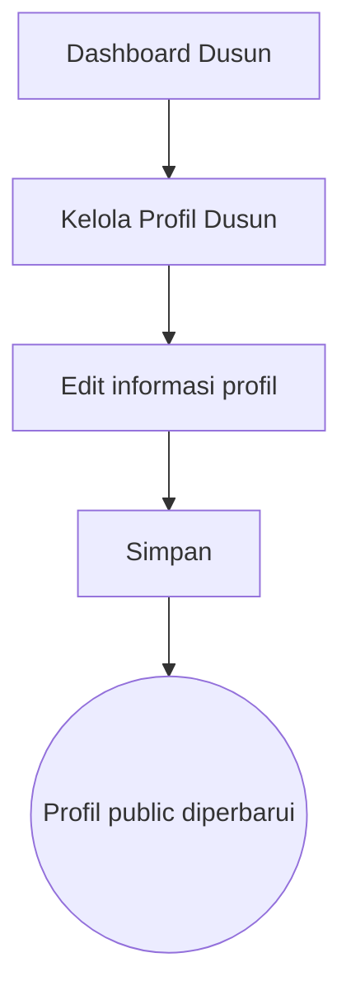
```mermaid
flowchart TD
    A[Dashboard Dusun] --> B[Kelola Profil Dusun]
    B --> C[Edit informasi profil]
    C --> D[Simpan]
    D --> E((Profil public diperbarui))
```

## UF-AD-006 — Dusun INACTIVE tetapi Admin Tetap Mengelola

**Actor:** Admin Dusun

**Priority:** SUPPORTING

**Goal:** Tetap mengelola data ketika entitas Dusun berstatus `INACTIVE`.

**Entry Point:** Login Admin setelah Dusun dinonaktifkan Super Admin.

**Preconditions:** Super Admin telah mengubah status Dusun menjadi `INACTIVE`; akun Admin Dusun tetap tersedia.

**Main Flow:**

1. Dusun berstatus `INACTIVE` dan hilang dari area public normal.
2. Admin Dusun membuka Login Admin.
3. Admin berhasil diautentikasi.
4. Dashboard Dusun tetap tersedia.
5. Admin memperbarui data dalam scope Dusunnya.

**Alternative / Conditional Flow:** Admin Dusun tidak dapat mengaktifkan kembali entitas Dusun; kewenangan tersebut tetap milik Super Admin.

**End State:** Data Dusun dapat tetap dikelola tanpa mengubah status `INACTIVE`.

**Traceability:** Sitemap: conditional Dusun INACTIVE, Login Admin, Dashboard Dusun; PRD Bagian 20, 22–23; Baseline: `FR-022`, `ROLE-004`, `ROLE-010`, `SEC-008`.

**Diagram:**

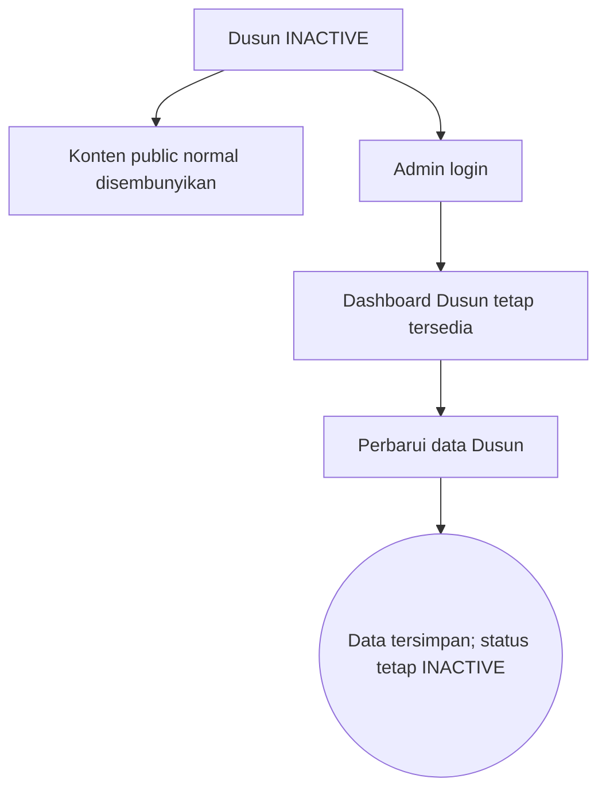
```mermaid
flowchart TD
    A[Dusun INACTIVE] --> B[Konten public normal disembunyikan]
    A --> C[Admin login]
    C --> D[Dashboard Dusun tetap tersedia]
    D --> E[Perbarui data Dusun]
    E --> F((Data tersimpan; status tetap INACTIVE))
```

# 9. Super Admin User Flows

## UF-SA-001 — Login Super Admin

**Actor:** Super Admin

**Priority:** SUPPORTING

**Goal:** Masuk ke Super Admin Dashboard dengan konteks global.

**Entry Point:** Login Admin.

**Preconditions:** Akun Super Admin tersedia.

**Main Flow:**

1. Super Admin membuka Login Admin.
2. Super Admin memasukkan username dan password.
3. Sistem melakukan autentikasi.
4. Sistem mengenali role Super Admin.
5. Sistem menampilkan Super Admin Dashboard.

**Alternative / Conditional Flow:** Login yang tidak berhasil tidak memberikan akses. Recovery akun Super Admin sendiri tetap `OPEN-010` dan tidak dibuat sebagai flow.

**End State:** Super Admin Dashboard global tersedia.

**Traceability:** Sitemap: Login Admin, Super Admin Dashboard; PRD Bagian 21 dan 23; Baseline: `ROLE-008`, `SEC-001`, `SEC-002`, `SEC-008`, `OPEN-010`.

**Diagram:**

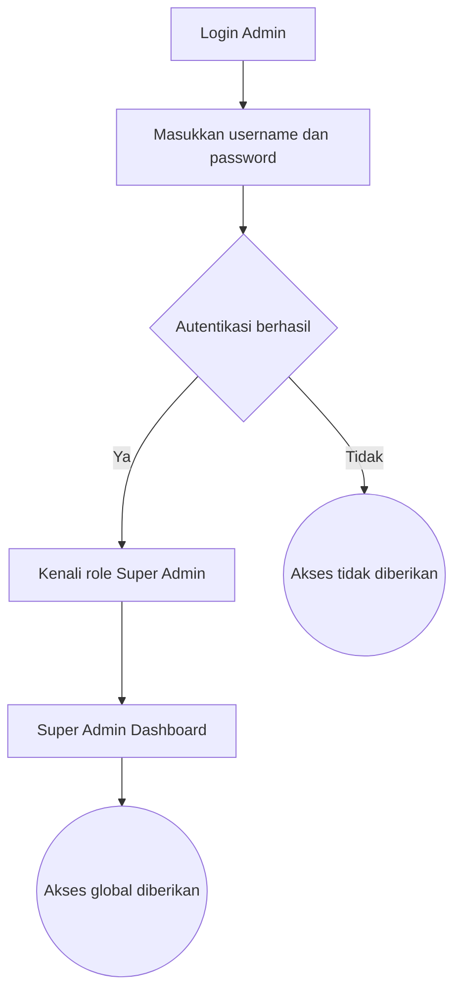
```mermaid
flowchart TD
    A[Login Admin] --> B[Masukkan username dan password]
    B --> C{Autentikasi berhasil}
    C -->|Ya| D[Kenali role Super Admin]
    D --> E[Super Admin Dashboard]
    E --> F((Akses global diberikan))
    C -->|Tidak| G((Akses tidak diberikan))
```

## UF-SA-002 — Kelola Data Lintas Dusun

**Actor:** Super Admin

**Priority:** SUPPORTING

**Goal:** Mengelola data tingkat Desa atau lintas seluruh Dusun sesuai management area.

**Entry Point:** Super Admin Dashboard.

**Preconditions:** Super Admin telah login.

**Main Flow:**

1. Super Admin memilih management area.
2. Super Admin menentukan konteks data Desa/Dusun bila diperlukan.
3. Sistem menampilkan list atau management view yang sesuai.
4. Super Admin membuat, melihat, mengubah, mengaktifkan/menonaktifkan, atau melakukan Soft Delete sesuai jenis data.
5. Super Admin menyimpan perubahan.

**Alternative / Conditional Flow:** Desain selector konteks tidak ditentukan. Operasi restore dan hard delete dijelaskan pada flow terpisah. Untuk data privat, izin publikasi offline menjadi precondition.

**End State:** Perubahan data tersimpan dalam konteks global yang dipilih.

**Traceability:** Sitemap: Super Admin Dashboard dan management areas; PRD Bagian 21 dan 25; Baseline: `ROLE-008`, `ROLE-011`, `PRIV-001`.

**Diagram:**

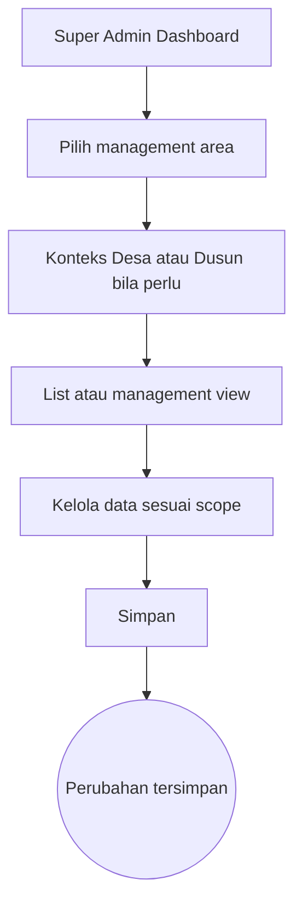
```mermaid
flowchart TD
    A[Super Admin Dashboard] --> B[Pilih management area]
    B --> C[Konteks Desa atau Dusun bila perlu]
    C --> D[List atau management view]
    D --> E[Kelola data sesuai scope]
    E --> F[Simpan]
    F --> G((Perubahan tersimpan))
```

## UF-SA-003 — Restore Soft Deleted Data

**Actor:** Super Admin

**Priority:** SUPPORTING

**Goal:** Memulihkan data yang sebelumnya di-Soft Delete.

**Entry Point:** Management area terkait.

**Preconditions:** Data berada pada state Nonaktif / Soft Deleted dan masih tersimpan.

**Main Flow:**

1. Super Admin membuka management area.
2. Super Admin mengakses data Nonaktif / Soft Deleted secara konseptual.
3. Super Admin memilih data.
4. Super Admin menjalankan restore.
5. Data kembali aktif sesuai state dan aturan visibility yang berlaku.

**Alternative / Conditional Flow:** User Flow tidak menentukan tab/filter UI. Mengaktifkan kembali entitas Dusun tidak otomatis memulihkan data operasional yang Soft Deleted.

**End State:** Data dipulihkan dan kembali mengikuti state yang berlaku.

**Traceability:** Sitemap: Soft Delete/Nonaktif IA, Super Admin management areas; PRD Bagian 21 dan 26; Baseline: `ROLE-008`, `SEC-009`.

**Diagram:**

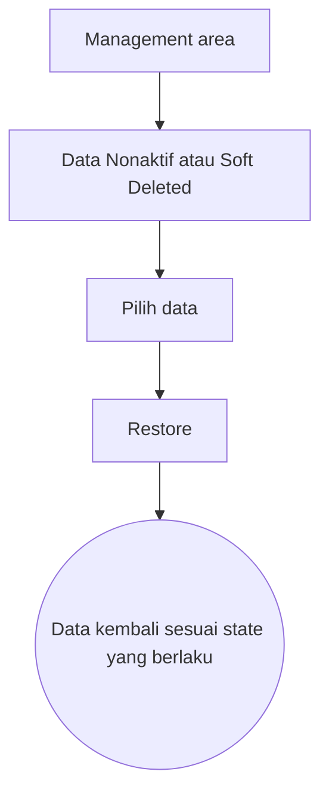
```mermaid
flowchart TD
    A[Management area] --> B[Data Nonaktif atau Soft Deleted]
    B --> C[Pilih data]
    C --> D[Restore]
    D --> E((Data kembali sesuai state yang berlaku))
```

## UF-SA-004 — Hard Delete Data Selain Dusun

**Actor:** Super Admin

**Priority:** SUPPORTING

**Goal:** Menghapus permanen data yang bukan entitas Dusun.

**Entry Point:** Management area terkait.

**Preconditions:** Actor adalah Super Admin dan target bukan entitas Dusun.

**Main Flow:**

1. Super Admin membuka management area.
2. Super Admin memilih data selain entitas Dusun.
3. Super Admin menjalankan hard delete.
4. Data dihapus permanen dan tidak mengikuti mekanisme restore Soft Delete.

**Alternative / Conditional Flow:** Jika target adalah entitas Dusun, hard delete tidak tersedia. User Flow tidak menambahkan confirmation modal, password re-entry, audit log, atau backup flow.

**End State:** Data selain Dusun terhapus permanen.

**Traceability:** Sitemap: Super Admin management operation boundaries; PRD Bagian 21 dan 26; Baseline: `ROLE-008`, `SEC-007`, `SEC-009`.

**Diagram:**

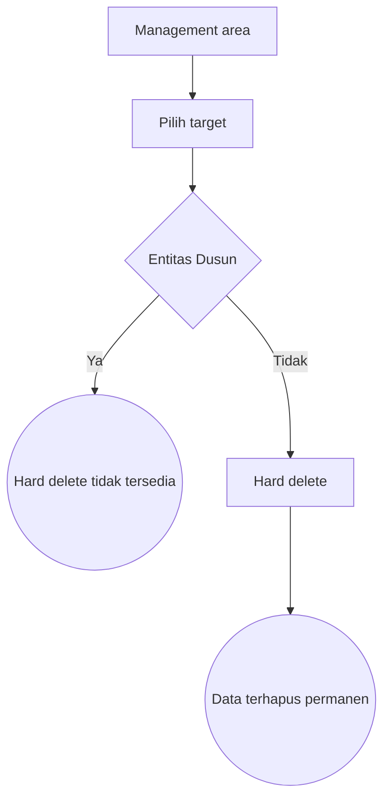
```mermaid
flowchart TD
    A[Management area] --> B[Pilih target]
    B --> C{Entitas Dusun}
    C -->|Ya| D((Hard delete tidak tersedia))
    C -->|Tidak| E[Hard delete]
    E --> F((Data terhapus permanen))
```

## UF-SA-005 — Nonaktifkan Dusun

**Actor:** Super Admin

**Priority:** SUPPORTING

**Goal:** Mengubah status entitas Dusun menjadi `INACTIVE` dengan dampak public yang konsisten.

**Entry Point:** Kelola Dusun pada Super Admin Dashboard.

**Preconditions:** Dusun berstatus `ACTIVE`.

**Main Flow:**

1. Super Admin membuka Kelola Dusun.
2. Super Admin memilih Dusun.
3. Super Admin mengubah status menjadi `INACTIVE`.
4. Dusun hilang dari Pilihan Dusun public.
5. Titik/data Dusun hilang dari Peta public.
6. Akses langsung tidak menampilkan konten public normal.
7. Data tetap tersimpan dan Admin Dusun tetap dapat login.

**Alternative / Conditional Flow:** Menonaktifkan Dusun bukan hard delete dan tidak menghapus akun Admin atau data terkait.

**End State:** Dusun berstatus `INACTIVE` dengan data serta akses admin tetap tersimpan.

**Traceability:** Sitemap: Kelola Dusun dan conditional Dusun INACTIVE; PRD Bagian 21–22; Baseline: `FR-022`, `ROLE-010`, `SEC-007`.

**Diagram:**

```mermaid
flowchart TD
    A[Kelola Dusun] --> B[Pilih Dusun ACTIVE]
    B --> C[Ubah menjadi INACTIVE]
    C --> D[Hilangkan dari pilihan dan Peta public]
    C --> E[Sembunyikan konten public normal]
    C --> F[Data dan akses Admin tetap ada]
    D --> G((Dusun INACTIVE))
    E --> G
    F --> G
```

## UF-SA-006 — Aktifkan Kembali Dusun

**Actor:** Super Admin

**Priority:** SUPPORTING

**Goal:** Mengubah kembali status entitas Dusun menjadi `ACTIVE`.

**Entry Point:** Kelola Dusun.

**Preconditions:** Dusun berstatus `INACTIVE` dan datanya masih tersimpan.

**Main Flow:**

1. Super Admin membuka Kelola Dusun.
2. Super Admin memilih Dusun `INACTIVE`.
3. Super Admin mengubah status menjadi `ACTIVE`.
4. Dusun kembali tersedia pada pilihan public.
5. Data aktif/titik aktif dapat kembali muncul sesuai state masing-masing.

**Alternative / Conditional Flow:** Data operasional yang berstatus Soft Deleted tidak otomatis di-restore oleh aktivasi Dusun.

**End State:** Dusun berstatus `ACTIVE`; hanya data yang memenuhi state aktif dapat tampil public.

**Traceability:** Sitemap: Kelola Dusun dan conditional Dusun ACTIVE; PRD Bagian 21–22; Baseline: `FR-022`, `ROLE-010`, `ROLE-008`.

**Diagram:**

```mermaid
flowchart TD
    A[Kelola Dusun] --> B[Pilih Dusun INACTIVE]
    B --> C[Ubah menjadi ACTIVE]
    C --> D[Dusun kembali tersedia public]
    D --> E{State data terkait}
    E -->|Aktif| F[Data dapat tampil]
    E -->|Soft Deleted| G[Data tetap tersembunyi]
    F --> H((Dusun ACTIVE))
    G --> H
```

## UF-SA-007 — Kelola Admin Dusun

**Actor:** Super Admin

**Priority:** SUPPORTING

**Goal:** Mengelola akun Admin Dusun sesuai kewenangan Super Admin.

**Entry Point:** Kelola Admin Dusun pada Super Admin Dashboard.

**Preconditions:** Super Admin telah login; struktur enam Dusun tersedia.

**Main Flow:**

1. Super Admin membuka Kelola Admin Dusun.
2. Super Admin memilih tindakan pengelolaan akun.
3. Super Admin dapat membuat akun dan mengaitkannya dengan satu Dusun.
4. Super Admin dapat menghapus akun Admin Dusun.
5. Super Admin dapat memilih reset password yang dirinci pada `UF-SA-008`.

**Alternative / Conditional Flow:** Satu Dusun dapat mempunyai lebih dari satu Admin Dusun. Tidak ada self-registration dan Admin Dusun tidak dapat membuat akun admin lain.

**End State:** Akun Admin Dusun dikelola sesuai scope satu Dusun.

**Traceability:** Sitemap: Kelola Admin Dusun; PRD Bagian 21 dan 23; Baseline: `ROLE-002`, `ROLE-005`, `ROLE-009`, `SEC-008`.

**Diagram:**

```mermaid
flowchart TD
    A[Kelola Admin Dusun] --> B{Tindakan akun}
    B -->|Buat| C[Buat akun dan kaitkan satu Dusun]
    B -->|Hapus| D[Hapus akun Admin Dusun]
    B -->|Reset| E[Flow reset password]
    C --> F((Akun dikelola))
    D --> F
    E --> F
```

## UF-SA-008 — Reset Password Admin Dusun

**Actor:** Super Admin

**Priority:** SUPPORTING

**Goal:** Mereset password akun Admin Dusun.

**Entry Point:** Kelola Admin Dusun.

**Preconditions:** Akun Admin Dusun tersedia dan Super Admin telah login.

**Main Flow:**

1. Super Admin membuka Kelola Admin Dusun.
2. Super Admin memilih akun Admin Dusun.
3. Super Admin menjalankan reset password.
4. Credential hasil reset tersedia untuk digunakan Admin Dusun sesuai prosedur operasional yang berlaku.

**Alternative / Conditional Flow:** Mekanisme pengiriman credential tidak ditentukan. Recovery akun Super Admin sendiri tetap `OPEN-010` dan tidak dibuat dalam flow ini.

**End State:** Admin Dusun dapat menggunakan credential hasil reset untuk login.

**Traceability:** Sitemap: Kelola Admin Dusun, Login Admin; PRD Bagian 21 dan 23; Baseline: `ROLE-009`, `SEC-008`, `OPEN-010`.

**Diagram:**

```mermaid
flowchart TD
    A[Kelola Admin Dusun] --> B[Pilih akun]
    B --> C[Reset password]
    C --> D[Credential hasil reset]
    D --> E((Admin Dusun dapat login))
```

## UF-SA-009 — Kelola Identitas Desa / Homepage Data Source

**Actor:** Super Admin

**Priority:** SUPPORTING

**Goal:** Memperbarui identitas Desa dan data sumber bagi Homepage data-driven tanpa page builder.

**Entry Point:** Super Admin Dashboard.

**Preconditions:** Super Admin telah login.

**Main Flow:**

1. Untuk identitas Desa, Super Admin membuka Identitas / Profil Desa, memperbarui data, lalu menyimpan.
2. Homepage menampilkan identitas terbaru.
3. Untuk section data-driven, Super Admin mengelola data pada modul sumber: Dusun aktif melalui Kelola Dusun; Agenda melalui Agenda & Kegiatan; Pengumuman melalui Pengumuman; Peta melalui data lokasi pada Fasilitas, UMKM, dan titik pelayanan yang diizinkan.
4. Homepage mengambil data aktif terbaru dari modul sumber.

**Alternative / Conditional Flow:** Tidak ada Homepage Page Builder atau manual ordering. Peta bukan sumber data bisnis independen. Lokasi dapat ditentukan dengan klik peta atau input latitude/longitude, tetapi lokasi tetap bagian dari modul sumber dan presentation pattern edit belum diputuskan.

**End State:** Homepage menampilkan identitas dan data aktif terbaru dari sumber yang sesuai.

**Traceability:** Sitemap: Identitas/Profil Desa, Homepage management, Kelola Dusun, Agenda, Pengumuman, Data/Peta map-centric; PRD Bagian 11, 18, 21; Baseline: `FR-004`, `MAP-001`–`MAP-004`, `ROLE-007`, `ROLE-008`, `ROLE-011`.

**Diagram:**

```mermaid
flowchart TD
    A[Super Admin Dashboard] --> B{Sumber Homepage}
    B -->|Identitas| C[Identitas atau Profil Desa]
    B -->|Dusun| D[Kelola Dusun]
    B -->|Agenda| E[Agenda dan Kegiatan]
    B -->|Pengumuman| F[Pengumuman]
    B -->|Peta| G[Lokasi pada modul sumber]
    C --> H[Simpan perubahan]
    D --> H
    E --> H
    F --> H
    G --> H
    H --> I((Homepage mengambil data terbaru))
```

# 10. Map Administrative Flow Clarification

Area administratif Data / Peta adalah konteks map-centric terhadap data lokasi yang berasal dari modul sumber:

- Fasilitas;
- UMKM;
- Kontak Pelayanan atau titik pelayanan yang relevan dan diizinkan.

Peta bukan database titik independen, source data bisnis baru, generic `map_points` storage, atau duplikasi data modul sumber. Admin dapat menentukan lokasi melalui klik pada peta atau input latitude/longitude (`MAP-004`), tetapi User Flow belum menentukan apakah editor dibuka dari form modul, area Peta admin, page, modal, atau drawer. Keputusan presentation pattern berada pada tahap UI/UX atau SRS bila diperlukan.

Tidak ada flow generic map-points CRUD. Pengelolaan lokasi tercakup secara konseptual dalam `UF-AD-002`, `UF-AD-003`, `UF-SA-002`, dan `UF-SA-009` sesuai scope role.

# 11. Privacy Conditional Flow

Untuk flow create/edit/publish yang melibatkan nomor personal, foto personal, rumah pribadi, atau lokasi privat, berlaku precondition berikut:

1. Izin publikasi telah diperoleh secara administratif/offline sebelum data dimasukkan.
2. Admin bertanggung jawab memastikan precondition tersebut terpenuhi.
3. Sistem MVP tidak mempunyai digital consent flow, request/approve consent, field persetujuan digital, atau upload bukti persetujuan.
4. Jika izin belum diperoleh, data privat tersebut tidak dimasukkan melalui flow create/edit.

Catatan ini berlaku pada `UF-AD-002`, `UF-AD-003`, `UF-SA-002`, serta flow public yang menampilkan data terkait. Referensi: `PRIV-001`, `MAP-010`.

# 12. Centralized Conditional / Alternative Flows

| Condition | Flow Impact |
| --- | --- |
| Dusun `ACTIVE` | Tersedia pada Pilihan Dusun; konten public normal dan titik aktif dapat tampil. |
| Dusun `INACTIVE` | Tidak tersedia pada pilihan/Peta public; konten public normal disembunyikan; Admin Dusun tetap dapat login dan mengelola data. |
| Data kosong | Section tetap tersedia dengan empty state; Public User dapat melanjutkan navigasi. |
| UMKM dengan koordinat | Dapat mempunyai marker dan konteks lokasi/arah. |
| UMKM tanpa koordinat | Tetap dapat dilihat pada direktori/Detail UMKM tetapi tidak mempunyai marker terkait. |
| Fasilitas dengan nomor | Detail mendukung handoff WhatsApp dan arah Google Maps. |
| Fasilitas tanpa nomor | Detail dan arah tetap tersedia; handoff WhatsApp tidak tersedia. |
| Pengumuman aktif | Tersedia pada daftar aktif dan Detail Pengumuman. |
| Pengumuman kedaluwarsa | Keluar dari daftar aktif dan tetap public melalui child PAGE Arsip Pengumuman. |
| Agenda `Akan Datang` | Ditampilkan dengan status sesuai tanggal sebelum mulai. |
| Agenda `Berlangsung` | Ditampilkan dengan status sesuai tanggal/rentang kegiatan. |
| Agenda `Selesai` | Ditampilkan dengan status selesai; dokumentasi opsional dapat tersedia. |
| Data aktif | Dapat tampil public sesuai scope dan kondisi lain yang berlaku. |
| Data Soft Deleted | Tidak tampil public, tetap tersimpan, dan hanya dapat di-restore Super Admin. |
| Public User | Tidak memerlukan login dan tidak mempunyai akses administratif. |
| Authenticated Admin | Akses mengikuti role: satu Dusun untuk Admin Dusun dan global untuk Super Admin. |

Tabel ini bukan state machine teknis dan tidak menambahkan status baru.

# 13. External Destinations

## 13.1 WhatsApp

- Digunakan untuk handoff dari Kontak Pelayanan, UMKM, atau Fasilitas dengan nomor yang tersedia.
- Flow portal berhenti ketika handoff ke WhatsApp terjadi.
- Behavior internal WhatsApp tidak menjadi bagian User Flow.
- Exact copy template Kontak Pelayanan tetap `OPEN-002 — NON-BLOCKING`.

## 13.2 Google Maps

- Google Maps merupakan destination eksternal untuk aksi arah/navigasi yang telah didukung product flow.
- Aksi arah dijamin pada konteks Peta/marker melalui `UF-PUB-004`.
- Detail Fasilitas/Lokasi tetap mendukung arah sesuai Sitemap dan PRD.
- Detail lain tidak otomatis memperoleh direct navigation CTA. Khusus UMKM, Detail UMKM menyediakan informasi lokasi bila tersedia dan dapat membawa pengguna ke konteks lokasi/Peta; flow arah selanjutnya mengikuti `UF-PUB-004`.
- Flow portal berhenti ketika handoff ke Google Maps terjadi.
- Portal tidak membuat routing/navigation engine internal.
- Behavior internal Google Maps tidak menjadi bagian User Flow.

# 14. Flow Traceability

| Flow ID | Sitemap Node(s) | PRD Section | Baseline IDs |
| --- | --- | --- | --- |
| `UF-PUB-001` | Homepage, Pilihan Dusun, Halaman Dusun | 2, 10–12, 19, 22 | `BR-003`, `BR-005`, `FR-002`, `FR-005`–`FR-007`, `FR-022`, `OPS-001` |
| `UF-PUB-002` | Homepage dan section data-driven | 10–11 | `FR-001`–`FR-004`, `FR-009`, `FR-016`–`FR-018`, `MAP-002` |
| `UF-PUB-003` | Halaman Dusun dan child sections | 12 | `FR-005`–`FR-007`, `FR-009`, `DATA-005` |
| `UF-PUB-004` | Peta Desa/Dusun, marker, detail terkait | 18 | `BR-006`, `MAP-001`–`MAP-010`, `PRIV-001` |
| `UF-PUB-005` | Kontak Pelayanan | 13 | `BR-007`, `FR-010`, `DATA-006`–`DATA-008`, `PRIV-001` |
| `UF-PUB-006` | UMKM, Detail UMKM, Peta | 14, 18 | `FR-011`, `FR-012`, `DATA-009`, `MAP-006`, `MAP-007`, `MAP-009`, `PRIV-001` |
| `UF-PUB-007` | Fasilitas, Detail Fasilitas/Lokasi, Peta | 15, 18 | `FR-013`, `DATA-010`–`DATA-013`, `MAP-006`–`MAP-008` |
| `UF-PUB-008` | Agenda/Kegiatan dan detail | 16 | `FR-014`–`FR-016`, `DATA-014`, `DATA-015`, `DATA-017`, `MEDIA-007` |
| `UF-PUB-009` | Pengumuman, Arsip public, Detail Pengumuman | 17 | `FR-008`, `FR-017`, `FR-018`, `DATA-016`, `ROLE-006` |
| `UF-PUB-010` | Conditional empty state | 10, 12 | `FR-009` |
| `UF-AD-001` | Login Admin, Dashboard Dusun | 20, 23 | `ROLE-002`, `ROLE-004`, `SEC-001`–`SEC-003`, `SEC-008` |
| `UF-AD-002` | Dashboard Dusun dan management areas | 20, 24–25 | `FR-019`, `ROLE-003`, `MAP-008`, `MAP-009`, `MEDIA-001`, `DATA-017`, `PRIV-001` |
| `UF-AD-003` | Admin Dusun management areas | 20 | `ROLE-003`, `ROLE-004`, `FR-019`, `SEC-003` |
| `UF-AD-004` | Soft Delete/Nonaktif | 20, 26 | `ROLE-006`, `SEC-009` |
| `UF-AD-005` | Kelola Profil Dusun | 12, 20 | `DATA-005`, `ROLE-003`, `ROLE-004`, `FR-019` |
| `UF-AD-006` | Dusun INACTIVE, Login, Dashboard Dusun | 20, 22–23 | `FR-022`, `ROLE-004`, `ROLE-010`, `SEC-008` |
| `UF-SA-001` | Login Admin, Super Admin Dashboard | 21, 23 | `ROLE-008`, `SEC-001`, `SEC-002`, `SEC-008` |
| `UF-SA-002` | Super Admin management areas | 21, 25 | `ROLE-008`, `ROLE-011`, `PRIV-001` |
| `UF-SA-003` | Data Nonaktif/Soft Deleted, restore | 21, 26 | `ROLE-008`, `SEC-009` |
| `UF-SA-004` | Hard delete data selain Dusun | 21, 26 | `ROLE-008`, `SEC-007`, `SEC-009` |
| `UF-SA-005` | Kelola Dusun, status INACTIVE | 21–22 | `FR-022`, `ROLE-010`, `SEC-007` |
| `UF-SA-006` | Kelola Dusun, status ACTIVE | 21–22 | `FR-022`, `ROLE-008`, `ROLE-010` |
| `UF-SA-007` | Kelola Admin Dusun | 21, 23 | `ROLE-002`, `ROLE-005`, `ROLE-009`, `SEC-008` |
| `UF-SA-008` | Kelola Admin Dusun, Login Admin | 21, 23 | `ROLE-009`, `SEC-008` |
| `UF-SA-009` | Identitas Desa, modul sumber Homepage, Data/Peta | 11, 18, 21 | `FR-004`, `MAP-001`–`MAP-004`, `ROLE-007`, `ROLE-008`, `ROLE-011` |

Traceability mencakup kelompok `BR`, `FR`, `MAP`, `ROLE`, `SEC`, `PRIV`, dan `OPS` pada flow yang relevan. Tabel tidak memetakan setiap field atau tindakan UI.

# 15. Future Flow Considerations

Tidak ada diagram atau flow MVP aktif untuk enam enhancement berikut:

| Requirement ID | Future Consideration | Status |
| --- | --- | --- |
| `DATA-004` | Penambahan Dusun baru | `FUTURE — FLOW NOT DEFINED FOR MVP` |
| `FR-020` | QR khusus per Dusun | `FUTURE — FLOW NOT DEFINED FOR MVP` |
| `MEDIA-004` | Galeri multi-foto UMKM | `FUTURE — FLOW NOT DEFINED FOR MVP` |
| `MAP-011` | Pencarian lokasi pada Peta | `FUTURE — FLOW NOT DEFINED FOR MVP` |
| `MAP-012` | Batas wilayah Dusun | `FUTURE — FLOW NOT DEFINED FOR MVP` |
| `OPS-002` | Papan QR kecil per Dusun | `FUTURE — FLOW NOT DEFINED FOR MVP` |

# 16. Open Non-Blocking Notes

Seluruh keputusan berikut tetap `OPEN — NON-BLOCKING` dan tidak membentuk flow baru:

| Open ID | Flow Impact |
| --- | --- |
| `OPEN-001` | Nama resmi Dusun memengaruhi label, bukan langkah flow. |
| `OPEN-002` | Exact copy template WhatsApp belum ditentukan; handoff tetap final. |
| `OPEN-004` | Pemegang Super Admin pasca-KKN tidak mengubah role flow. |
| `OPEN-005` | Calon Admin seluruh Dusun tidak mengubah flow Dashboard. |
| `OPEN-006` | Supervisor operasional tidak membentuk role/flow produk baru. |
| `OPEN-007` | Hosting/domain tidak menentukan flow atau exact URL. |
| `OPEN-008` | Desain papan QR tidak mengubah tujuan QR utama ke Homepage. |
| `OPEN-009` | Tech stack tidak dipilih pada User Flow. |
| `OPEN-010` | Recovery Super Admin tidak dibuat sebagai flow. |
| `OPEN-011` | Dataset aktual memengaruhi data/empty state, bukan struktur flow. |

Jumlah `USER FLOW OPEN QUESTION`: **0**. Tidak ada OPEN baseline yang ditutup atau dijawab dalam dokumen ini.

# 17. User Flow vs UI Boundary

## 17.1 USER FLOW MAY DECIDE

- starting point;
- conceptual action;
- decision branch;
- destination;
- terminal/success state;
- role scope;
- conditional path;
- external handoff boundary.

## 17.2 USER FLOW MUST NOT DECIDE

- exact button label atau exact copy;
- exact form layout;
- navbar atau bottom navigation;
- tabs, modal, atau drawer;
- animation atau component;
- warna, typography, atau spacing;
- exact URL, path, slug, atau anchor;
- API, database, framework, provider, atau library.

# 18. Mermaid Requirements and Validation Boundary

- Setiap diagram menggunakan `flowchart TD` atau `flowchart LR`.
- Setiap diagram mewakili satu goal utama dan menggunakan label singkat.
- Paragraph panjang tidak ditempatkan dalam node.
- External destination/terminal result menggunakan bentuk `(( ))` bila sesuai.
- Diagram tidak menetapkan komponen UI atau implementasi teknis.
- Validasi syntax dilakukan sebelum handoff human review; hasil dicatat pada laporan penyelesaian, bukan sebagai acceptance criteria teknis.

**Mermaid structural inspection: PASS.** Seluruh code fence lengkap; setiap diagram menggunakan deklarasi yang didukung; node ID, bracket, parenthesis, dan edge syntax telah diperiksa secara struktural; tidak ada diagram terpotong.

# 19. Change Request and Open Question Summary

| Review Item | Count | Result |
| --- | ---: | --- |
| `SITEMAP CHANGE REQUEST` | 0 | Tidak diperlukan; seluruh flow menggunakan node Sitemap v1.0. |
| `PRD CHANGE REQUEST` | 0 | Tidak diperlukan; tidak ada behavior produk baru. |
| `BASELINE CHANGE REQUEST` | 0 | Tidak diperlukan; tidak ada perubahan requirement FROZEN. |
| `USER FLOW OPEN QUESTION` | 0 | Tidak ada pertanyaan flow baru. |

# 20. User Flow Review Checklist

- [x] Sitemap v1.0 digunakan sebagai source utama IA.
- [x] PRD v1.0 digunakan sebagai product source.
- [x] Requirements Baseline tidak diubah.
- [x] Tidak ada PAGE baru diam-diam.
- [x] Tidak ada feature baru.
- [x] Tiga critical public flows tercakup.
- [x] Public tanpa login.
- [x] Homepage flow konsisten.
- [x] Halaman Dusun tetap single-page.
- [x] Peta flow konsisten.
- [x] Marker pelayanan ter-cover tanpa DETAIL baru.
- [x] WhatsApp external handoff jelas.
- [x] Google Maps external handoff jelas.
- [x] Arsip Pengumuman public.
- [x] Soft Delete berbeda dari Arsip Pengumuman.
- [x] Admin Dusun hanya satu Dusun.
- [x] Admin Dusun tidak hard delete/restore.
- [x] Super Admin global.
- [x] Hard delete tidak berlaku untuk Dusun.
- [x] Dusun inactive flow konsisten.
- [x] Tidak ada manual ordering.
- [x] Tidak ada Homepage Page Builder.
- [x] Consent tetap offline.
- [x] FUTURE tidak memiliki flow MVP aktif.
- [x] OPEN tidak diselesaikan diam-diam.
- [x] Tidak ada UI decision.
- [x] Tidak ada tech decision.
- [x] Mermaid diagram readable dan valid secara struktural.
- [x] Traceability tersedia.
- [x] User Flows siap untuk human review.
- [x] `UF-PUB-006` tidak mengunci direct Google Maps CTA dari Detail UMKM.
- [x] External destination Google Maps tidak digeneralisasi ke semua detail.
- [x] Soft Delete tidak menentukan presentation/visibility internal Dashboard Admin Dusun.
- [x] Privacy precondition konsisten: izin diperoleh sebelum data privat dimasukkan.
- [x] User Flows ditetapkan Version 1.0 — FROZEN FOR MVP.

Seluruh item checklist telah diverifikasi melalui final review. User Flows ditetapkan sebagai `Version 1.0 — FROZEN FOR MVP`.
