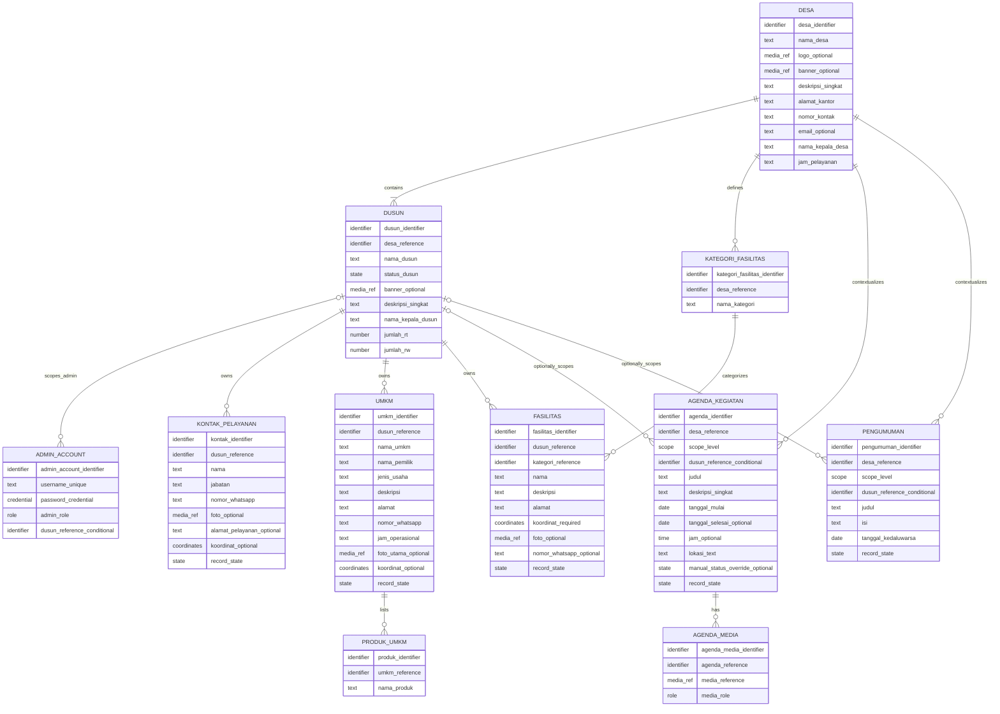

# Document Information

| Field | Value |
| --- | --- |
| Project | Portal Informasi Desa Bendung |
| Document | ERD / Data Model |
| Version | 1.0 |
| Status | FROZEN FOR MVP |
| Requirement Source | Requirements Baseline v1.0 — FROZEN FOR MVP |
| Product Source | PRD v1.0 — FROZEN FOR MVP |
| IA Source | Sitemap v1.0 — FROZEN FOR MVP |
| Behavior Source | User Flows v1.0 — FROZEN FOR MVP |
| Authorization Source | Roles & Permissions v1.0 — FROZEN FOR MVP |

ERD / Data Model v1.0 telah melalui human review. Tidak ditemukan `BASELINE CHANGE REQUEST`, `PRD CHANGE REQUEST`, `SITEMAP CHANGE REQUEST`, `USER FLOW CHANGE REQUEST`, maupun `ROLES/PERMISSIONS CHANGE REQUEST`.

Perubahan data model di masa depan yang mengubah struktur IA, behavior produk, requirement, flow, atau authorization harus mengikuti Change Request terhadap source FROZEN terkait terlebih dahulu.

# 1. Purpose and Boundaries

Dokumen ini menerjemahkan source FROZEN menjadi **Conceptual + Logical Data Model** untuk Portal Informasi Desa Bendung. Model menjelaskan entity, candidate identifier, attribute konseptual, ownership, relationship, cardinality, optionality, lifecycle/state, data-integrity rule, dan implikasi authorization.

Dokumen ini menjadi input bagi technical architecture, physical database schema, migration, API design, backend implementation, authorization enforcement, dan pengujian integritas data. Dokumen ini tidak mengubah requirement upstream.

Termasuk dalam tahap ini:

- entity dan value/reference yang benar-benar diperlukan MVP;
- hubungan dan cardinality konseptual;
- scope `DESA`, `DUSUN`, `OWN_DUSUN`, dan `GLOBAL`;
- pemisahan lifecycle, visibility, dan Soft Delete;
- keputusan konseptual untuk lokasi dan media;
- constraint bisnis serta traceability.

Belum termasuk:

- database engine, ORM, provider, atau framework;
- SQL DDL, tipe data database, primary/foreign key fisik, index, trigger, atau stored procedure;
- UUID versus auto increment;
- RLS, middleware, session/JWT, atau policy-engine implementation;
- API contract, migration code, storage architecture, dan source code.

# 2. Source Hierarchy

Urutan authority yang digunakan:

`Requirements Baseline → PRD → Sitemap → User Flows → Roles & Permissions → ERD / Data Model`

Requirements Baseline tetap authority tertinggi. ERD tidak boleh menambahkan behavior, role, halaman, atau flow. Jika perubahan model membutuhkan perubahan source FROZEN, perubahan harus dilaporkan sebagai Change Request dan tidak diselesaikan diam-diam.

# 3. Modeling Principles

1. **Requirement-driven.** Setiap entity dan rule mempunyai source yang dapat ditelusuri.
2. **No speculative entities.** Entity tidak dibuat hanya karena umum pada implementasi lain.
3. **Explicit ownership.** Data tingkat Dusun mempunyai konteks Dusun yang dapat digunakan untuk isolasi `OWN_DUSUN`.
4. **Lifecycle is not permission.** Lifecycle Agenda dan expiry Pengumuman bukan `ACTIVATE`/`DEACTIVATE` authorization.
5. **Soft Delete is not archive.** Soft Deleted data tidak public; Arsip Pengumuman tetap public dan berasal dari expiry.
6. **Map remains source-driven.** Peta adalah projection dari source entity, bukan business entity atau generic marker storage.
7. **Parent-scoped location and media.** Ownership lokasi dan media mengikuti parent resource.
8. **Technology-agnostic.** Istilah identifier, reference, state, dan cardinality bersifat konseptual.
9. **No premature physical schema.** Detail persistence ditunda sampai Physical Database Schema / Technical Data Design.
10. **Maintainable MVP.** Model paling sederhana yang tetap mampu menjaga requirement dan authorization invariants diprioritaskan.

# 4. Entity Evaluation and Inventory

## 4.1 Evaluation Result

| Candidate Concept | Modeling Result | Reasoning |
| --- | --- | --- |
| Desa | Entity `DESA` | Menyimpan identitas tunggal Desa Bendung dan menjadi konteks root. |
| Dusun + Profil Dusun | Satu entity `DUSUN` | Profil adalah attribute dari Dusun, bukan lifecycle/ownership terpisah. |
| Admin/User | Entity `ADMIN_ACCOUNT` | Diperlukan untuk autentikasi, role, dan binding satu Dusun bagi Admin Dusun. Public User tidak mempunyai account row. |
| Kontak Pelayanan | Entity `KONTAK_PELAYANAN` | Record berulang, owned by Dusun, dapat Soft Delete, dan dapat mempunyai koordinat opsional. |
| UMKM | Entity `UMKM` | Record direktori owned by Dusun dengan produk, media, kontak, dan koordinat opsional. |
| Produk UMKM | Child entity `PRODUK_UMKM` | Satu UMKM dapat memiliki beberapa nama produk; child sederhana menjaga item tetap atomik tanpa menjadi katalog e-commerce. |
| Fasilitas | Entity `FASILITAS` | Record owned by Dusun dengan kategori dan koordinat wajib. |
| Kategori Fasilitas | Entity `KATEGORI_FASILITAS` | Kategori dinamis dikelola Super Admin dan digunakan banyak Fasilitas. |
| Agenda/Kegiatan | Entity `AGENDA_KEGIATAN` | Mendukung exclusive scope Desa/Dusun, lifecycle tanggal, override, dan media. |
| Pengumuman | Entity `PENGUMUMAN` | Mendukung exclusive scope Desa/Dusun, expiry/archive, dan Soft Delete sebagai axis terpisah. |
| Arsip Pengumuman | Bukan entity | Derived public collection dari `PENGUMUMAN` yang expired dan tidak Soft Deleted. |
| Media | Reference pada source entity + child `AGENDA_MEDIA` | Media tunggal sederhana tidak membutuhkan generic polymorphic entity; Agenda membutuhkan repeatable poster/dokumentasi. |
| Lokasi/Koordinat | Value object/attribute pada source entity | Menjaga Peta source-driven dan menghindari duplicate marker/business record. |
| MapMarker | Tidak dibuat | Marker adalah projection public dari Fasilitas, UMKM berkoordinat, dan Kontak Pelayanan yang memenuhi syarat. |

## 4.2 Final Entity Inventory

| Entity | Purpose | Scope | Owner / Parent | MVP Status | Source |
| --- | --- | --- | --- | --- | --- |
| `DESA` | Identitas dan kontak Desa Bendung | Desa | Root context | MVP | `DATA-001`, `DATA-002`, `FR-002`–`FR-004` |
| `DUSUN` | Struktur, profil, dan status enam Dusun | Dusun | `DESA` | MVP | `DATA-003`, `DATA-005`, `FR-005`, `FR-022` |
| `ADMIN_ACCOUNT` | Akun Admin Dusun atau Super Admin | OWN_DUSUN / GLOBAL | Optional `DUSUN` according to role | MVP | `ROLE-002`–`ROLE-005`, `ROLE-008`, `ROLE-009`, `SEC-008` |
| `KONTAK_PELAYANAN` | Direktori layanan dan WhatsApp | Dusun | `DUSUN` | MVP | `DATA-006`–`DATA-008`, `FR-010`, `MAP-010` |
| `UMKM` | Direktori usaha dan tindakan kontak/lokasi | Dusun | `DUSUN` | MVP | `FR-011`, `DATA-009`, `MAP-009`, `MEDIA-003` |
| `PRODUK_UMKM` | Nama produk berulang milik satu UMKM | Dusun via parent | `UMKM` | MVP | `FR-012`, `DATA-009` |
| `KATEGORI_FASILITAS` | Vocabulary kategori Fasilitas dinamis | Global/Desa | `DESA` context | MVP | `DATA-013`, `ROLE-011` |
| `FASILITAS` | Informasi fasilitas dan lokasi wajib | Dusun | `DUSUN`; references category | MVP | `DATA-010`–`DATA-013`, `MAP-008`, `FR-013` |
| `AGENDA_KEGIATAN` | Agenda Desa/Dusun dengan lifecycle tanggal | Desa atau Dusun | `DESA`; optional `DUSUN` by scope | MVP | `FR-014`–`FR-016`, `DATA-014`, `DATA-015`, `DATA-017` |
| `AGENDA_MEDIA` | Poster/dokumentasi repeatable milik Agenda | Inherits Agenda scope | `AGENDA_KEGIATAN` | MVP, optional | `MEDIA-001`, `MEDIA-007` |
| `PENGUMUMAN` | Pengumuman Desa/Dusun dengan expiry dan archive derived | Desa atau Dusun | `DESA`; optional `DUSUN` by scope | MVP | `FR-008`, `FR-017`, `FR-018`, `DATA-016` |

**Jumlah entity final: 11.**

# 5. Entity Definitions

Notation optionality:

- **Required:** ditetapkan source atau diperlukan langsung agar entity memenuhi fungsi dasarnya.
- **Optional:** eksplisit opsional pada source atau hanya ada untuk scope tertentu.
- **Derived:** dihitung/diproyeksikan dan bukan source-of-truth field independen.
- **DERIVED CONSTRAINT:** konsekuensi logis langsung yang diperlukan untuk menjaga requirement.

## 5.1 DESA

**Purpose:** Root context tunggal untuk identitas Portal Desa Bendung dan data tingkat Desa.

**Conceptual identifier:** `desa_identifier`.

| Attribute | Optionality | Meaning |
| --- | --- | --- |
| nama_desa | Required | Nama Desa Bendung. |
| logo_media_reference | Optional | Reference logo Desa; bukan Media entity generik. |
| banner_media_reference | Optional | Reference foto/banner Desa. |
| deskripsi_singkat | Required | Profil singkat Homepage. |
| alamat_kantor | Required | Alamat kantor Desa. |
| nomor_kontak | Required | Kontak kantor Desa. |
| email | Optional | Email Desa jika tersedia. |
| nama_kepala_desa | Required | Nama Kepala Desa. |
| jam_pelayanan | Required | Jam pelayanan kantor Desa. |

**Relationships:** satu DESA mempunyai enam DUSUN awal, banyak KATEGORI_FASILITAS, AGENDA_KEGIATAN, dan PENGUMUMAN dalam konteks portal.

**Lifecycle/state:** tidak ada Soft Delete atau lifecycle khusus yang ditetapkan.

**Ownership:** hanya Super Admin mengelola data tingkat Desa.

**Source:** `FR-002`–`FR-004`, `DATA-001`, `DATA-002`, `ROLE-008`, `ROLE-011`.

## 5.2 DUSUN

**Purpose:** Menyimpan identitas, profil, dan state publik satu Dusun. Profil Dusun tidak dipisah menjadi entity lain.

**Conceptual identifier:** `dusun_identifier`.

| Attribute | Optionality | Meaning |
| --- | --- | --- |
| desa_reference | Required | Parent DESA. |
| nama_dusun | Required | Nama resmi atau placeholder yang berlaku. |
| status_dusun | Required | `ACTIVE` atau `INACTIVE`. |
| banner_media_reference | Optional | Foto/banner Dusun. |
| deskripsi_singkat | Required | Profil ringkas Dusun. |
| nama_kepala_dusun | Required | Nama Kepala Dusun; tidak otomatis menjadi Kontak Pelayanan. |
| jumlah_rt | Required | Jumlah RT. |
| jumlah_rw | Required | Jumlah RW. |

**Relationships:** belongs to satu DESA; mempunyai banyak Admin Dusun, Kontak Pelayanan, UMKM, Fasilitas, Agenda/Kegiatan Dusun, dan Pengumuman Dusun.

**Lifecycle/state:** `ACTIVE` / `INACTIVE`. State ini bukan Soft Delete. Data dan akun terkait tetap tersimpan ketika `INACTIVE`.

**Ownership:** Admin Dusun dapat update profil `OWN_DUSUN`, tetapi hanya Super Admin dapat mengubah `status_dusun`. Hard delete Dusun tidak tersedia melalui UI.

**Source:** `DATA-003`, `DATA-005`, `FR-022`, `ROLE-003`, `ROLE-010`, `SEC-007`.

## 5.3 ADMIN_ACCOUNT

**Purpose:** Menyimpan identity credential konseptual dan role bagi admin yang dapat login. Public User tidak menjadi row pada entity ini.

**Conceptual identifier:** `admin_account_identifier`.

| Attribute | Optionality | Meaning |
| --- | --- | --- |
| username | Required; conceptually unique | Username login. |
| password_credential | Required | Credential yang wajib disimpan menggunakan strong hashing; algoritma tidak dipilih. |
| role | Required | `ADMIN_DUSUN` atau `SUPER_ADMIN`. |
| dusun_reference | Conditional | Tepat satu DUSUN untuk `ADMIN_DUSUN`; kosong untuk `SUPER_ADMIN`. |

**Relationships:** sebuah DUSUN dapat mempunyai nol atau lebih ADMIN_ACCOUNT ber-role `ADMIN_DUSUN`; setiap akun Admin Dusun terkait tepat satu Dusun.

**Lifecycle/state:** secara konseptual akun berada pada lifecycle `ACTIVE → LOGICALLY_REMOVED`. Ketika Super Admin menghapus akun Admin Dusun, akun tidak lagi aktif, tidak dapat digunakan untuk login, dan tidak lagi menjadi Admin Dusun aktif, tetapi identity record dipertahankan secara persisten agar hubungan/histori yang memerlukan identity reference tidak diputus secara destruktif.

Lifecycle ini bukan operational Soft Delete, bukan permission `RESTORE`, dan tidak menciptakan `RESTORE_ADMIN_ACCOUNT`, reactivation, undelete, self-service recovery, atau audit-log feature. Representasi fisik—termasuk apakah menggunakan flag, status, timestamp, enum, atau mekanisme lain—ditunda ke Physical Database Schema / Technical Data Design setelah R&D dan pemilihan database.

**Ownership:** akun dikelola Super Admin. Binding DUSUN menjadi dasar enforcement `OWN_DUSUN`; Super Admin tidak dibatasi DUSUN.

**Source:** `ROLE-002`, `ROLE-004`, `ROLE-005`, `ROLE-008`, `ROLE-009`, `SEC-002`, `SEC-003`, `SEC-008`.

## 5.4 KONTAK_PELAYANAN

**Purpose:** Menyimpan orang/kontak pelayanan yang dapat dipublikasikan pada konteks Dusun.

**Conceptual identifier:** `kontak_identifier`.

| Attribute | Optionality | Meaning |
| --- | --- | --- |
| dusun_reference | Required | Owner DUSUN. |
| nama | Required | Nama kontak. |
| jabatan | Required | Jabatan/jenis pelayanan fleksibel. |
| nomor_whatsapp | Required for public visibility | Nomor untuk handoff WhatsApp. |
| foto_media_reference | Optional | Foto kontak. |
| alamat_pelayanan | Optional | Alamat/titik pelayanan bila relevan dan diizinkan. |
| koordinat | Optional | Pair latitude/longitude konseptual; harus lengkap sebagai satu unit. |
| record_state | Required | `ACTIVE` atau `SOFT_DELETED`; merepresentasikan status operasional/Nonaktif pada MVP. |

**Relationships:** belongs to satu DUSUN.

**Lifecycle/state:** `record_state` mengontrol visibility operasional. Tidak ada consent field digital.

**Ownership:** Admin Dusun mengelola record pada `OWN_DUSUN`; Super Admin `GLOBAL`.

**Source:** `DATA-006`–`DATA-008`, `FR-010`, `MAP-003`, `MAP-010`, `PRIV-001`, `ROLE-006`.

## 5.5 UMKM

**Purpose:** Menyimpan satu usaha dalam direktori informasi, bukan entity transaksi.

**Conceptual identifier:** `umkm_identifier`.

| Attribute | Optionality | Meaning |
| --- | --- | --- |
| dusun_reference | Required | Owner DUSUN. |
| nama_umkm | Required | Nama usaha. |
| nama_pemilik | Required | Nama pemilik. |
| jenis_usaha | Required | Jenis usaha; dapat menjadi sumber kategori tampilan. |
| deskripsi | Required | Deskripsi usaha. |
| alamat | Required | Alamat usaha. |
| nomor_whatsapp | Required | Kontak WhatsApp UMKM. |
| jam_operasional | Required | Informasi jam operasional yang didukung source. |
| foto_utama_media_reference | Optional | Maksimal satu foto utama pada MVP. |
| koordinat | Optional | Pair latitude/longitude; tanpa koordinat UMKM tetap public tetapi bukan marker. |
| record_state | Required | `ACTIVE` atau `SOFT_DELETED`. |

**Relationships:** belongs to satu DUSUN dan mempunyai nol atau lebih PRODUK_UMKM.

**Lifecycle/state:** tidak ada e-commerce state. `record_state` terpisah dari ketersediaan koordinat.

**Ownership:** mengikuti DUSUN; products dan media reference mewarisi scope parent.

**Source:** `FR-011`, `FR-012`, `DATA-009`, `MAP-009`, `MEDIA-003`, `PRIV-001`, `ROLE-006`.

## 5.6 PRODUK_UMKM

**Purpose:** Menyimpan item nama produk dalam list/tags milik UMKM tanpa katalog transaksi.

**Conceptual identifier:** `produk_identifier`.

| Attribute | Optionality | Meaning |
| --- | --- | --- |
| umkm_reference | Required | Parent UMKM. |
| nama_produk | Required | Nama/tag produk. |

**Relationships:** setiap PRODUK_UMKM belongs to tepat satu UMKM; satu UMKM dapat mempunyai beberapa produk.

**Lifecycle/state:** tidak mempunyai state, harga, stok, order, cart, payment, atau lifecycle independen. Visibility dan delete behavior mengikuti parent UMKM.

**Ownership:** inherited dari UMKM dan DUSUN.

**Source:** `FR-012`, `DATA-009`, Roles & Permissions §6.

## 5.7 KATEGORI_FASILITAS

**Purpose:** Menyimpan kategori dinamis yang dipakai Fasilitas.

**Conceptual identifier:** `kategori_fasilitas_identifier`.

| Attribute | Optionality | Meaning |
| --- | --- | --- |
| desa_reference | Required | Context Desa untuk vocabulary global portal. |
| nama_kategori | Required | Nama kategori. |

**Relationships:** satu KATEGORI_FASILITAS digunakan nol atau lebih FASILITAS; setiap FASILITAS mempunyai tepat satu category reference.

**Lifecycle/state:** tidak ditetapkan state khusus. Cascade deletion tidak ditentukan.

**Ownership:** hanya Super Admin dapat create/update. Admin Dusun hanya menggunakan kategori tersedia.

**Source:** `DATA-013`, `ROLE-011`, Roles & Permissions §15.

## 5.8 FASILITAS

**Purpose:** Menyimpan fasilitas Dusun beserta category dan titik wajib untuk Peta.

**Conceptual identifier:** `fasilitas_identifier`.

| Attribute | Optionality | Meaning |
| --- | --- | --- |
| dusun_reference | Required | Owner DUSUN. |
| kategori_fasilitas_reference | Required | Kategori dinamis. |
| nama | Required | Nama fasilitas. |
| deskripsi | Required | Deskripsi fasilitas. |
| alamat | Required | Alamat fasilitas. |
| koordinat | Required | Pair latitude/longitude lengkap. |
| foto_media_reference | Optional | Foto fasilitas. |
| nomor_whatsapp | Optional | Kontak fasilitas; action WhatsApp hanya jika tersedia. |
| record_state | Required | `ACTIVE` atau `SOFT_DELETED`. |

**Relationships:** belongs to satu DUSUN dan satu KATEGORI_FASILITAS.

**Lifecycle/state:** `record_state` menentukan visibility operasional; kategori bukan lifecycle.

**Ownership:** Admin Dusun `OWN_DUSUN`; Super Admin `GLOBAL`.

**Source:** `DATA-010`–`DATA-013`, `MAP-008`, `FR-013`, `ROLE-006`.

## 5.9 AGENDA_KEGIATAN

**Purpose:** Menyimpan Agenda/Kegiatan tingkat Desa atau Dusun dengan lifecycle yang bersumber pada tanggal.

**Conceptual identifier:** `agenda_identifier`.

| Attribute | Optionality | Meaning |
| --- | --- | --- |
| desa_reference | Required | Context Desa Bendung. |
| scope_level | Required | `DESA` atau `DUSUN`. |
| dusun_reference | Conditional | Required hanya ketika `scope_level = DUSUN`; kosong untuk scope Desa. |
| judul | Required | Judul kegiatan. |
| deskripsi_singkat | Required | Ringkasan kegiatan. |
| tanggal_mulai | Required | Source-of-truth awal lifecycle. |
| tanggal_selesai | Optional | Untuk kegiatan multi-hari; tanggal mulai dipakai sebagai effective end bila kosong. |
| jam | Optional | Jam kegiatan. |
| lokasi_text | Required | Keterangan lokasi kegiatan; bukan marker Peta otomatis. |
| manual_status_override | Optional | Salah satu `AKAN_DATANG`, `BERLANGSUNG`, `SELESAI`. |
| calculated_status | Derived | Dihitung dari tanggal; digunakan bila manual override kosong. |
| effective_status | Derived | Manual override bila ada, selain itu calculated status. |
| record_state | Required | `ACTIVE` atau `SOFT_DELETED`; axis terpisah dari lifecycle. |

**Relationships:** belongs to satu DESA context; optional belongs to satu DUSUN menurut exclusive scope; mempunyai nol atau lebih AGENDA_MEDIA.

**Lifecycle/state:** tanggal adalah source of truth untuk default lifecycle. Override tidak mengubah tanggal dan bukan permission `ACTIVATE`/`DEACTIVATE`.

**Ownership:** Agenda Desa hanya dikelola Super Admin; Agenda Dusun dikelola Admin Dusun owner atau Super Admin.

**Source:** `FR-014`–`FR-016`, `DATA-014`, `DATA-015`, `DATA-017`, `MEDIA-007`, `ROLE-003`, `ROLE-011`.

## 5.10 AGENDA_MEDIA

**Purpose:** Menyimpan reference media repeatable khusus Agenda tanpa membentuk generic polymorphic media system.

**Conceptual identifier:** `agenda_media_identifier`.

| Attribute | Optionality | Meaning |
| --- | --- | --- |
| agenda_reference | Required | Parent AGENDA_KEGIATAN. |
| media_reference | Required | Reference media; storage representation belum ditentukan. |
| media_role | Required | `POSTER_AWAL` atau `DOKUMENTASI`. |

**Relationships:** setiap AGENDA_MEDIA belongs to satu AGENDA_KEGIATAN; Agenda dapat mempunyai nol atau lebih media.

**Lifecycle/state:** inherited dari Agenda. Dokumentasi digunakan untuk kegiatan selesai; media tidak mempunyai ownership independen.

**Ownership:** inherited dari Agenda dan scope Desa/Dusun.

**Source:** `MEDIA-001`, `MEDIA-007`, `FR-014`.

## 5.11 PENGUMUMAN

**Purpose:** Menyimpan Pengumuman tingkat Desa atau Dusun dengan expiry-derived public archive.

**Conceptual identifier:** `pengumuman_identifier`.

| Attribute | Optionality | Meaning |
| --- | --- | --- |
| desa_reference | Required | Context Desa Bendung. |
| scope_level | Required | `DESA` atau `DUSUN`. |
| dusun_reference | Conditional | Required hanya ketika scope Dusun; kosong untuk scope Desa. |
| judul | Required — DERIVED CONSTRAINT | Identifier manusiawi untuk daftar/detail Pengumuman. |
| isi | Required — DERIVED CONSTRAINT | Konten yang dibaca pada Detail Pengumuman. |
| tanggal_kedaluwarsa | Required | Source-of-truth lifecycle active/archive. |
| expiry_state | Derived | `AKTIF` sebelum/pada expiry; `KEDALUWARSA_ARSIP` setelah expiry. |
| record_state | Required | `ACTIVE` atau `SOFT_DELETED`; axis terpisah dari expiry. |

**Relationships:** belongs to satu DESA context; optional belongs to satu DUSUN menurut exclusive scope.

**Lifecycle/state:** Arsip Pengumuman bukan entity dan bukan state delete. Public archive query hanya memilih record expired yang tidak Soft Deleted dan whose scope remains publicly visible.

**Ownership:** Pengumuman Desa hanya dikelola Super Admin; Pengumuman Dusun dikelola Admin Dusun owner atau Super Admin.

**Source:** `FR-008`, `FR-017`, `FR-018`, `DATA-016`, `ROLE-006`, `ROLE-011`.

# 6. Relationship Matrix

| No. | Parent | Child | Cardinality | Child Required? | Meaning |
| ---: | --- | --- | --- | --- | --- |
| 1 | `DESA` | `DUSUN` | 1 : many | Yes | Setiap Dusun berada dalam satu Desa; MVP dimulai dengan enam Dusun. |
| 2 | `DUSUN` | `ADMIN_ACCOUNT` | 1 : 0..many | Conditional | Hanya akun `ADMIN_DUSUN` yang wajib terikat tepat satu Dusun; `SUPER_ADMIN` tidak terikat Dusun. |
| 3 | `DUSUN` | `KONTAK_PELAYANAN` | 1 : 0..many | Yes | Setiap Kontak Pelayanan dimiliki satu Dusun. |
| 4 | `DUSUN` | `UMKM` | 1 : 0..many | Yes | Setiap UMKM dimiliki satu Dusun. |
| 5 | `UMKM` | `PRODUK_UMKM` | 1 : 0..many | Yes | Produk adalah child sederhana satu UMKM. |
| 6 | `DESA` | `KATEGORI_FASILITAS` | 1 : 0..many | Yes | Vocabulary kategori berlaku pada konteks Desa. |
| 7 | `KATEGORI_FASILITAS` | `FASILITAS` | 1 : 0..many | Yes | Setiap Fasilitas menggunakan tepat satu kategori. |
| 8 | `DUSUN` | `FASILITAS` | 1 : 0..many | Yes | Setiap Fasilitas dimiliki satu Dusun. |
| 9 | `DESA` | `AGENDA_KEGIATAN` | 1 : 0..many | Yes | Semua Agenda berada dalam konteks portal Desa. |
| 10 | `DUSUN` | `AGENDA_KEGIATAN` | 0..1 : 0..many | Conditional | Reference Dusun wajib hanya untuk Agenda scope `DUSUN`. |
| 11 | `AGENDA_KEGIATAN` | `AGENDA_MEDIA` | 1 : 0..many | Yes | Media Agenda selalu mengikuti parent Agenda. |
| 12 | `DESA` | `PENGUMUMAN` | 1 : 0..many | Yes | Semua Pengumuman berada dalam konteks portal Desa. |
| 13 | `DUSUN` | `PENGUMUMAN` | 0..1 : 0..many | Conditional | Reference Dusun wajib hanya untuk Pengumuman scope `DUSUN`. |

**Jumlah relationship utama: 13.** Tidak ada many-to-many relationship pada MVP. Tidak ada relationship MapMarker, Cart, Order, Payment, Stock, Consent, atau Page Builder.

# 7. ER Diagram

Diagram berikut bersifat conceptual/logical. Nama attribute dan `identifier` bukan nama kolom, tipe database, PK/FK fisik, atau keputusan implementation.



# 8. Lifecycle and State Model

## 8.1 Dusun Lifecycle

`ACTIVE ↔ INACTIVE`

- Hanya Super Admin mengubah state.
- `INACTIVE` menghilangkan Dusun, konten normal, dan titik terkait dari public projection.
- Data, relationship, dan akun Admin Dusun tetap tersimpan.
- Admin Dusun tetap dapat login dan mengelola data `OWN_DUSUN`.
- Pengaktifan kembali tidak me-restore child yang berstatus `SOFT_DELETED`.
- State ini bukan Soft Delete dan tidak menyediakan hard delete Dusun.

## 8.2 Operational Data State

Entity operasional `KONTAK_PELAYANAN`, `UMKM`, `FASILITAS`, `AGENDA_KEGIATAN`, dan `PENGUMUMAN` mempunyai axis:

`ACTIVE ↔ SOFT_DELETED`

- `SOFT_DELETED` tidak tampil public dan tetap tersimpan.
- Admin Dusun dapat Soft Delete dalam `OWN_DUSUN`.
- Super Admin dapat Soft Delete dan restore dalam `GLOBAL`.
- Restore hanya mengubah axis operational state; lifecycle/expiry lain tetap dihitung secara independen.
- Representasi dashboard, tab, filter, timestamp, atau flag fisik belum ditentukan.

Child `PRODUK_UMKM` dan `AGENDA_MEDIA` mengikuti operational state parent dan tidak mempunyai Soft Delete independen pada model MVP.

## 8.3 Agenda Lifecycle

Source-of-truth lifecycle adalah tanggal:

```text
effective_end = tanggal_selesai bila tersedia, selain itu tanggal_mulai

today < tanggal_mulai                    → AKAN_DATANG
tanggal_mulai <= today <= effective_end → BERLANGSUNG
today > effective_end                   → SELESAI
```

`manual_status_override` bersifat opsional dan hanya dapat berisi tiga value yang sama. `effective_status` menggunakan override bila tersedia, selain itu menggunakan calculated status. Override tidak menimpa tanggal dan bukan permission `ACTIVATE`/`DEACTIVATE`.

Public visibility Agenda tetap memerlukan `record_state = ACTIVE` serta, untuk scope Dusun, parent DUSUN berstatus `ACTIVE`.

## 8.4 Pengumuman Lifecycle

Expiry dan Soft Delete adalah dua axis berbeda:

| Expiry State | Record State | Public Result |
| --- | --- | --- |
| Sebelum/pada `tanggal_kedaluwarsa` | `ACTIVE` | Daftar Pengumuman aktif pada scope terkait |
| Setelah `tanggal_kedaluwarsa` | `ACTIVE` | Arsip Pengumuman public pada scope terkait |
| Sebelum/pada atau setelah expiry | `SOFT_DELETED` | Tidak public; bukan Arsip Pengumuman |

Untuk scope Dusun, parent DUSUN juga harus `ACTIVE` agar record dapat tampil public. Expiry bukan permission `ACTIVATE`/`DEACTIVATE`, dan Arsip Pengumuman bukan entity atau generic archive.

## 8.5 Admin Account Lifecycle

Lifecycle konseptual akun Admin Dusun adalah:

`ACTIVE → LOGICALLY_REMOVED`

- `ACTIVE`: akun dapat digunakan untuk login dan berfungsi sebagai Admin Dusun pada satu binding DUSUN.
- `LOGICALLY_REMOVED`: akun tidak dapat login dan tidak lagi menjadi Admin Dusun aktif, tetapi identity record dipertahankan agar referensi identity/histori tidak diputus secara destruktif.
- Perubahan ini hanya dapat dipicu melalui kemampuan penghapusan akun milik Super Admin (`ROLE-009`).
- Lifecycle ini bukan operational `SOFT_DELETED`, tidak mempunyai permission restore, dan tidak menentukan reactivation/undelete flow.
- Jika akun aktif baru diperlukan kemudian, operasionalnya menggunakan kemampuan create/manage akun milik Super Admin, bukan restore record yang telah dihapus.
- Model tidak menetapkan nama field, timestamp, enum, physical row deletion, trigger, atau database policy untuk merepresentasikannya.

# 9. Ownership and Authorization Mapping

## 9.1 Entity-Level Implications

| Entity / Value | Public User | Admin Dusun | Super Admin | Model Enforcement Basis |
| --- | --- | --- | --- | --- |
| `DESA` | Public projection | No write | GLOBAL management | Root Desa context |
| `DUSUN` | Hanya `ACTIVE` | View/update profil own; no status change | GLOBAL update/status | Direct entity state and admin binding |
| `ADMIN_ACCOUNT` | No account/access | Own authentication only; no admin management | Create/manage/assign/reset/logical removal | Role, conditional Dusun binding, dan retained identity lifecycle |
| `KONTAK_PELAYANAN` | Active, authorized, parent Dusun active | CRUD/Soft Delete `OWN_DUSUN` | GLOBAL incl. restore/hard delete | Required `dusun_reference` |
| `UMKM` + `PRODUK_UMKM` | Active parent; marker only with coordinates | Manage parent/children `OWN_DUSUN` | GLOBAL | Required UMKM–Dusun relationship |
| `FASILITAS` | Active, parent Dusun active | Manage `OWN_DUSUN` using available categories | GLOBAL | Required Dusun and Category relationships |
| `KATEGORI_FASILITAS` | Visible through public Fasilitas | Read/use only | Create/update GLOBAL | Desa-level vocabulary |
| `AGENDA_KEGIATAN` + `AGENDA_MEDIA` | Active based on scope/state | Manage only scope Dusun own | Manage Desa and all Dusun | `scope_level` + conditional Dusun reference |
| `PENGUMUMAN` | Active list or archive by expiry | Manage only scope Dusun own | Manage Desa and all Dusun | `scope_level`, expiry, and record state |
| Koordinat/media reference | Public only with parent visibility/permission | Inherits `OWN_DUSUN` parent | Inherits GLOBAL parent | No independent owner/entity |

`MANAGE` selalu tunduk pada scope, resource applicability, delete semantics, dan prohibited actions di Roles & Permissions v1.0.

## 9.2 Authorization Invariant Coverage

| Invariant | Data Model Support |
| --- | --- |
| `AUTH-INV-001` | Semua data Dusun mempunyai direct/derived path ke `DUSUN`; Admin Account mempunyai tepat satu Dusun. |
| `AUTH-INV-002` | Public User tidak direpresentasikan sebagai account dan hanya membaca public projection. |
| `AUTH-INV-003` | Operational data state dapat dipulihkan tanpa kehilangan record; authorization restore tetap Super Admin. Retained ADMIN_ACCOUNT identity tidak membentuk restore permission akun. |
| `AUTH-INV-004` | DUSUN memakai ACTIVE/INACTIVE tanpa Soft Delete/hard-delete lifecycle. |
| `AUTH-INV-005` | Entity selain DUSUN dapat menjadi target hard delete oleh Super Admin; mekanisme fisik belum ditentukan. |
| `AUTH-INV-006` | Status DUSUN tidak menghapus/menonaktifkan binding ADMIN_ACCOUNT. |
| `AUTH-INV-007` | Public projection mensyaratkan `record_state = ACTIVE`. |
| `AUTH-INV-008` | Arsip diturunkan dari expiry Pengumuman aktif, terpisah dari `record_state`. |
| `AUTH-INV-009` | Homepage mengambil DESA/DUSUN/AGENDA/PENGUMUMAN dan source map; tidak ada PageBuilder entity. |
| `AUTH-INV-010` | Koordinat dan media reference berada pada/di bawah parent resource. |
| `AUTH-INV-011` | Entity Desa-level dan status DUSUN dapat dibedakan dari data `OWN_DUSUN`. |
| `AUTH-INV-012` | Tidak ada approval, moderation, atau content-approval entity/state. |

**Authorization Invariant coverage: 12/12.**

## 9.3 User Flow Coverage

| Flow ID | Data Model Support |
| --- | --- |
| `UF-PUB-001` | DESA → DUSUN `ACTIVE` menyediakan QR/Homepage/Dusun data destination. |
| `UF-PUB-002` | DESA, Agenda scope Desa, Pengumuman scope Desa, dan derived Map projection menyediakan informasi Homepage. |
| `UF-PUB-003` | DUSUN menjadi owner semua section data Dusun. |
| `UF-PUB-004` | Koordinat pada Fasilitas/UMKM/Kontak menghasilkan marker projection tanpa MapMarker entity. |
| `UF-PUB-005` | Kontak aktif mempunyai WhatsApp dan scope Dusun. |
| `UF-PUB-006` | UMKM mempunyai products, WhatsApp, foto utama optional, dan coordinates optional. |
| `UF-PUB-007` | Fasilitas mempunyai category, coordinates required, dan WhatsApp optional. |
| `UF-PUB-008` | Agenda mempunyai scope, dates, derived/override status, dan AgendaMedia. |
| `UF-PUB-009` | Pengumuman memisahkan expiry archive dari Soft Delete. |
| `UF-PUB-010` | Relasi 0..many memungkinkan section kosong tanpa menghapus struktur parent. |
| `UF-AD-001` | ADMIN_ACCOUNT role dan tepat satu Dusun menentukan dashboard context. |
| `UF-AD-002` | Entity operasional mendukung create langsung pada owner Dusun; tidak ada approval entity. |
| `UF-AD-003` | Direct ownership path mendukung update `OWN_DUSUN`. |
| `UF-AD-004` | `record_state` mendukung Soft Delete tanpa kehilangan record. |
| `UF-AD-005` | Profil menjadi attribute DUSUN yang dapat di-update tanpa status change. |
| `UF-AD-006` | Binding ADMIN_ACCOUNT tetap ada ketika DUSUN `INACTIVE`. |
| `UF-SA-001` | ADMIN_ACCOUNT role `SUPER_ADMIN` mempunyai scope global tanpa Dusun binding. |
| `UF-SA-002` | Semua entity mempunyai Desa/Dusun context yang dapat dikelola GLOBAL. |
| `UF-SA-003` | Operational `record_state` mendukung restore. |
| `UF-SA-004` | Entity selain DUSUN dapat dihapus permanen sesuai authorization; physical semantics deferred. |
| `UF-SA-005` | `status_dusun = INACTIVE` mempertahankan child data dan admin binding. |
| `UF-SA-006` | `status_dusun = ACTIVE` memulihkan parent visibility tanpa mengubah child Soft Delete state. |
| `UF-SA-007` | ADMIN_ACCOUNT mendukung multiple admins per Dusun, binding tepat satu Dusun, dan logical removal dengan retained identity record. |
| `UF-SA-008` | ADMIN_ACCOUNT mempunyai password credential yang dapat diganti/reset. |
| `UF-SA-009` | Homepage bersumber dari DESA, DUSUN, Agenda, Pengumuman, dan projection lokasi; tidak ada page builder. |

**User Flow coverage: 25/25 (10 Public, 6 Admin Dusun, 9 Super Admin).**

# 10. Map / Location Modeling Decision

## 10.1 Option Comparison

| Criterion | Option A — Coordinates on Source Entity | Option B — Shared LOCATION Entity |
| --- | --- | --- |
| Source ownership | Directly matches Fasilitas, UMKM, or Kontak Pelayanan | Requires an extra association layer |
| Duplication | One coordinate value object per relevant source; no duplicate marker record | Avoids repeated coordinate field shape but adds location row/reference |
| Optionality | Natural: required on Fasilitas, optional on UMKM/Kontak | Must express different requiredness through relationship constraints |
| Referential integrity | Simple parent-owned value | Strong reusable location identity, but reuse is not required by source |
| Public filtering | Derived from source entity + parent Dusun state | Derived through shared entity plus source joins |
| Extensibility | Sufficient for MVP marker sources | Better if many entities share/reuse one physical place later |
| Complexity | Lower; no polymorphic association | Higher; risks generic `map_points` pattern or duplicated business meaning |
| Maintainability | Easy to explain during handover | More abstract than current MVP requires |

## 10.2 Selected Approach

**FROZEN decision: Option A — Coordinates on Source Entity.**

Reasoning:

1. Fasilitas, UMKM, dan Kontak Pelayanan tetap menjadi source of truth bisnis.
2. Requiredness berbeda secara jelas: Fasilitas wajib; UMKM dan Kontak Pelayanan opsional.
3. Tidak ada requirement untuk satu location record dipakai bersama beberapa business entity.
4. Model mendukung `AUTH-INV-010` karena coordinates mengikuti parent ownership.
5. Peta Desa dan Peta Dusun dapat dibentuk sebagai read projection tanpa entity `MAP_MARKER` atau `LOCATION` independen.

`koordinat` adalah conceptual value object yang harus berisi latitude dan longitude secara lengkap atau kosong sebagai satu unit. Representasi database fisik belum dipilih.

## 10.3 Derived Map Projection

Marker public dibentuk dari:

- FASILITAS dengan `record_state = ACTIVE`, coordinates tersedia, dan parent DUSUN `ACTIVE`;
- UMKM dengan `record_state = ACTIVE`, coordinates tersedia, dan parent DUSUN `ACTIVE`;
- KONTAK_PELAYANAN dengan `record_state = ACTIVE`, coordinates tersedia, relevan sebagai titik pelayanan, izin offline telah diperoleh, dan parent DUSUN `ACTIVE`.

Peta Desa membaca seluruh eligible source dari Dusun aktif. Peta Dusun menggunakan projection yang sama dengan scope satu Dusun. Marker, popup, dan filter bukan entity persistence baru.

## 10.4 Derived Map Filter Taxonomy

Human review menetapkan **DERIVED TAXONOMY** tanpa entity kategori Peta universal:

| Marker Source | Derived Map Category |
| --- | --- |
| `UMKM` | Konstanta konseptual `UMKM` |
| `KONTAK_PELAYANAN` yang eligible | Konstanta konseptual `PELAYANAN` |
| `FASILITAS` | Nama/value dari `KATEGORI_FASILITAS` yang terkait |

`SEMUA` bukan category value yang disimpan. `SEMUA` hanya opsi presentation/query untuk tidak membatasi hasil berdasarkan kategori.

Derived taxonomy tidak membuat `MAP_CATEGORY`, `LOCATION_CATEGORY`, `MARKER_CATEGORY`, universal category table, independent category ownership, atau generic map-point business entity. `KATEGORI_FASILITAS` tetap satu-satunya category entity yang persisted dalam model ini dan tidak diduplikasi untuk Peta. Exact query implementation ditunda ke tahap teknis.

# 11. Media Modeling Decision

## 11.1 Option Comparison

| Criterion | Option A — Source References + AGENDA_MEDIA | Option B — Generic MEDIA Entity for All Owners |
| --- | --- | --- |
| MVP media shape | Direct refs untuk logo/banner/foto tunggal; child untuk media Agenda | Satu abstraction untuk seluruh media |
| UMKM one-main-photo rule | Langsung terlihat sebagai satu optional reference | Membutuhkan constraint role/count tambahan |
| Agenda documentation | Didukung oleh child repeatable `AGENDA_MEDIA` | Didukung melalui generic owner association |
| Ownership | Eksplisit mengikuti setiap parent | Memerlukan polymorphic owner atau banyak junction |
| Complexity | Rendah dan source-specific | Lebih tinggi; generic polymorphism belum diperlukan source |
| Future multi-photo UMKM | Membutuhkan perubahan model saat FUTURE disetujui | Lebih siap, tetapi membocorkan future abstraction ke MVP |
| Maintainability | Mudah dipahami operator/developer berikutnya | Lebih fleksibel tetapi lebih abstrak |

## 11.2 Selected Approach

**FROZEN decision: Option A — source-owned media references plus `AGENDA_MEDIA`.**

- DESA mempunyai optional logo dan banner reference.
- DUSUN mempunyai optional banner reference.
- KONTAK_PELAYANAN mempunyai optional photo reference.
- UMKM mempunyai maksimal satu optional main-photo reference pada MVP.
- FASILITAS mempunyai optional photo reference.
- AGENDA_KEGIATAN mempunyai child `AGENDA_MEDIA` untuk role poster awal dan dokumentasi.

Keputusan ini tidak menetapkan storage path, upload table, CDN, file metadata, image library, atau pipeline optimasi. Placeholder adalah presentation fallback, bukan record media wajib. `MEDIA-004` multi-photo UMKM tetap FUTURE dan tidak dimodelkan aktif.

# 12. Data Integrity Rules

ID berikut adalah normalisasi data-model dari source FROZEN. ID ini bukan requirement produk baru.

| ID | Rule | Basis |
| --- | --- | --- |
| `ERD-DIR-001` | Portal MVP mempunyai satu context DESA Bendung. | Product scope; `DATA-001` |
| `ERD-DIR-002` | DESA mempunyai enam DUSUN awal; create Dusun baru bukan capability MVP. | `DATA-003`, `DATA-004` |
| `ERD-DIR-003` | Setiap DUSUN belongs to tepat satu DESA. | DERIVED CONSTRAINT dari context produk |
| `ERD-DIR-004` | `status_dusun` hanya `ACTIVE` atau `INACTIVE`. | `FR-022`, `ROLE-010` |
| `ERD-DIR-005` | Mengubah DUSUN ke `INACTIVE` tidak menghapus child data atau Admin binding. | `FR-022`, `AUTH-INV-006` |
| `ERD-DIR-006` | DUSUN tidak mempunyai hard-delete operation melalui UI. | `SEC-007`, `AUTH-INV-004` |
| `ERD-DIR-007` | Public User tidak mempunyai ADMIN_ACCOUNT. | `FR-001`, `ROLE-001` |
| `ERD-DIR-008` | ADMIN_ACCOUNT role hanya `ADMIN_DUSUN` atau `SUPER_ADMIN`. | Roles & Permissions §2 |
| `ERD-DIR-009` | Akun `ADMIN_DUSUN` wajib terkait tepat satu DUSUN; `SUPER_ADMIN` tidak terkait DUSUN. | `ROLE-004`, `SEC-003` |
| `ERD-DIR-010` | Satu DUSUN dapat mempunyai nol atau lebih Admin Dusun. | `ROLE-002` |
| `ERD-DIR-011` | Username ADMIN_ACCOUNT harus unik secara konseptual. | DERIVED CONSTRAINT untuk autentikasi username |
| `ERD-DIR-012` | KONTAK_PELAYANAN, UMKM, dan FASILITAS wajib mempunyai satu owner DUSUN. | `ROLE-003`, `SEC-003` |
| `ERD-DIR-013` | KONTAK_PELAYANAN yang public wajib mempunyai nomor WhatsApp. | `DATA-007` |
| `ERD-DIR-014` | Data privat hanya dimasukkan setelah izin offline; tidak ada consent field/entity digital. | `PRIV-001` |
| `ERD-DIR-015` | Koordinat KONTAK_PELAYANAN opsional dan harus lengkap sebagai pair bila tersedia. | `MAP-010`; DERIVED pair integrity |
| `ERD-DIR-016` | Koordinat UMKM opsional dan harus lengkap sebagai pair bila tersedia. | `MAP-009`; DERIVED pair integrity |
| `ERD-DIR-017` | UMKM tanpa koordinat tetap public/directory-eligible tetapi tidak menghasilkan marker. | `MAP-009` |
| `ERD-DIR-018` | UMKM mempunyai maksimal satu foto utama pada MVP. | `MEDIA-003` |
| `ERD-DIR-019` | Setiap PRODUK_UMKM belongs to tepat satu UMKM dan mengikuti parent visibility/ownership. | `FR-012`, Roles & Permissions §6 |
| `ERD-DIR-020` | PRODUK_UMKM tidak mempunyai price, stock, cart, order, payment, atau transaction state. | `FR-011`, `FR-012` |
| `ERD-DIR-021` | Setiap FASILITAS wajib menggunakan tepat satu KATEGORI_FASILITAS yang tersedia. | `DATA-011`, `DATA-013`; DERIVED cardinality |
| `ERD-DIR-022` | Setiap FASILITAS wajib mempunyai pair koordinat lengkap. | `MAP-008` |
| `ERD-DIR-023` | Nomor Fasilitas opsional; action WhatsApp hanya tersedia bila nomor ada. | `DATA-012`, `FR-013` |
| `ERD-DIR-024` | Agenda scope `DESA` tidak mempunyai dusun_reference; scope `DUSUN` wajib mempunyai tepat satu. | `FR-016`; DERIVED exclusive-scope constraint |
| `ERD-DIR-025` | Pengumuman scope `DESA` tidak mempunyai dusun_reference; scope `DUSUN` wajib mempunyai tepat satu. | `FR-017`; DERIVED exclusive-scope constraint |
| `ERD-DIR-026` | Tanggal selesai Agenda tidak boleh sebelum tanggal mulai; bila kosong, tanggal mulai menjadi effective end. | `FR-015`; DERIVED date integrity |
| `ERD-DIR-027` | Default lifecycle Agenda dihitung dari tanggal; optional override hanya tiga status yang sama dan tidak mengganti date source. | `FR-015` |
| `ERD-DIR-028` | AGENDA_MEDIA wajib belongs to satu Agenda; role hanya poster awal atau dokumentasi. | `MEDIA-007`; DERIVED child integrity |
| `ERD-DIR-029` | Expiry Pengumuman menentukan active/archive lifecycle dan bukan `ACTIVATE`/`DEACTIVATE` permission. | `DATA-016`, `FR-018` |
| `ERD-DIR-030` | Arsip Pengumuman hanya berisi Pengumuman expired yang `record_state = ACTIVE`; Soft Deleted tidak masuk arsip. | `FR-018`, `AUTH-INV-008` |
| `ERD-DIR-031` | Operational `SOFT_DELETED` tidak public, tetap tersimpan, dan dapat di-restore Super Admin. | `ROLE-006`, `ROLE-008` |
| `ERD-DIR-032` | Admin Dusun tidak restore/hard delete; hard delete data selain DUSUN hanya Super Admin. | `SEC-009`, `AUTH-INV-003`, `AUTH-INV-005` |
| `ERD-DIR-033` | Marker Peta hanya derived projection dari source entity eligible dan parent DUSUN `ACTIVE`. Kategori marker diturunkan sebagai `UMKM`, `PELAYANAN`, atau value KATEGORI_FASILITAS; `SEMUA` hanya opsi query dan tidak disimpan. Tidak ada independent MapMarker, MapCategory, atau category ownership baru. | `MAP-001`–`MAP-005`, `DATA-013`, `ROLE-011`, `PRIV-001`, `AUTH-INV-010` |
| `ERD-DIR-034` | Media reference dan AGENDA_MEDIA mewarisi ownership, visibility, dan privacy boundary parent. | `MEDIA-001`, `MEDIA-007`, `PRIV-001`, `AUTH-INV-010` |
| `ERD-DIR-035` | Penghapusan operasional Admin Dusun mengubah lifecycle konseptual akun dari `ACTIVE` menjadi `LOGICALLY_REMOVED`: login dan status Admin aktif berakhir, identity record tetap dipertahankan, dan tidak ada `RESTORE_ADMIN_ACCOUNT`. Representasi persistence fisik ditunda. | `ROLE-009`, Roles & Permissions §11–§12 |

**Jumlah Data Integrity Rules: 35.**

# 13. Traceability Matrix

| Entity / Relationship / Rule | Source Requirement / Flow / Permission |
| --- | --- |
| `DESA` and Homepage projection | `FR-002`–`FR-004`, `DATA-001`, `DATA-002`, `ROLE-008`; `UF-PUB-002`, `UF-SA-009` |
| `DESA 1:M DUSUN` | `DATA-003`, `DATA-004`, `FR-022`; `UF-PUB-001`, `UF-SA-005`, `UF-SA-006` |
| `DUSUN` profile and lifecycle | `DATA-005`, `FR-022`, `ROLE-003`, `ROLE-010`, `SEC-007`; `UF-AD-005`, `UF-AD-006` |
| `DUSUN 1:M ADMIN_ACCOUNT` | `ROLE-002`, `ROLE-004`, `SEC-003`, `SEC-008`; `UF-AD-001`, `UF-SA-007`, `UF-SA-008` |
| `ADMIN_ACCOUNT` role/credential | `ROLE-005`, `ROLE-008`, `ROLE-009`, `SEC-001`, `SEC-002`, `SEC-008`; `UF-SA-001` |
| ADMIN_ACCOUNT logical removal / retained identity | `ROLE-009`; Roles & Permissions §11–§12; `UF-SA-007` |
| `KONTAK_PELAYANAN` and optional coordinates | `DATA-006`–`DATA-008`, `FR-010`, `MAP-003`, `MAP-010`, `PRIV-001`; `UF-PUB-005` |
| `UMKM 1:M PRODUK_UMKM` | `FR-011`, `FR-012`, `DATA-009`, `MAP-009`, `MEDIA-003`; `UF-PUB-006` |
| `KATEGORI_FASILITAS 1:M FASILITAS` | `DATA-010`–`DATA-013`, `ROLE-011`; `UF-PUB-007`, `UF-SA-002` |
| Required Fasilitas coordinates | `MAP-008`; `UF-PUB-004`, `UF-PUB-007`, `UF-AD-002` |
| Agenda exclusive scope | `FR-014`, `FR-016`, `ROLE-003`, `ROLE-011`; `UF-PUB-008`, `UF-SA-002` |
| Agenda date lifecycle and override | `FR-015`, `DATA-014`, `DATA-015`, `DATA-017`; `UF-PUB-008` |
| `AGENDA_KEGIATAN 1:M AGENDA_MEDIA` | `MEDIA-001`, `MEDIA-007`; `UF-PUB-008`, `UF-AD-002` |
| Pengumuman exclusive scope | `FR-008`, `FR-017`, `ROLE-003`, `ROLE-011`; `UF-PUB-009` |
| Announcement expiry/public archive | `FR-018`, `DATA-016`, `AUTH-INV-008`; `UF-PUB-009` |
| Operational Soft Delete | `ROLE-006`, `ROLE-008`, `SEC-009`; `UF-AD-004`, `UF-SA-003`, `UF-SA-004` |
| Source-owned coordinates and map projection | `MAP-001`–`MAP-010`, `PRIV-001`; `UF-PUB-004`, `UF-SA-009` |
| Derived map filter taxonomy | `MAP-003`, `MAP-005`, `DATA-013`, `ROLE-011`; PRD §15, §18; `UF-PUB-004` |
| Source-owned media references | `MEDIA-001`–`MEDIA-003`, `MEDIA-006`, `MEDIA-007`, `PRIV-001`; `UF-AD-002`, `UF-SA-002` |
| No approval/page builder/order entity | `FR-004`, `FR-019`, `ROLE-007`, `AUTH-INV-009`, `AUTH-INV-012`; `UF-AD-002`, `UF-SA-009` |

## 13.1 Future Boundary

Enam FUTURE requirement tidak menjadi capability/entity aktif MVP:

| Requirement | Data Model Boundary |
| --- | --- |
| `DATA-004` | Model mempunyai DUSUN, tetapi create Dusun baru tidak aktif pada MVP. |
| `FR-020` | Tidak ada entity QR-per-Dusun. |
| `MEDIA-004` | Tidak ada multi-photo UMKM relationship pada MVP. |
| `MAP-011` | Tidak ada search-index/entity location-search yang diputuskan. |
| `MAP-012` | Tidak ada boundary geometry entity. |
| `OPS-002` | Tidak ada entity papan QR per Dusun. |

# 14. Resolved ERD Decisions and Open Questions

ID keputusan berikut merupakan catatan internal Data Model, bukan requirement produk baru.

## 14.1 Human Decision Log

### ERD-DEC-001 — Derived Map Filter Taxonomy

**Status:** `RESOLVED BY HUMAN REVIEW`

Kategori filter Peta diturunkan dari parent resource: marker UMKM menggunakan kategori konseptual `UMKM`; marker titik pelayanan eligible menggunakan `PELAYANAN`; marker Fasilitas menggunakan KATEGORI_FASILITAS terkait. `SEMUA` hanya opsi filter/query, bukan persisted category. Keputusan tidak menambah entity atau relationship.

**Traceability:** `MAP-003`, `MAP-005`, `DATA-013`, `ROLE-011`; PRD §15 dan §18.

### ERD-DEC-002 — Logical Removal with Retained Admin Identity

**Status:** `RESOLVED BY HUMAN REVIEW`

Penghapusan akun Admin Dusun oleh Super Admin menghentikan login dan status akun aktif, tetapi mempertahankan identity record secara persisten. Keputusan ini tidak menyamakan account removal dengan operational Soft Delete, tidak menambah restore/reactivate/undelete permission, dan tidak menetapkan field atau mekanisme database fisik.

**Traceability:** `ROLE-009`; Roles & Permissions §11–§12; `UF-SA-007`.

## 14.2 ERD Open Question Summary

**ERD OPEN QUESTION: 0.** Kedua pertanyaan draft telah diselesaikan melalui human review dan dicatat sebagai `ERD-DEC-001` serta `ERD-DEC-002`.

## 14.3 NON-BLOCKING UPSTREAM OPEN

| Open ID | Data Model Impact |
| --- | --- |
| `OPEN-001` | Mengubah value nama DUSUN, bukan struktur. |
| `OPEN-002` | Mengubah copy WhatsApp, bukan data model. |
| `OPEN-004` | Identitas pemegang Super Admin tidak mengubah role structure. |
| `OPEN-005` | Calon Admin Dusun mengubah data instance, bukan cardinality. |
| `OPEN-006` | Supervisor operasional bukan role/account type baru. |
| `OPEN-007` | Hosting/domain tidak mengubah entity model. |
| `OPEN-008` | Desain papan tidak mengubah data model. |
| `OPEN-009` | Tech/database selection sengaja tidak diputuskan. |
| `OPEN-010` | Recovery Super Admin tidak dimodelkan menjadi entity/flow baru. |
| `OPEN-011` | Dataset aktual memengaruhi record awal dan empty state, bukan structure. |

# 15. Change Requests

| Category | Count | Result |
| --- | ---: | --- |
| `BASELINE CHANGE REQUEST` | 0 | Tidak diperlukan. |
| `PRD CHANGE REQUEST` | 0 | Tidak diperlukan. |
| `SITEMAP CHANGE REQUEST` | 0 | Tidak diperlukan. |
| `USER FLOW CHANGE REQUEST` | 0 | Tidak diperlukan; coverage 25/25. |
| `ROLES/PERMISSIONS CHANGE REQUEST` | 0 | Tidak diperlukan; 12/12 invariants supported. |

# 16. Review Checklist

- [x] Semua entity berasal dari kebutuhan nyata.
- [x] Tidak ada fitur baru.
- [x] Tidak ada entity e-commerce.
- [x] Tidak ada entity pelayanan online.
- [x] Tidak ada generic map marker sebagai business source baru tanpa justification.
- [x] Ownership Dusun jelas.
- [x] Admin Dusun dapat diisolasi ke satu Dusun.
- [x] Super Admin global dapat direpresentasikan.
- [x] Dusun INACTIVE tidak menghapus data.
- [x] Soft Delete berbeda dari Arsip Pengumuman.
- [x] Agenda lifecycle bukan permission.
- [x] Pengumuman expiry bukan ACTIVATE/DEACTIVATE permission.
- [x] Hard delete Dusun tidak didukung.
- [x] Fasilitas wajib koordinat.
- [x] UMKM boleh tanpa koordinat.
- [x] Scope Agenda Desa/Dusun jelas.
- [x] Scope Pengumuman Desa/Dusun jelas.
- [x] Optionality field mengikuti source atau diberi label DERIVED CONSTRAINT.
- [x] Future requirement tidak bocor ke MVP model tanpa kebutuhan.
- [x] No tech stack decision.
- [x] No SQL/schema implementation.
- [x] Mermaid ERD konsisten dengan definisi tekstual.
- [x] Traceability lengkap.
- [x] Semua uncertainty ditulis eksplisit atau diselesaikan melalui human review.
- [x] Taxonomy kategori filter Peta telah diselesaikan.
- [x] Peta tidak menggunakan universal category entity baru.
- [x] Penghapusan akun Admin menggunakan logical removal dengan retained identity record.
- [x] Penghapusan akun tidak menciptakan `RESTORE_ADMIN_ACCOUNT` permission.
- [x] ERD OPEN QUESTION = 0.
- [x] ERD / Data Model ditetapkan Version 1.0 — FROZEN FOR MVP.

Seluruh item checklist telah diverifikasi melalui human review dan final validation.

# 17. Final Validation Summary

- Version `1.0` dan status `FROZEN FOR MVP` telah ditetapkan setelah human review.
- Source FROZEN tetap tidak diubah.
- Final inventory berisi 11 entity dan 13 relationship utama.
- Model mencakup 35 Data Integrity Rules.
- User Flow coverage adalah 25/25.
- Authorization Invariant coverage adalah 12/12.
- `ERD OPEN QUESTION` berjumlah 0; dua keputusan human review dicatat pada Decision Log.
- Seluruh kategori Change Request berjumlah 0.
- Derived Map taxonomy tidak menambah universal category entity; `SEMUA` bukan persisted category.
- Admin Account removal mempertahankan identity record tanpa permission `RESTORE_ADMIN_ACCOUNT` dan tanpa mengunci representasi fisik.
- Tidak ada MapMarker, generic Location, consent, e-commerce, approval, Page Builder, audit, API, SQL, schema fisik, atau implementation entity baru.
- Mermaid ER Diagram telah diperiksa secara struktural pada level source Markdown; renderer eksternal tidak digunakan.
- ERD / Data Model siap menjadi input Technical R&D, tetapi belum menjadi Physical Database Schema.
