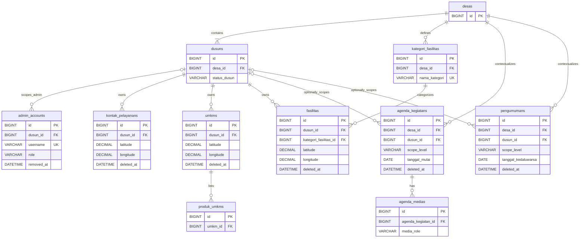

# Physical Database Schema / Technical Data Design

| Field | Value |
| --- | --- |
| Project | Portal Informasi Desa Bendung |
| Document | Physical Database Schema / Technical Data Design |
| Version | 1.2 |
| Status | FROZEN FOR MVP |
| Database Engine | MariaDB |
| Conceptual Source | ERD/Data Model v1.0 — FROZEN FOR MVP |
| Authorization Source | Roles & Permissions v1.0 — FROZEN FOR MVP |
| Technical Source | Technical R&D v1.0 — FROZEN FOR MVP |

Physical Database Schema / Technical Data Design v1.2 telah melalui human review, memasukkan klarifikasi teknis `PDS-CR-001` serta Change Request yang disetujui `PDS-CR-002` (Dukungan Remember Me / `remember_token` pada `admin_accounts`), dan tetap ditetapkan sebagai `FROZEN FOR MVP`.

Tidak ditemukan:

- Baseline Change Request;
- PRD Change Request;
- Sitemap Change Request;
- User Flow Change Request;
- Roles/Permissions Change Request;
- ERD Change Request;
- Technical Baseline Change Request.

# 1. Document Purpose

Dokumen ini menerjemahkan ERD/Data Model konseptual dan logis menjadi desain relasional fisik untuk MariaDB. Cakupannya adalah tabel, kolom, tipe data MariaDB, primary key, foreign key, nullability, unique constraint, index, default, representasi lifecycle/status, Soft Delete, logical removal akun, referential action, naming convention, dan data dictionary.

Dokumen ini belum membuat SQL DDL final, Laravel migration, Eloquent Model, Seeder, Factory, Repository, API, Controller, UI, test code, deployment configuration, atau source code. Semua source berstatus `FROZEN FOR MVP` tetap tidak diubah.

# 2. Database Design Principles

1. Relational integrity didahulukan dan constraint ditempatkan di database bila dapat dinyatakan secara aman.
2. Desain menggunakan fitur MariaDB yang portabel dan sederhana untuk shared hosting.
3. Ownership/context Desa dan Dusun selalu eksplisit melalui foreign key yang bersumber dari ERD.
4. Duplikasi diminimalkan tanpa membuat abstraction prematur.
5. Tidak ada `map_points`, universal map-category table, generic media CMS, consent table, ACL table, atau Page Builder.
6. Koordinat dan media mengikuti parent model sesuai ERD.
7. Authorization tetap ditegakkan server-side melalui Laravel Policies/Gates; schema hanya menyediakan struktur pendukungnya.
8. Index dibuat hanya untuk constraint dan pola query yang dapat diturunkan dari source FROZEN.
9. Database menggunakan storage engine InnoDB dan character set `utf8mb4`; collation awal `utf8mb4_unicode_ci` dipilih untuk kompatibilitas luas.
10. Empty state adalah hasil tidak adanya child row, bukan placeholder row atau status baru.

# 3. Naming Convention

- Nama tabel menggunakan `snake_case` dan bentuk koleksi/plural yang konsisten dengan konvensi Eloquent, misalnya `admin_accounts` dan `agenda_medias`. Istilah domain Indonesia dipertahankan; bentuk seperti `desas`, `dusuns`, dan `umkms` adalah nama fisik plural.
- Nama kolom menggunakan `snake_case`.
- Primary key setiap tabel bernama `id`.
- Foreign key bernama `<parent>_id`.
- Timestamp audit bernama `created_at` dan `updated_at`.
- Soft Delete operasional menggunakan `deleted_at` hanya pada resource yang mendukungnya.
- Logical removal akun menggunakan `removed_at`, bukan `deleted_at`.
- Media disimpan sebagai reference path dengan suffix `_path`.
- Constraint menggunakan prefix `pk_`, `fk_`, `uq_`, dan `chk_`; index non-unique menggunakan `idx_`.
- Nama state/code disimpan dalam uppercase `UPPER_SNAKE_CASE`.

# 4. Exact Physical Entity Mapping

## 4.1 Entity-to-Table Mapping

| Conceptual Entity | Physical Table | Reason / Notes |
| --- | --- | --- |
| `DESA` | `desas` | Root context dan identitas Desa. |
| `DUSUN` | `dusuns` | Profil dan lifecycle Dusun tetap dalam satu tabel. |
| `ADMIN_ACCOUNT` | `admin_accounts` | Credential, role, binding Dusun, dan retained identity. |
| `KONTAK_PELAYANAN` | `kontak_pelayanans` | Resource operasional milik Dusun. |
| `UMKM` | `umkms` | Resource direktori usaha milik Dusun. |
| `PRODUK_UMKM` | `produk_umkms` | Child relational untuk beberapa nama produk. |
| `KATEGORI_FASILITAS` | `kategori_fasilitas` | Vocabulary dinamis tingkat Desa. |
| `FASILITAS` | `fasilitas` | Resource fasilitas dengan kategori dan koordinat wajib. |
| `AGENDA_KEGIATAN` | `agenda_kegiatans` | Agenda scope Desa/Dusun dengan lifecycle tanggal. |
| `AGENDA_MEDIA` | `agenda_medias` | Child repeatable khusus poster/dokumentasi Agenda. |
| `PENGUMUMAN` | `pengumumans` | Pengumuman scope Desa/Dusun dengan expiry-derived archive. |

**Coverage:** 11/11 conceptual entities menjadi tepat 11 application/domain physical tables. Tidak ada entity yang ditambah, dihilangkan, atau digabung.

## 4.2 Physical Relationship Mapping

| No. | Physical Relationship | FK | Cardinality | Coverage |
| ---: | --- | --- | --- | --- |
| 1 | `desas` → `dusuns` | `dusuns.desa_id` | 1 : many | Mapped |
| 2 | `dusuns` → `admin_accounts` | `admin_accounts.dusun_id` | 1 : 0..many, conditional by role | Mapped |
| 3 | `dusuns` → `kontak_pelayanans` | `kontak_pelayanans.dusun_id` | 1 : 0..many | Mapped |
| 4 | `dusuns` → `umkms` | `umkms.dusun_id` | 1 : 0..many | Mapped |
| 5 | `umkms` → `produk_umkms` | `produk_umkms.umkm_id` | 1 : 0..many | Mapped |
| 6 | `desas` → `kategori_fasilitas` | `kategori_fasilitas.desa_id` | 1 : 0..many | Mapped |
| 7 | `kategori_fasilitas` → `fasilitas` | `fasilitas.kategori_fasilitas_id` | 1 : 0..many | Mapped |
| 8 | `dusuns` → `fasilitas` | `fasilitas.dusun_id` | 1 : 0..many | Mapped |
| 9 | `desas` → `agenda_kegiatans` | `agenda_kegiatans.desa_id` | 1 : 0..many | Mapped |
| 10 | `dusuns` → `agenda_kegiatans` | `agenda_kegiatans.dusun_id` | 0..1 : 0..many, conditional by scope | Mapped |
| 11 | `agenda_kegiatans` → `agenda_medias` | `agenda_medias.agenda_kegiatan_id` | 1 : 0..many | Mapped |
| 12 | `desas` → `pengumumans` | `pengumumans.desa_id` | 1 : 0..many | Mapped |
| 13 | `dusuns` → `pengumumans` | `pengumumans.dusun_id` | 0..1 : 0..many, conditional by scope | Mapped |

**Coverage:** 13/13 main relationships mapped. Tidak ada many-to-many atau relationship baru.

## 4.3 Framework Operational Metadata

Laravel MAY membuat tabel `migrations` sebagai repository/history untuk tooling migration. Tabel ini diklasifikasikan sebagai **framework operational metadata**, berada di luar hitungan application/domain schema, dan bukan conceptual entity maupun business data.

| Framework Metadata Table | Purpose | Domain Boundary |
| --- | --- | --- |
| `migrations` | Menyimpan riwayat migration yang telah dijalankan oleh Laravel. | Tidak memiliki domain FK, domain relationship, product CRUD, UI, authorization resource, atau product behavior. |

Expected implementation inventory setelah migration initialization:

- 11 application/domain physical tables;
- 1 framework metadata table, yaitu `migrations`;
- total 12 SQL tables.

`migrations` tidak dimasukkan ke Entity-to-Table Mapping, Mermaid domain ERD, 13 domain relationships, dua business UNIQUE constraints, atau 35 Data Integrity Rules. Exception ini hanya berlaku untuk `migrations`; tabel framework `users`, `password_reset_tokens`, `sessions`, `cache`, `cache_locks`, `jobs`, `job_batches`, dan `failed_jobs` tetap tidak diizinkan tanpa Change Request terpisah yang disetujui.

# 5. Table Specifications

## Table: desas

**Purpose**

Menyimpan satu root context Portal Desa Bendung dan identitas tingkat Desa.

**Conceptual Source**

`DESA`.

**Ownership / Scope**

Scope Desa; hanya Super Admin yang mengelola.

**Columns**

| Column | MariaDB Type | Nullable | Default | Key/Constraint | Description |
| --- | --- | --- | --- | --- | --- |
| `id` | `BIGINT UNSIGNED` | No | Auto increment | PK | Surrogate identifier. |
| `nama_desa` | `VARCHAR(150)` | No | — | — | Nama Desa Bendung. |
| `logo_path` | `VARCHAR(512)` | Yes | `NULL` | — | Storage-relative logo reference. |
| `banner_path` | `VARCHAR(512)` | Yes | `NULL` | — | Storage-relative banner reference. |
| `deskripsi_singkat` | `TEXT` | No | — | — | Profil singkat Homepage. |
| `alamat_kantor` | `TEXT` | No | — | — | Alamat kantor Desa. |
| `nomor_kontak` | `VARCHAR(32)` | No | — | — | Kontak kantor Desa. |
| `email` | `VARCHAR(254)` | Yes | `NULL` | — | Email opsional. |
| `nama_kepala_desa` | `VARCHAR(150)` | No | — | — | Nama Kepala Desa. |
| `jam_pelayanan` | `VARCHAR(255)` | No | — | — | Teks jam pelayanan kantor. |
| `created_at` | `DATETIME` | No | Application-managed | — | Waktu pembuatan row dalam UTC. |
| `updated_at` | `DATETIME` | No | Application-managed | — | Waktu perubahan terakhir dalam UTC. |

**Primary Key**

`pk_desas (id)`.

**Foreign Keys**

Tidak ada; tabel ini adalah root context.

**Unique Constraints**

Tidak ada business UNIQUE. Satu-context Desa ditegakkan oleh bootstrap/application invariant, bukan uniqueness nama.

**Indexes**

Tidak ada secondary index; satu row context tidak memerlukan index tambahan.

**Lifecycle / Delete Semantics**

Tidak menggunakan Soft Delete dan tidak mempunyai operasi hard delete produk.

**Authorization Relevance**

Menjadi root untuk data tingkat Desa dan sumber Homepage yang hanya dapat diubah Super Admin.

**Integrity Rules Supported**

Mendukung `ERD-DIR-001` serta parent untuk `ERD-DIR-003`.

**Source Traceability**

ERD §5.1; `DATA-001`, `DATA-002`, `FR-002`–`FR-004`, `ROLE-008`.

## Table: dusuns

**Purpose**

Menyimpan enam struktur awal Dusun, profil, dan state publiknya.

**Conceptual Source**

`DUSUN`.

**Ownership / Scope**

Belongs to satu Desa. Profil dapat dikelola Admin Dusun `OWN_DUSUN` dan Super Admin; status hanya Super Admin.

**Columns**

| Column | MariaDB Type | Nullable | Default | Key/Constraint | Description |
| --- | --- | --- | --- | --- | --- |
| `id` | `BIGINT UNSIGNED` | No | Auto increment | PK | Surrogate identifier. |
| `desa_id` | `BIGINT UNSIGNED` | No | — | FK | Parent Desa. |
| `nama_dusun` | `VARCHAR(150)` | No | — | — | Nama resmi atau placeholder yang berlaku. |
| `status_dusun` | `VARCHAR(16)` | No | `ACTIVE` | CHECK | `ACTIVE` atau `INACTIVE`. |
| `banner_path` | `VARCHAR(512)` | Yes | `NULL` | — | Storage-relative banner reference. |
| `deskripsi_singkat` | `TEXT` | No | — | — | Profil ringkas Dusun. |
| `nama_kepala_dusun` | `VARCHAR(150)` | No | — | — | Nama Kepala Dusun. |
| `jumlah_rt` | `SMALLINT UNSIGNED` | No | — | — | Jumlah RT terverifikasi. |
| `jumlah_rw` | `SMALLINT UNSIGNED` | No | — | — | Jumlah RW terverifikasi. |
| `created_at` | `DATETIME` | No | Application-managed | — | Waktu pembuatan row dalam UTC. |
| `updated_at` | `DATETIME` | No | Application-managed | — | Waktu perubahan terakhir dalam UTC. |

**Primary Key**

`pk_dusuns (id)`.

**Foreign Keys**

| Column | References | ON UPDATE | ON DELETE | Reason |
| --- | --- | --- | --- | --- |
| `desa_id` | `desas.id` | `RESTRICT` | `RESTRICT` | Root context dan seluruh enam Dusun tidak boleh terlepas/terhapus cascaded. |

**Unique Constraints**

Tidak ada. Nama Dusun tidak diberi uniqueness yang tidak dinyatakan source.

**Indexes**

| Index | Columns | Type | Reason |
| --- | --- | --- | --- |
| `idx_dusuns_desa_status` | (`desa_id`, `status_dusun`) | BTREE | Pilihan Dusun aktif dan public projection per Desa; sekaligus mendukung FK. |

**Lifecycle / Delete Semantics**

`ACTIVE ↔ INACTIVE`; bukan Soft Delete. Tidak ada `deleted_at` dan tidak ada hard delete melalui product UI. Seluruh child dan binding admin tetap tersimpan ketika `INACTIVE`.

**Authorization Relevance**

Menjadi boundary `OWN_DUSUN`; perubahan `status_dusun` hanya melalui Super Admin.

**Integrity Rules Supported**

`ERD-DIR-002`–`ERD-DIR-006`, `ERD-DIR-010`.

**Source Traceability**

ERD §5.2, §8.1; `DATA-003`, `DATA-005`, `FR-022`, `ROLE-003`, `ROLE-010`, `SEC-007`.

## Table: admin_accounts

**Purpose**

Menyimpan akun autentikasi untuk Admin Dusun dan Super Admin tanpa membuat akun Public User.

**Conceptual Source**

`ADMIN_ACCOUNT`.

**Ownership / Scope**

`ADMIN_DUSUN` memiliki tepat satu `dusun_id`; `SUPER_ADMIN` tidak memiliki binding Dusun.

**Columns**

| Column | MariaDB Type | Nullable | Default | Key/Constraint | Description |
| --- | --- | --- | --- | --- | --- |
| `id` | `BIGINT UNSIGNED` | No | Auto increment | PK | Retained identity identifier. |
| `dusun_id` | `BIGINT UNSIGNED` | Yes | `NULL` | FK + CHECK | Wajib untuk Admin Dusun; kosong untuk Super Admin. |
| `username` | `VARCHAR(100)` | No | — | UNIQUE | Username login global. |
| `password_hash` | `VARCHAR(255)` | No | — | — | Strong hash dari Laravel hashing facility. |
| `role` | `VARCHAR(24)` | No | — | CHECK | `ADMIN_DUSUN` atau `SUPER_ADMIN`. |
| `remember_token` | `VARCHAR(100)` | Yes | `NULL` | — | Token autentikasi persisten Remember Me bawaan Laravel (`PDS-CR-002`). |
| `removed_at` | `DATETIME` | Yes | `NULL` | CHECK | Waktu logical removal akun Admin Dusun dalam UTC. |
| `created_at` | `DATETIME` | No | Application-managed | — | Waktu pembuatan akun dalam UTC. |
| `updated_at` | `DATETIME` | No | Application-managed | — | Waktu perubahan credential/assignment dalam UTC. |

Check direction:

- `role IN ('ADMIN_DUSUN', 'SUPER_ADMIN')`;
- `(role = 'ADMIN_DUSUN' AND dusun_id IS NOT NULL) OR (role = 'SUPER_ADMIN' AND dusun_id IS NULL)`;
- `role = 'ADMIN_DUSUN' OR removed_at IS NULL`.

**Primary Key**

`pk_admin_accounts (id)`.

**Foreign Keys**

| Column | References | ON UPDATE | ON DELETE | Reason |
| --- | --- | --- | --- | --- |
| `dusun_id` | `dusuns.id` | `RESTRICT` | `RESTRICT` | Binding Admin Dusun dan retained identity tidak boleh diputus cascaded. |

**Unique Constraints**

`uq_admin_accounts_username (username)`. Constraint global ini tetap mencakup row dengan `removed_at IS NOT NULL`; username akun yang di-logically remove tetap reserved dan tidak dapat digunakan oleh akun baru selama retained identity row masih ada.

**Indexes**

| Index | Columns | Type | Reason |
| --- | --- | --- | --- |
| `idx_admin_accounts_dusun_removed` | (`dusun_id`, `removed_at`) | BTREE | Daftar admin aktif/removed per Dusun dan dukungan FK. |

Unique username index melayani login; tidak dibuat index login atau removed-username tambahan. Trim dan validasi casing/format input username dilakukan pada application boundary. Application tidak boleh menerapkan normalization yang bertentangan dengan behavior uniqueness database collation.

**Lifecycle / Delete Semantics**

`removed_at IS NULL` berarti akun aktif; nilai non-null berarti `LOGICALLY_REMOVED`. Row, username, role, binding, identity, dan global UNIQUE username tetap ada. Username tersebut tetap reserved; akun pengganti harus menggunakan username berbeda. Ini bukan Soft Delete dan tidak memiliki restore, reactivate, undelete, username recycling, merge identity, atau account-recovery permission baru.

**Authorization Relevance**

`role` dan `dusun_id` mendukung `OWN_DUSUN`/`GLOBAL`; login wajib menolak row dengan `removed_at IS NOT NULL`.

**Integrity Rules Supported**

`ERD-DIR-007`–`ERD-DIR-011`, `ERD-DIR-035`.

**Source Traceability**

ERD §5.3, §8.5; Roles & Permissions §11–§12; `ROLE-002`, `ROLE-004`, `ROLE-005`, `ROLE-008`, `ROLE-009`, `SEC-002`, `SEC-003`, `SEC-008`.

## Table: kontak_pelayanans

**Purpose**

Menyimpan Kontak Pelayanan publik milik satu Dusun beserta lokasi pelayanan opsional.

**Conceptual Source**

`KONTAK_PELAYANAN`.

**Ownership / Scope**

Wajib dimiliki satu Dusun; Admin Dusun hanya `OWN_DUSUN`, Super Admin `GLOBAL`.

**Columns**

| Column | MariaDB Type | Nullable | Default | Key/Constraint | Description |
| --- | --- | --- | --- | --- | --- |
| `id` | `BIGINT UNSIGNED` | No | Auto increment | PK | Identifier kontak. |
| `dusun_id` | `BIGINT UNSIGNED` | No | — | FK | Owner Dusun. |
| `nama` | `VARCHAR(150)` | No | — | — | Nama kontak. |
| `jabatan` | `VARCHAR(150)` | No | — | — | Jabatan/jenis pelayanan fleksibel. |
| `nomor_whatsapp` | `VARCHAR(32)` | No | — | — | Nomor WhatsApp wajib untuk record public. |
| `foto_path` | `VARCHAR(512)` | Yes | `NULL` | — | Storage-relative photo reference. |
| `alamat_pelayanan` | `TEXT` | Yes | `NULL` | — | Alamat pelayanan bila relevan dan diizinkan. |
| `latitude` | `DECIMAL(9,6)` | Yes | `NULL` | CHECK pair/range | Latitude opsional. |
| `longitude` | `DECIMAL(9,6)` | Yes | `NULL` | CHECK pair/range | Longitude opsional. |
| `created_at` | `DATETIME` | No | Application-managed | — | Waktu pembuatan dalam UTC. |
| `updated_at` | `DATETIME` | No | Application-managed | — | Waktu perubahan dalam UTC. |
| `deleted_at` | `DATETIME` | Yes | `NULL` | Soft Delete | Non-null berarti Soft Deleted. |

**Primary Key**

`pk_kontak_pelayanans (id)`.

**Foreign Keys**

| Column | References | ON UPDATE | ON DELETE | Reason |
| --- | --- | --- | --- | --- |
| `dusun_id` | `dusuns.id` | `RESTRICT` | `RESTRICT` | Ownership harus dipertahankan; Dusun tidak di-hard-delete. |

**Unique Constraints**

Tidak ada; nama atau nomor kontak tidak dinyatakan unik.

**Indexes**

| Index | Columns | Type | Reason |
| --- | --- | --- | --- |
| `idx_kontak_pelayanans_dusun_deleted` | (`dusun_id`, `deleted_at`) | BTREE | Daftar/public projection dan marker Pelayanan per Dusun. |

**Lifecycle / Delete Semantics**

Physical mapping lifecycle `DATA-007`:

- `ACTIVE`: `deleted_at IS NULL`;
- `INACTIVE` / `NONAKTIF` / `SOFT_DELETED`: `deleted_at IS NOT NULL`.

Tidak ada kolom `status`, `is_active`, `active`, atau `status_kontak` karena kolom tersebut akan menciptakan dua source-of-truth untuk lifecycle yang sama. Restore hanya mengosongkan `deleted_at` melalui Super Admin.

**Authorization Relevance**

`dusun_id` mendukung policy `OWN_DUSUN`. Kontak Pelayanan hanya dapat tampil public ketika `deleted_at IS NULL`, parent `dusuns.status_dusun = 'ACTIVE'`, dan privacy/publication precondition telah dipenuhi. Jika koordinat tersedia, marker hanya eligible ketika pair latitude/longitude valid dan izin publikasi offline telah diperoleh. Tidak ada consent field.

**Integrity Rules Supported**

`ERD-DIR-012`–`ERD-DIR-015`, `ERD-DIR-031`–`ERD-DIR-034`.

**Source Traceability**

ERD §5.4, §10; `DATA-006`–`DATA-008`, `FR-010`, `MAP-010`, `PRIV-001`, `ROLE-006`.

## Table: umkms

**Purpose**

Menyimpan direktori UMKM non-transaksional milik satu Dusun.

**Conceptual Source**

`UMKM`.

**Ownership / Scope**

Wajib dimiliki satu Dusun; child produk, media path, dan koordinat mengikuti parent.

**Columns**

| Column | MariaDB Type | Nullable | Default | Key/Constraint | Description |
| --- | --- | --- | --- | --- | --- |
| `id` | `BIGINT UNSIGNED` | No | Auto increment | PK | Identifier UMKM. |
| `dusun_id` | `BIGINT UNSIGNED` | No | — | FK | Owner Dusun. |
| `nama_umkm` | `VARCHAR(200)` | No | — | — | Nama usaha; tidak global-unique. |
| `nama_pemilik` | `VARCHAR(150)` | No | — | — | Nama pemilik. |
| `jenis_usaha` | `VARCHAR(150)` | No | — | — | Jenis usaha. |
| `deskripsi` | `TEXT` | No | — | — | Deskripsi usaha. |
| `alamat` | `TEXT` | No | — | — | Alamat usaha. |
| `nomor_whatsapp` | `VARCHAR(32)` | No | — | — | Kontak WhatsApp. |
| `jam_operasional` | `VARCHAR(255)` | No | — | — | Teks jam operasional. |
| `foto_utama_path` | `VARCHAR(512)` | Yes | `NULL` | — | Maksimal satu storage-relative main-photo reference. |
| `latitude` | `DECIMAL(9,6)` | Yes | `NULL` | CHECK pair/range | Latitude opsional. |
| `longitude` | `DECIMAL(9,6)` | Yes | `NULL` | CHECK pair/range | Longitude opsional. |
| `created_at` | `DATETIME` | No | Application-managed | — | Waktu pembuatan dalam UTC. |
| `updated_at` | `DATETIME` | No | Application-managed | — | Waktu perubahan dalam UTC. |
| `deleted_at` | `DATETIME` | Yes | `NULL` | Soft Delete | Non-null berarti Soft Deleted. |

**Primary Key**

`pk_umkms (id)`.

**Foreign Keys**

| Column | References | ON UPDATE | ON DELETE | Reason |
| --- | --- | --- | --- | --- |
| `dusun_id` | `dusuns.id` | `RESTRICT` | `RESTRICT` | Ownership tidak boleh hilang atau berpindah cascaded. |

**Unique Constraints**

Tidak ada; nama UMKM tidak dibuat global-unique atau scope-unique tanpa requirement.

**Indexes**

| Index | Columns | Type | Reason |
| --- | --- | --- | --- |
| `idx_umkms_dusun_deleted` | (`dusun_id`, `deleted_at`) | BTREE | Direktori aktif dan marker eligible per Dusun. |

**Lifecycle / Delete Semantics**

Menggunakan `deleted_at`. UMKM tanpa koordinat tetap valid dan public-directory-eligible ketika tidak Soft Deleted dan parent Dusun aktif.

**Authorization Relevance**

`dusun_id` menjadi basis `OWN_DUSUN`; product dan media mengikuti parent.

**Integrity Rules Supported**

`ERD-DIR-012`, `ERD-DIR-014`, `ERD-DIR-016`–`ERD-DIR-020`, `ERD-DIR-031`–`ERD-DIR-034`.

**Source Traceability**

ERD §5.5; `FR-011`, `FR-012`, `DATA-009`, `MAP-009`, `MEDIA-003`, `PRIV-001`, `ROLE-006`.

## Table: produk_umkms

**Purpose**

Menyimpan beberapa nama produk atomik untuk satu UMKM tanpa field e-commerce.

**Conceptual Source**

`PRODUK_UMKM`.

**Ownership / Scope**

Mewarisi ownership dan visibility dari parent `umkms`.

**Columns**

| Column | MariaDB Type | Nullable | Default | Key/Constraint | Description |
| --- | --- | --- | --- | --- | --- |
| `id` | `BIGINT UNSIGNED` | No | Auto increment | PK | Identifier produk. |
| `umkm_id` | `BIGINT UNSIGNED` | No | — | FK | Parent UMKM. |
| `nama_produk` | `VARCHAR(200)` | No | — | — | Nama/tag produk. |
| `created_at` | `DATETIME` | No | Application-managed | — | Waktu pembuatan dalam UTC. |
| `updated_at` | `DATETIME` | No | Application-managed | — | Waktu perubahan dalam UTC. |

**Primary Key**

`pk_produk_umkms (id)`.

**Foreign Keys**

| Column | References | ON UPDATE | ON DELETE | Reason |
| --- | --- | --- | --- | --- |
| `umkm_id` | `umkms.id` | `RESTRICT` | `CASCADE` | Produk tidak memiliki lifecycle/ownership independen dan harus ikut ketika parent di-hard-delete. |

**Unique Constraints**

Tidak ada; source tidak mewajibkan uniqueness nama produk per UMKM.

**Indexes**

| Index | Columns | Type | Reason |
| --- | --- | --- | --- |
| `idx_produk_umkms_umkm` | (`umkm_id`) | BTREE | Memuat list produk parent dan mendukung FK. |

**Lifecycle / Delete Semantics**

Tidak mempunyai Soft Delete independen. Soft Delete UMKM menyembunyikan produk melalui parent; hard delete parent menghapus child row secara cascade.

**Authorization Relevance**

Semua operasi mengikuti authorization parent UMKM; tidak ada permission Produk independen.

**Integrity Rules Supported**

`ERD-DIR-019`, `ERD-DIR-020`.

**Source Traceability**

ERD §5.6; `FR-012`, `DATA-009`; Roles & Permissions §6.

## Table: kategori_fasilitas

**Purpose**

Menyimpan kategori Fasilitas dinamis tingkat Desa.

**Conceptual Source**

`KATEGORI_FASILITAS`.

**Ownership / Scope**

Vocabulary dalam context Desa; hanya Super Admin dapat create/update/hard delete bila tidak digunakan.

**Columns**

| Column | MariaDB Type | Nullable | Default | Key/Constraint | Description |
| --- | --- | --- | --- | --- | --- |
| `id` | `BIGINT UNSIGNED` | No | Auto increment | PK | Identifier kategori. |
| `desa_id` | `BIGINT UNSIGNED` | No | — | FK + UNIQUE member | Context Desa. |
| `nama_kategori` | `VARCHAR(150)` | No | — | UNIQUE member | Nama kategori dinamis. |
| `created_at` | `DATETIME` | No | Application-managed | — | Waktu pembuatan dalam UTC. |
| `updated_at` | `DATETIME` | No | Application-managed | — | Waktu perubahan dalam UTC. |

**Primary Key**

`pk_kategori_fasilitas (id)`.

**Foreign Keys**

| Column | References | ON UPDATE | ON DELETE | Reason |
| --- | --- | --- | --- | --- |
| `desa_id` | `desas.id` | `RESTRICT` | `RESTRICT` | Vocabulary tidak boleh kehilangan root context. |

**Unique Constraints**

`uq_kategori_fasilitas_desa_nama (desa_id, nama_kategori)`. Input dinormalisasi dengan trim di application; collation case-insensitive mencegah duplikasi kapitalisasi pada satu Desa.

**Indexes**

Tidak ada secondary index tambahan; unique index diawali `desa_id` dan mendukung FK/list per Desa.

**Lifecycle / Delete Semantics**

Tidak menggunakan Soft Delete. Hard delete hanya dapat dilakukan Super Admin dan akan ditolak bila masih direferensikan Fasilitas.

**Authorization Relevance**

Admin Dusun hanya membaca/menggunakan kategori; write hanya Super Admin.

**Integrity Rules Supported**

`ERD-DIR-021`, `ERD-DIR-033`.

**Source Traceability**

ERD §5.7; `DATA-013`, `ROLE-011`; Roles & Permissions §15.

## Table: fasilitas

**Purpose**

Menyimpan fasilitas milik Dusun, kategori dinamis, dan koordinat wajib.

**Conceptual Source**

`FASILITAS`.

**Ownership / Scope**

Wajib dimiliki satu Dusun dan mereferensikan satu Kategori Fasilitas.

**Columns**

| Column | MariaDB Type | Nullable | Default | Key/Constraint | Description |
| --- | --- | --- | --- | --- | --- |
| `id` | `BIGINT UNSIGNED` | No | Auto increment | PK | Identifier Fasilitas. |
| `dusun_id` | `BIGINT UNSIGNED` | No | — | FK | Owner Dusun. |
| `kategori_fasilitas_id` | `BIGINT UNSIGNED` | No | — | FK | Kategori dinamis. |
| `nama` | `VARCHAR(200)` | No | — | — | Nama fasilitas. |
| `deskripsi` | `TEXT` | No | — | — | Deskripsi fasilitas. |
| `alamat` | `TEXT` | No | — | — | Alamat fasilitas. |
| `latitude` | `DECIMAL(9,6)` | No | — | CHECK range | Latitude wajib. |
| `longitude` | `DECIMAL(9,6)` | No | — | CHECK range | Longitude wajib. |
| `foto_path` | `VARCHAR(512)` | Yes | `NULL` | — | Storage-relative photo reference. |
| `nomor_whatsapp` | `VARCHAR(32)` | Yes | `NULL` | — | Kontak WhatsApp opsional. |
| `created_at` | `DATETIME` | No | Application-managed | — | Waktu pembuatan dalam UTC. |
| `updated_at` | `DATETIME` | No | Application-managed | — | Waktu perubahan dalam UTC. |
| `deleted_at` | `DATETIME` | Yes | `NULL` | Soft Delete | Non-null berarti Soft Deleted. |

**Primary Key**

`pk_fasilitas (id)`.

**Foreign Keys**

| Column | References | ON UPDATE | ON DELETE | Reason |
| --- | --- | --- | --- | --- |
| `dusun_id` | `dusuns.id` | `RESTRICT` | `RESTRICT` | Ownership tidak boleh hilang. |
| `kategori_fasilitas_id` | `kategori_fasilitas.id` | `RESTRICT` | `RESTRICT` | Kategori yang masih digunakan tidak boleh dihapus atau diganti cascaded. |

**Unique Constraints**

Tidak ada; nama fasilitas tidak dinyatakan unik.

**Indexes**

| Index | Columns | Type | Reason |
| --- | --- | --- | --- |
| `idx_fasilitas_dusun_deleted` | (`dusun_id`, `deleted_at`) | BTREE | Daftar aktif dan marker per Dusun. |
| `idx_fasilitas_kategori_deleted` | (`kategori_fasilitas_id`, `deleted_at`) | BTREE | Filter kategori Fasilitas aktif dan dukungan FK kategori. |

**Lifecycle / Delete Semantics**

Menggunakan `deleted_at`. Koordinat tetap wajib pada row Soft Deleted agar restore tidak menghasilkan Fasilitas invalid.

**Authorization Relevance**

`dusun_id` mendukung `OWN_DUSUN`; kategori hanya dipilih dari vocabulary yang dikelola Super Admin.

**Integrity Rules Supported**

`ERD-DIR-012`, `ERD-DIR-014`, `ERD-DIR-021`–`ERD-DIR-023`, `ERD-DIR-031`–`ERD-DIR-034`.

**Source Traceability**

ERD §5.8; `DATA-010`–`DATA-013`, `MAP-008`, `FR-013`, `ROLE-006`.

## Table: agenda_kegiatans

**Purpose**

Menyimpan Agenda/Kegiatan scope Desa atau Dusun dengan lifecycle tanggal dan override opsional.

**Conceptual Source**

`AGENDA_KEGIATAN`.

**Ownership / Scope**

Selalu berada pada satu context Desa; `dusun_id` hanya ada untuk scope `DUSUN`.

**Columns**

| Column | MariaDB Type | Nullable | Default | Key/Constraint | Description |
| --- | --- | --- | --- | --- | --- |
| `id` | `BIGINT UNSIGNED` | No | Auto increment | PK | Identifier Agenda. |
| `desa_id` | `BIGINT UNSIGNED` | No | — | FK | Context Desa. |
| `dusun_id` | `BIGINT UNSIGNED` | Yes | `NULL` | FK + CHECK | Wajib hanya untuk scope Dusun. |
| `scope_level` | `VARCHAR(16)` | No | — | CHECK | `DESA` atau `DUSUN`. |
| `judul` | `VARCHAR(255)` | No | — | — | Judul kegiatan. |
| `deskripsi_singkat` | `TEXT` | No | — | — | Ringkasan kegiatan. |
| `tanggal_mulai` | `DATE` | No | — | CHECK member | Tanggal mulai lokal. |
| `tanggal_selesai` | `DATE` | Yes | `NULL` | CHECK | Tanggal selesai opsional, tidak sebelum mulai. |
| `jam` | `TIME` | Yes | `NULL` | — | Jam lokal opsional. |
| `lokasi_text` | `VARCHAR(255)` | No | — | — | Keterangan lokasi; bukan marker otomatis. |
| `manual_status_override` | `VARCHAR(20)` | Yes | `NULL` | CHECK | Override: `AKAN_DATANG`, `BERLANGSUNG`, atau `SELESAI`. |
| `created_at` | `DATETIME` | No | Application-managed | — | Waktu pembuatan dalam UTC. |
| `updated_at` | `DATETIME` | No | Application-managed | — | Waktu perubahan dalam UTC. |
| `deleted_at` | `DATETIME` | Yes | `NULL` | Soft Delete | Non-null berarti Soft Deleted. |

Check direction:

- `(scope_level = 'DESA' AND dusun_id IS NULL) OR (scope_level = 'DUSUN' AND dusun_id IS NOT NULL)`;
- `tanggal_selesai IS NULL OR tanggal_selesai >= tanggal_mulai`;
- `manual_status_override IS NULL OR manual_status_override IN ('AKAN_DATANG', 'BERLANGSUNG', 'SELESAI')`.

**Primary Key**

`pk_agenda_kegiatans (id)`.

**Foreign Keys**

| Column | References | ON UPDATE | ON DELETE | Reason |
| --- | --- | --- | --- | --- |
| `desa_id` | `desas.id` | `RESTRICT` | `RESTRICT` | Semua Agenda tetap dalam root context. |
| `dusun_id` | `dusuns.id` | `RESTRICT` | `RESTRICT` | Scope Dusun tidak boleh terlepas; Dusun tidak di-hard-delete. |

**Unique Constraints**

Tidak ada; judul/tanggal Agenda tidak dinyatakan unik.

**Indexes**

| Index | Columns | Type | Reason |
| --- | --- | --- | --- |
| `idx_agenda_kegiatans_dusun_deleted_mulai` | (`dusun_id`, `deleted_at`, `tanggal_mulai`) | BTREE | Agenda aktif/Soft Deleted per Dusun dan pengurutan/filter tanggal. |
| `idx_agenda_kegiatans_desa_scope_deleted_mulai` | (`desa_id`, `scope_level`, `deleted_at`, `tanggal_mulai`) | BTREE | Agenda Desa/Homepage serta management berdasarkan scope dan tanggal. |

Status efektif tidak di-index karena tidak dipersisted dan dapat berasal dari override atau tanggal berjalan.

**Lifecycle / Delete Semantics**

`deleted_at` adalah axis operasional. `calculated_status` dihitung saat query/application berdasarkan tanggal dalam `Asia/Jakarta`; `effective_status = manual_status_override` bila ada, selain itu calculated status. Override tidak mengubah tanggal.

**Authorization Relevance**

Scope Desa hanya dapat ditulis Super Admin. Admin Dusun hanya dapat menulis row `scope_level = DUSUN` dengan `dusun_id` yang sama dengan akun.

**Integrity Rules Supported**

`ERD-DIR-024`, `ERD-DIR-026`–`ERD-DIR-028`, `ERD-DIR-031`–`ERD-DIR-034`.

**Source Traceability**

ERD §5.9, §8.3; `FR-014`–`FR-016`, `DATA-014`, `DATA-015`, `DATA-017`, `MEDIA-007`, `ROLE-003`, `ROLE-011`.

## Table: agenda_medias

**Purpose**

Menyimpan reference poster awal atau dokumentasi yang repeatable untuk Agenda.

**Conceptual Source**

`AGENDA_MEDIA`.

**Ownership / Scope**

Mewarisi scope, ownership, visibility, dan privacy boundary dari parent Agenda.

**Columns**

| Column | MariaDB Type | Nullable | Default | Key/Constraint | Description |
| --- | --- | --- | --- | --- | --- |
| `id` | `BIGINT UNSIGNED` | No | Auto increment | PK | Identifier media reference. |
| `agenda_kegiatan_id` | `BIGINT UNSIGNED` | No | — | FK | Parent Agenda. |
| `media_path` | `VARCHAR(512)` | No | — | — | Storage-relative media reference. |
| `media_role` | `VARCHAR(24)` | No | — | CHECK | `POSTER_AWAL` atau `DOKUMENTASI`. |
| `created_at` | `DATETIME` | No | Application-managed | — | Waktu pembuatan dalam UTC. |
| `updated_at` | `DATETIME` | No | Application-managed | — | Waktu perubahan metadata dalam UTC. |

**Primary Key**

`pk_agenda_medias (id)`.

**Foreign Keys**

| Column | References | ON UPDATE | ON DELETE | Reason |
| --- | --- | --- | --- | --- |
| `agenda_kegiatan_id` | `agenda_kegiatans.id` | `RESTRICT` | `CASCADE` | Media tidak mempunyai lifecycle independen dan ikut hard delete parent. |

**Unique Constraints**

Tidak ada; ERD mengizinkan nol atau lebih media dan tidak menetapkan satu-per-role.

**Indexes**

| Index | Columns | Type | Reason |
| --- | --- | --- | --- |
| `idx_agenda_medias_agenda` | (`agenda_kegiatan_id`) | BTREE | Memuat seluruh media parent dan mendukung FK. |

**Lifecycle / Delete Semantics**

Visibility/Soft Delete mengikuti Agenda. Cascade menghapus row database; penghapusan file filesystem tetap harus dikoordinasikan application karena FK tidak dapat menghapus file.

**Authorization Relevance**

Tidak ada resource admin media independen; seluruh akses melalui policy parent Agenda.

**Integrity Rules Supported**

`ERD-DIR-028`, `ERD-DIR-034`.

**Source Traceability**

ERD §5.10, §11; `MEDIA-001`, `MEDIA-007`, `FR-014`.

## Table: pengumumans

**Purpose**

Menyimpan Pengumuman scope Desa/Dusun dengan active/archive yang diturunkan dari expiry.

**Conceptual Source**

`PENGUMUMAN`.

**Ownership / Scope**

Selalu berada pada satu context Desa; `dusun_id` hanya untuk scope `DUSUN`.

**Columns**

| Column | MariaDB Type | Nullable | Default | Key/Constraint | Description |
| --- | --- | --- | --- | --- | --- |
| `id` | `BIGINT UNSIGNED` | No | Auto increment | PK | Identifier Pengumuman. |
| `desa_id` | `BIGINT UNSIGNED` | No | — | FK | Context Desa. |
| `dusun_id` | `BIGINT UNSIGNED` | Yes | `NULL` | FK + CHECK | Wajib hanya untuk scope Dusun. |
| `scope_level` | `VARCHAR(16)` | No | — | CHECK | `DESA` atau `DUSUN`. |
| `judul` | `VARCHAR(255)` | No | — | — | Judul daftar/detail. |
| `isi` | `TEXT` | No | — | — | Konten Pengumuman. |
| `tanggal_kedaluwarsa` | `DATE` | No | — | — | Source-of-truth active/archive lokal. |
| `created_at` | `DATETIME` | No | Application-managed | — | Waktu pembuatan dalam UTC. |
| `updated_at` | `DATETIME` | No | Application-managed | — | Waktu perubahan dalam UTC. |
| `deleted_at` | `DATETIME` | Yes | `NULL` | Soft Delete | Non-null berarti Soft Deleted. |

Check direction: `(scope_level = 'DESA' AND dusun_id IS NULL) OR (scope_level = 'DUSUN' AND dusun_id IS NOT NULL)`.

**Primary Key**

`pk_pengumumans (id)`.

**Foreign Keys**

| Column | References | ON UPDATE | ON DELETE | Reason |
| --- | --- | --- | --- | --- |
| `desa_id` | `desas.id` | `RESTRICT` | `RESTRICT` | Semua Pengumuman tetap dalam root context. |
| `dusun_id` | `dusuns.id` | `RESTRICT` | `RESTRICT` | Scope Dusun tidak boleh terlepas. |

**Unique Constraints**

Tidak ada; judul/konten/tanggal tidak dinyatakan unik.

**Indexes**

| Index | Columns | Type | Reason |
| --- | --- | --- | --- |
| `idx_pengumumans_dusun_deleted_expiry` | (`dusun_id`, `deleted_at`, `tanggal_kedaluwarsa`) | BTREE | Active/archive public dan management per Dusun. |
| `idx_pengumumans_desa_scope_deleted_expiry` | (`desa_id`, `scope_level`, `deleted_at`, `tanggal_kedaluwarsa`) | BTREE | Pengumuman Desa/Homepage serta query active/archive menurut expiry. |

**Lifecycle / Delete Semantics**

`deleted_at` adalah Soft Delete terpisah. `tanggal_kedaluwarsa >= current local date` berarti aktif; tanggal yang sudah lewat berarti Arsip Pengumuman public, selama `deleted_at IS NULL` dan parent Dusun (bila ada) aktif. Tidak ada archive table atau `archived_at`.

**Authorization Relevance**

Scope Desa hanya ditulis Super Admin; scope Dusun mengikuti `OWN_DUSUN`/`GLOBAL`.

**Integrity Rules Supported**

`ERD-DIR-025`, `ERD-DIR-029`–`ERD-DIR-033`.

**Source Traceability**

ERD §5.11, §8.4; `FR-008`, `FR-017`, `FR-018`, `DATA-016`, `ROLE-006`, `ROLE-011`.

## 5.1 Check Constraint Catalogue

Katalog berikut menetapkan arah ekspresi fisik. Nama dan expression harus dipertahankan saat DDL/migration dibuat pada fase berikutnya; bagian ini sendiri bukan SQL DDL.

| Constraint | Table | Required Expression / Rule |
| --- | --- | --- |
| `chk_dusuns_status` | `dusuns` | `status_dusun IN ('ACTIVE', 'INACTIVE')` |
| `chk_admin_accounts_role` | `admin_accounts` | `role IN ('ADMIN_DUSUN', 'SUPER_ADMIN')` |
| `chk_admin_accounts_role_scope` | `admin_accounts` | Admin Dusun mempunyai non-null `dusun_id`; Super Admin mempunyai null `dusun_id` |
| `chk_admin_accounts_removed_role` | `admin_accounts` | `removed_at` hanya boleh non-null untuk role `ADMIN_DUSUN` |
| `chk_kontak_pelayanans_coordinate_pair` | `kontak_pelayanans` | Latitude dan longitude harus sama-sama null atau sama-sama non-null |
| `chk_kontak_pelayanans_latitude` | `kontak_pelayanans` | Latitude null atau berada pada `-90..90` |
| `chk_kontak_pelayanans_longitude` | `kontak_pelayanans` | Longitude null atau berada pada `-180..180` |
| `chk_umkms_coordinate_pair` | `umkms` | Latitude dan longitude harus sama-sama null atau sama-sama non-null |
| `chk_umkms_latitude` | `umkms` | Latitude null atau berada pada `-90..90` |
| `chk_umkms_longitude` | `umkms` | Longitude null atau berada pada `-180..180` |
| `chk_fasilitas_latitude` | `fasilitas` | Latitude berada pada `-90..90` |
| `chk_fasilitas_longitude` | `fasilitas` | Longitude berada pada `-180..180` |
| `chk_agenda_kegiatans_scope` | `agenda_kegiatans` | Scope Desa mempunyai null `dusun_id`; scope Dusun mempunyai non-null `dusun_id` |
| `chk_agenda_kegiatans_dates` | `agenda_kegiatans` | `tanggal_selesai` null atau tidak sebelum `tanggal_mulai` |
| `chk_agenda_kegiatans_override` | `agenda_kegiatans` | Override null atau salah satu tiga status Agenda |
| `chk_agenda_medias_role` | `agenda_medias` | `media_role IN ('POSTER_AWAL', 'DOKUMENTASI')` |
| `chk_pengumumans_scope` | `pengumumans` | Scope Desa mempunyai null `dusun_id`; scope Dusun mempunyai non-null `dusun_id` |

Selain CHECK database, application validation wajib memastikan string required tidak kosong, path bersifat storage-relative, nomor/kontak mengikuti format yang disepakati saat implementation, serta `dusun_id` conditional berada dalam `desa_id` context yang sama. Constraint terakhir tidak memerlukan composite FK pada MVP satu-Desa, tetapi tetap menjadi validation invariant di application boundary.

# 6. Primary Key Strategy

Seluruh tabel menggunakan `BIGINT UNSIGNED AUTO_INCREMENT` bernama `id`.

Alasan:

- sesuai default identifier integer Eloquent;
- sederhana untuk debugging, handover, import/export, dan foreign key;
- index/storage lebih kecil daripada UUID/ULID string;
- tidak ada requirement distributed ID generation atau offline merge;
- public URL tidak otomatis memerlukan opaque database PK dan URL/slug bukan keputusan schema ini.

UUID/ULID tidak dipilih karena manfaat yang dibutuhkan source tidak ada.

# 7. Admin / User Table

Hanya `admin_accounts` yang menyimpan authenticated identity. Public User tidak mempunyai row. Dua role disimpan dalam constrained `VARCHAR`, bukan role/permission tables, karena role set kecil dan stabil serta permission ditegakkan Laravel Policies/Gates.

`ADMIN_DUSUN` wajib mempunyai tepat satu `dusun_id`; satu Dusun dapat direferensikan banyak akun. `SUPER_ADMIN` wajib mempunyai `dusun_id = NULL`. Reset password mengganti `password_hash`; tidak ada self-service recovery atau email identity requirement.

# 8. Admin Account Logical Removal

Physical representation yang dipilih adalah nullable `removed_at`.

- `NULL`: akun aktif dan dapat dipertimbangkan untuk login.
- Non-null: akun `LOGICALLY_REMOVED`, tidak dapat login, tetapi row identity, username, role, dan binding Dusun dipertahankan.
- Global UNIQUE pada `username` tetap berlaku terhadap row retained. Username akun removed tetap reserved dan tidak boleh dipakai kembali; akun pengganti harus memakai username berbeda.
- Tidak menggunakan `deleted_at`, `is_active`, atau generic `status`, sehingga semantics tidak tercampur dengan Soft Delete operasional.
- Tidak ada restore, reactivate, undelete, username recycling, merge identity, atau account-recovery permission baru untuk akun.
- Login memerlukan username cocok, password valid, dan `removed_at IS NULL`.

Exact trim dan casing/format validation username dilakukan pada application boundary tanpa menentang database collation. Konsekuensi username reserved adalah physical identity-integrity consequence, bukan permission atau flow baru. Roles & Permissions tetap authority dan tidak ada `RESTORE_ADMIN_ACCOUNT`.

# 9. Dusun Relationship

- Enam row awal dibuat melalui bootstrap/initial-data operation; schema tidak membuka capability `CREATE_DUSUN` pada produk.
- Exact count enam dijaga application/operational bootstrap karena SQL row constraint lokal tidak proporsional untuk membatasi jumlah global.
- `dusuns.desa_id` wajib dan seluruh child memiliki FK `RESTRICT`.
- Multiple Admin Dusun per Dusun didukung tanpa unique constraint pada `admin_accounts.dusun_id`.
- `status_dusun` menggunakan `ACTIVE`/`INACTIVE` dan tidak mengubah/meniadakan child row.
- Kemampuan teknis `INSERT` pada database bukan product permission.

# 10. Desa vs Dusun Scope

Agenda dan Pengumuman menggunakan pola yang sama:

- `desa_id` selalu wajib sebagai root context;
- `scope_level = 'DESA'` mensyaratkan `dusun_id IS NULL`;
- `scope_level = 'DUSUN'` mensyaratkan `dusun_id IS NOT NULL`;
- CHECK database dan application validation mencegah scope ambigu;
- Policies/Gates memastikan Admin Dusun hanya menulis scope `DUSUN` miliknya.

Tidak ada polymorphic scope table.

# 11. Kontak Pelayanan

`kontak_pelayanans` mendukung nama, jabatan, WhatsApp wajib untuk public record, foto opsional, alamat/koordinat pelayanan opsional, ownership Dusun, dan Soft Delete. `DATA-007` active/inactive direpresentasikan secara tunggal oleh `deleted_at`: null berarti `ACTIVE`, sedangkan non-null berarti `INACTIVE` / `NONAKTIF` / `SOFT_DELETED`. Tidak dibuat status aktif kedua.

Public visibility mensyaratkan `deleted_at IS NULL`, parent Dusun `ACTIVE`, dan privacy/publication precondition yang berlaku. Pair koordinat hanya diisi bila titik memang relevan dan izin offline telah ada; marker hanya eligible bila pair valid. Tidak dibuat field digital consent maupun `show_on_map`.

# 12. UMKM

`umkms` menyimpan tepat satu owner Dusun, informasi usaha, satu optional main-photo path, dan optional coordinate pair. Row tanpa koordinat tetap valid serta dapat tampil di direktori, tetapi tidak menjadi marker. Tidak ada price, stock, SKU, order, cart, payment, atau transaction field.

# 13. Produk UMKM

`produk_umkms` adalah child relational satu-to-many. Setiap row hanya menyimpan `nama_produk` dan FK parent; JSON tidak digunakan. Visibility, ownership, Soft Delete, dan hard delete mengikuti UMKM.

# 14. Fasilitas

`fasilitas` mewajibkan Dusun, Kategori Fasilitas, nama, deskripsi, alamat, latitude, dan longitude. Foto dan WhatsApp opsional. Koordinat tetap wajib pada row Soft Deleted agar restore tidak menghasilkan data invalid.

# 15. Kategori Fasilitas

Kategori disimpan dinamis di `kategori_fasilitas`; bukan enum. Uniqueness berlaku pada `(desa_id, nama_kategori)` dengan trim di application dan collation case-insensitive. FK `RESTRICT` mencegah hard delete kategori yang masih digunakan Fasilitas. Tidak ada `map_categories`, `location_categories`, atau `marker_categories`.

# 16. Agenda & Kegiatan

- Tanggal tetap source-of-truth lifecycle.
- `effective_end = tanggal_selesai` bila ada, selain itu `tanggal_mulai`.
- Status calculated: sebelum mulai `AKAN_DATANG`, dalam rentang `BERLANGSUNG`, setelah akhir `SELESAI`.
- `manual_status_override` nullable menyimpan hanya override, sehingga informasi computed-versus-manual tidak hilang.
- Effective status dihitung: override bila non-null, selain itu calculated status.
- `deleted_at` merupakan axis operasional terpisah.
- Poster/dokumentasi opsional disimpan sebagai child `agenda_medias`.

# 17. Pengumuman

Active/archive tidak dipersisted sebagai enum. Query menggunakan `tanggal_kedaluwarsa`:

- aktif: `deleted_at IS NULL` dan tanggal lokal saat ini `<= tanggal_kedaluwarsa`;
- arsip public: `deleted_at IS NULL` dan tanggal lokal saat ini `> tanggal_kedaluwarsa`;
- Soft Deleted: `deleted_at IS NOT NULL`, tidak public dalam kedua query.

Tidak ada archive table, copy row, atau `archived_at`.

# 18. Location / Coordinates

Latitude/longitude memakai exact fixed-point `DECIMAL(9,6)`, bukan `FLOAT`/`DOUBLE`. Enam digit desimal cukup untuk marker MVP dan menghindari representasi binary floating-point yang tidak eksak.

Constraint:

- latitude `BETWEEN -90.000000 AND 90.000000`;
- longitude `BETWEEN -180.000000 AND 180.000000`;
- UMKM/Kontak: keduanya `NULL` atau keduanya non-null;
- Fasilitas: keduanya `NOT NULL`.

Database CHECK dan application validation digunakan bersama. Application juga memvalidasi input peta sebelum persistence.

# 19. Map Filter Taxonomy

Taxonomy sepenuhnya derived:

| Source | Derived Category |
| --- | --- |
| `umkms` eligible | Konstanta application `UMKM` |
| `kontak_pelayanans` eligible | Konstanta application `PELAYANAN` |
| `fasilitas` eligible | `kategori_fasilitas.nama_kategori` |

`SEMUA` adalah opsi query tanpa filter dan tidak disimpan. Tidak ada universal map category/table baru.

# 20. Media Physical Design

Database menyimpan storage-relative reference pada `VARCHAR(512)`, bukan BLOB atau absolute server path. Reference dapat berupa Laravel disk-relative path yang tetap portabel terhadap perubahan physical filesystem root.

Single media references berada pada parent (`logo_path`, `banner_path`, `foto_path`, `foto_utama_path`). Media Agenda yang repeatable berada di `agenda_medias`. Placeholder adalah fallback presentation dan tidak memerlukan row/path. File validation, resize, compression, modern-format conversion, cleanup, dan backup berada di application/operations; detail library/path provider tetap di luar schema.

# 21. Soft Delete Strategy

Hanya lima tabel berikut menggunakan nullable `deleted_at`:

1. `kontak_pelayanans`;
2. `umkms`;
3. `fasilitas`;
4. `agenda_kegiatans`;
5. `pengumumans`.

`deleted_at IS NULL` berarti operational `ACTIVE`; non-null berarti `SOFT_DELETED`. Public query selalu mengecualikan non-null. Restore hanya Super Admin dan mengosongkan `deleted_at`. Child `produk_umkms` dan `agenda_medias` mengikuti parent. `dusuns.status_dusun`, `admin_accounts.removed_at`, serta expiry Pengumuman merupakan semantics berbeda.

Khusus `kontak_pelayanans`, mapping tersebut adalah representasi fisik `DATA-007`: `ACTIVE` ketika `deleted_at IS NULL`, serta `INACTIVE` / `NONAKTIF` / `SOFT_DELETED` ketika `deleted_at IS NOT NULL`. Tidak ada redundant contact-status column.

Enam tabel yang tidak mempunyai `deleted_at` adalah `desas`, `dusuns`, `admin_accounts`, `produk_umkms`, `kategori_fasilitas`, dan `agenda_medias`. Child resource mengikuti parent sesuai desain.

Lifecycle axes tetap berbeda:

| Axis | Physical Source of Truth | Semantics |
| --- | --- | --- |
| Dusun | `dusuns.status_dusun` | `ACTIVE` / `INACTIVE`; bukan Soft Delete. |
| Operational data | Applicable `deleted_at` | Active atau Soft Deleted; restore hanya Super Admin. |
| Admin account | `admin_accounts.removed_at` | Retained identity logical removal; tidak ada restore/reuse. |
| Pengumuman | `pengumumans.tanggal_kedaluwarsa` | Active/archive derived; terpisah dari `deleted_at`. |
| Agenda | Date columns + optional `manual_status_override` | Effective status memakai override bila ada, selain itu derived dari tanggal. |

# 22. Hard Delete Referential Design

| Parent | Child | ON DELETE | Justification |
| --- | --- | --- | --- |
| `desas` | seluruh direct child | `RESTRICT` | Root context tidak mempunyai operasi delete produk. |
| `dusuns` | seluruh direct child | `RESTRICT` | Dusun tidak dapat hard delete dan child tidak boleh menjadi orphan. |
| `admin_accounts` binding | — | `RESTRICT` dari Dusun | Retained identity dijaga; account removal bukan row delete. |
| `kategori_fasilitas` | `fasilitas` | `RESTRICT` | Kategori yang dipakai tidak boleh dihapus cascaded. |
| `umkms` | `produk_umkms` | `CASCADE` | Produk adalah child penuh tanpa lifecycle/permission independen. |
| `agenda_kegiatans` | `agenda_medias` | `CASCADE` | Media adalah child penuh Agenda. |

Semua FK menggunakan `ON UPDATE RESTRICT` karena surrogate PK immutable. `CASCADE` tidak digunakan sebagai default. Hard delete leaf operational resource tetap dilakukan hanya melalui authorization Super Admin. File filesystem yang terkait harus dibersihkan application setelah operasi database berhasil; database cascade hanya berlaku pada row.

# 23. Unique Constraints

Hanya dua business UNIQUE constraints direkomendasikan:

1. `uq_admin_accounts_username (username)` untuk login username global;
2. `uq_kategori_fasilitas_desa_nama (desa_id, nama_kategori)` untuk mencegah duplikasi kategori dalam satu Desa.

Global UNIQUE username tetap mencakup logically removed account, sehingga username retained tetap reserved. Exact trim/casing validation dilakukan di application boundary dan database collation tetap menjadi authority uniqueness. Primary key tidak dihitung sebagai business UNIQUE. Nama UMKM, kontak, fasilitas, Agenda, Pengumuman, dan Produk tidak diberi uniqueness tanpa source.

# 24. Index Design

Total **12 non-unique secondary indexes** direkomendasikan pada table specifications. Dua business UNIQUE constraints menghasilkan dua unique indexes tambahan, dan setiap tabel mempunyai primary-key index.

Coverage pola akses:

- seluruh FK mempunyai supporting index, baik secondary atau prefix unique/composite index;
- Dusun aktif: `idx_dusuns_desa_status`;
- scope/Soft Delete public: index `dusun_id, deleted_at` pada resource Dusun;
- Agenda: index scope + `deleted_at` + `tanggal_mulai`;
- Pengumuman: index scope + `deleted_at` + `tanggal_kedaluwarsa`;
- marker per Dusun: index resource per Dusun, dengan coordinate presence sebagai residual filter;
- kategori Fasilitas: `idx_fasilitas_kategori_deleted`;
- login: unique index username.

Tidak dibuat index pada calculated Agenda status, boolean-like state tunggal ber-cardinality rendah, media path, atau kolom teks panjang. Composite index baru harus dibuktikan oleh query/`EXPLAIN` pada tahap implementasi, bukan ditambahkan secara spekulatif.

# 25. Nullability

Nullability mengikuti source FROZEN:

- email Desa, seluruh media, tanggal selesai Agenda, jam Agenda, WhatsApp Fasilitas, alamat/koordinat Kontak, koordinat UMKM, manual Agenda override, lifecycle timestamps, dan `dusun_id` conditional boleh `NULL`;
- koordinat Fasilitas wajib;
- pair koordinat opsional tidak boleh setengah terisi;
- `dusun_id` Admin/Agenda/Pengumuman dikontrol conditional CHECK;
- field konseptual required tetap `NOT NULL`.

Empty string bukan pengganti `NULL`; application validation wajib menolak string kosong pada field required dan menormalisasi optional empty input menjadi `NULL`.

# 26. Enum / Status Representation

Native MariaDB `ENUM` tidak digunakan. Bounded stable states memakai `VARCHAR` + CHECK + application validation:

| Concern | Column | Allowed Values |
| --- | --- | --- |
| Admin role | `admin_accounts.role` | `ADMIN_DUSUN`, `SUPER_ADMIN` |
| Dusun lifecycle | `dusuns.status_dusun` | `ACTIVE`, `INACTIVE` |
| Scope | `scope_level` | `DESA`, `DUSUN` |
| Agenda override | `manual_status_override` | `NULL`, `AKAN_DATANG`, `BERLANGSUNG`, `SELESAI` |
| Agenda media role | `agenda_medias.media_role` | `POSTER_AWAL`, `DOKUMENTASI` |

Constrained `VARCHAR` dipilih agar value eksplisit, mudah dibaca, dan dapat diubah melalui migration bila source kelak berubah tanpa ketergantungan native ENUM. Kategori Fasilitas tetap data dinamis dalam tabel.

# 27. Timestamp Strategy

- Semua entity table menggunakan `created_at` dan `updated_at` karena row merupakan data administratif yang perlu ditelusuri freshness/perubahan terakhir dan konvensi ini didukung Eloquent.
- `deleted_at` hanya untuk lima operational Soft Delete resources.
- `removed_at` hanya untuk logical removal akun Admin Dusun.
- Audit/lifecycle timestamps memakai `DATETIME` tanpa fractional seconds dan ditulis application dalam UTC.
- Database tidak bergantung pada implicit first-`TIMESTAMP` auto-update behavior; Eloquent/application mengelola nilai eksplisit.
- Tidak ada audit-log table atau timestamp dekoratif lain.

# 28. Time / Date Semantics

- `tanggal_mulai`, `tanggal_selesai`, dan `tanggal_kedaluwarsa` menggunakan `DATE`.
- `jam` menggunakan nullable `TIME` dan ditafsirkan sebagai waktu lokal.
- `created_at`, `updated_at`, `deleted_at`, dan `removed_at` menggunakan `DATETIME` dalam UTC.
- Timezone aplikasi adalah `Asia/Jakarta`.
- Agenda status dan Pengumuman expiry dihitung terhadap tanggal kalender `Asia/Jakarta`; tidak ada timezone column per row karena portal memiliki satu konteks operasional.
- Business date/time tidak dicampur dengan audit timestamp.

# 29. Data Integrity Rule Mapping

| Integrity Rule | Physical Enforcement Direction | Table/Column |
| --- | --- | --- |
| `ERD-DIR-001` | Application/bootstrap singleton invariant | `desas` |
| `ERD-DIR-002` | Operational initial-data rule + authorization; no `CREATE_DUSUN` product capability | `dusuns` |
| `ERD-DIR-003` | NOT NULL + FK | `dusuns.desa_id` |
| `ERD-DIR-004` | CHECK | `dusuns.status_dusun` |
| `ERD-DIR-005` | Lifecycle logic + FK `RESTRICT` | `dusuns.status_dusun`; all child FKs |
| `ERD-DIR-006` | Authorization/UI prohibition + FK design | `dusuns` |
| `ERD-DIR-007` | Authentication/application model; no public account table/role value | `admin_accounts` |
| `ERD-DIR-008` | CHECK | `admin_accounts.role` |
| `ERD-DIR-009` | Conditional CHECK + FK | `admin_accounts.role`, `dusun_id` |
| `ERD-DIR-010` | One-to-many FK; no UNIQUE on `dusun_id` | `admin_accounts.dusun_id` |
| `ERD-DIR-011` | UNIQUE | `admin_accounts.username` |
| `ERD-DIR-012` | NOT NULL + FK | `kontak_pelayanans.dusun_id`, `umkms.dusun_id`, `fasilitas.dusun_id` |
| `ERD-DIR-013` | NOT NULL + application validation | `kontak_pelayanans.nomor_whatsapp` |
| `ERD-DIR-014` | Operational/offline precondition; intentionally no database consent field | Relevant private fields |
| `ERD-DIR-015` | Pair/range CHECK + application validation | `kontak_pelayanans.latitude`, `longitude` |
| `ERD-DIR-016` | Pair/range CHECK + application validation | `umkms.latitude`, `longitude` |
| `ERD-DIR-017` | Derived query; coordinate nullability does not affect directory visibility | `umkms.latitude`, `longitude`, `deleted_at` |
| `ERD-DIR-018` | Single nullable column, not child gallery | `umkms.foto_utama_path` |
| `ERD-DIR-019` | NOT NULL FK + inherited parent query/lifecycle | `produk_umkms.umkm_id` |
| `ERD-DIR-020` | Schema absence + application boundary | `produk_umkms` contains no e-commerce columns |
| `ERD-DIR-021` | NOT NULL FK + `RESTRICT` | `fasilitas.kategori_fasilitas_id` |
| `ERD-DIR-022` | NOT NULL + range CHECK | `fasilitas.latitude`, `longitude` |
| `ERD-DIR-023` | NULL allowed + conditional application action | `fasilitas.nomor_whatsapp` |
| `ERD-DIR-024` | Conditional CHECK + FK | `agenda_kegiatans.scope_level`, `dusun_id` |
| `ERD-DIR-025` | Conditional CHECK + FK | `pengumumans.scope_level`, `dusun_id` |
| `ERD-DIR-026` | CHECK + derived effective-end logic | `agenda_kegiatans.tanggal_mulai`, `tanggal_selesai` |
| `ERD-DIR-027` | CHECK + application-derived lifecycle | `agenda_kegiatans.manual_status_override`, date columns |
| `ERD-DIR-028` | NOT NULL FK + CHECK | `agenda_medias.agenda_kegiatan_id`, `media_role` |
| `ERD-DIR-029` | Derived query/lifecycle logic | `pengumumans.tanggal_kedaluwarsa` |
| `ERD-DIR-030` | Derived query combining expiry and Soft Delete | `pengumumans.tanggal_kedaluwarsa`, `deleted_at` |
| `ERD-DIR-031` | Nullable lifecycle timestamp + public query/policy | Five applicable `deleted_at` columns |
| `ERD-DIR-032` | Authorization/application policy + referential action | Five Soft Delete resources; hard-delete boundaries |
| `ERD-DIR-033` | Derived query; no map/category persistence tables | Parent coordinates, `kategori_fasilitas`, Dusun status |
| `ERD-DIR-034` | Parent-owned path columns + Agenda FK/inherited policy | Media path columns, `agenda_medias` |
| `ERD-DIR-035` | Nullable retained-identity timestamp + login lifecycle logic | `admin_accounts.removed_at` |

**Coverage:** 35/35 Data Integrity Rules.

Clarification `DATA-007` tidak menambah rule baru: active/inactive Kontak Pelayanan dipetakan melalui `kontak_pelayanans.deleted_at` pada operational lifecycle `ERD-DIR-031`. Public visibility juga mensyaratkan parent Dusun `ACTIVE` dan privacy/publication precondition. Tidak ada redundant status column atau consent field.

# 30. Authorization Support Mapping

| Invariant | Physical Schema Support | Application Enforcement |
| --- | --- | --- |
| `AUTH-INV-001` | Direct/derived path to `dusuns.id`; Admin binding | Policy compares resource Dusun with authenticated `dusun_id` |
| `AUTH-INV-002` | No Public User row/role | Public routes read only eligible projection |
| `AUTH-INV-003` | `deleted_at` retains row for restore | Restore Gate restricted to Super Admin; no account restore |
| `AUTH-INV-004` | No `deleted_at` on `dusuns`; child FK `RESTRICT` | No Dusun hard-delete operation |
| `AUTH-INV-005` | Safe FK behavior for permitted hard-delete targets | Hard delete Gate restricted to Super Admin |
| `AUTH-INV-006` | Admin binding unaffected by `status_dusun` | Login does not reject solely because Dusun inactive |
| `AUTH-INV-007` | `deleted_at` on operational resources | Public queries require `deleted_at IS NULL` |
| `AUTH-INV-008` | Expiry and `deleted_at` are separate columns/axes | Archive query derives from expiry only for active rows |
| `AUTH-INV-009` | Homepage sources exist; no Page Builder table | Super Admin manages source modules only |
| `AUTH-INV-010` | Coordinates/media are parent columns or Agenda child | Policy always authorizes through parent |
| `AUTH-INV-011` | Desa context, Dusun binding, category table, status column | Super Admin-only Gates for Desa/category/status |
| `AUTH-INV-012` | No approval/moderation fields or tables | Authorized Admin Dusun writes publish directly |

**Coverage:** 12/12 Authorization Invariants. Schema mendukung enforcement; Policies/Gates tetap authority runtime.

# 31. User Flow Support

| Flow Group | Required Data Structures | Status |
| --- | --- | --- |
| `UF-PUB-001`–`003`, `010` | `desas`, active `dusuns`, zero-to-many section children | COMPATIBLE — 4/4 |
| `UF-PUB-004`–`009` | Parent-owned coordinates/media, `umkms` + products, `fasilitas` + category, Agenda lifecycle/media, Pengumuman expiry | COMPATIBLE — 6/6 |
| `UF-AD-001`, `006` | `admin_accounts.role/dusun_id/removed_at`, independent `dusuns.status_dusun` | COMPATIBLE — 2/2 |
| `UF-AD-002`–`005` | Direct Dusun ownership, mutable resources, `deleted_at`, no approval state | COMPATIBLE — 4/4 |
| `UF-SA-001`, `007`, `008` | Global role, account binding, retained identity, password hash | COMPATIBLE — 3/3 |
| `UF-SA-002`–`006`, `009` | Global Desa/Dusun context, restore/hard-delete structures, Dusun state, data-driven Homepage sources | COMPATIBLE — 6/6 |

**Coverage:** 25/25 User Flows compatible (10 Public, 6 Admin Dusun, 9 Super Admin).

# 32. Laravel ORM Compatibility

- Plural snake_case tables, `id`, `<parent>_id`, `created_at`, dan `updated_at` mengikuti konvensi Eloquent.
- Integer auto-increment PK tidak memerlukan custom non-incrementing key configuration.
- `deleted_at` sesuai konvensi Laravel SoftDeletes hanya pada lima applicable models kelak.
- `removed_at` sengaja bukan SoftDeletes; account login scope harus eksplisit.
- Tidak ada composite primary key; business composite uniqueness tetap dapat digunakan.
- Nama tabel beristilah Indonesia yang pluralisasinya tidak natural harus dinyatakan eksplisit pada Model bila Eloquent tidak menurunkannya identik. Dokumen ini tidak membuat Model.

# 33. MariaDB Compatibility

- Seluruh tipe adalah MariaDB/InnoDB standard: `BIGINT UNSIGNED`, `SMALLINT UNSIGNED`, `VARCHAR`, `TEXT`, `DECIMAL`, `DATE`, `TIME`, dan `DATETIME`.
- PK, FK, UNIQUE, CHECK, serta `RESTRICT`/`CASCADE` adalah constraint MariaDB/InnoDB.
- Fixed-point `DECIMAL` dipilih untuk koordinat; tidak ada PostgreSQL-only type, partial index, generated GIS abstraction, atau RLS.
- Final migration/DDL harus memastikan versi MariaDB provider benar-benar menegakkan CHECK constraints; application validation tetap wajib dan provider qualification tetap `RND-OQ-002`.
- Tidak ada JSON karena seluruh data berulang yang ditetapkan ERD telah direlasikan.

Referensi kompatibilitas teknis:

- MariaDB Constraints: <https://mariadb.com/docs/server/reference/sql-statements/data-definition/constraint>
- MariaDB Foreign Keys: <https://mariadb.com/docs/server/ha-and-performance/optimization-and-tuning/optimization-and-indexes/foreign-keys>
- MariaDB Date/Time: <https://mariadb.com/docs/server/mariadb-quickstart-guides/mariadb-datetime-guide>
- Laravel Eloquent conventions: <https://laravel.com/docs/13.x/eloquent>

# 34. Physical ER Diagram

Structural syntax inspection hanya dilakukan pada source Markdown; external Mermaid renderer tidak digunakan.

# 35. Physical Design Decision Log

| ID | Decision | Rationale / Source Boundary |
| --- | --- | --- |
| `PDS-DEC-001` | `BIGINT UNSIGNED AUTO_INCREMENT` untuk seluruh PK | Sederhana, kecil, Eloquent-compatible; tidak ada kebutuhan UUID/ULID. |
| `PDS-DEC-002` | Plural `snake_case`, `id`, `<parent>_id`, conventional timestamps | Konsisten dan menurunkan handover/ORM friction. |
| `PDS-DEC-003` | `VARCHAR` + CHECK untuk bounded states | Lebih maintainable/portable daripada native ENUM; bukan dynamic category. |
| `PDS-DEC-004` | `removed_at` untuk account logical removal | Mempertahankan identity; global UNIQUE membuat retained username tetap reserved tanpa restore/reuse permission. |
| `PDS-DEC-005` | `deleted_at` hanya pada lima operational resources | Menerjemahkan Soft Delete; `DATA-007` active/inactive Kontak direpresentasikan oleh axis ini tanpa redundant status column. |
| `PDS-DEC-006` | `scope_level` + nullable conditional `dusun_id` | Menjamin exclusive Desa/Dusun scope tanpa polymorphism. |
| `PDS-DEC-007` | `DECIMAL(9,6)` untuk coordinates | Exact fixed-point, cukup untuk marker MVP, range dapat di-CHECK. |
| `PDS-DEC-008` | Persist hanya `manual_status_override` Agenda | Calculated/effective status tetap derived dan provenance override tidak hilang. |
| `PDS-DEC-009` | Pengumuman archive derived dari expiry | Tidak ada duplication, archive table, atau `archived_at`. |
| `PDS-DEC-010` | Parent path fields + `agenda_medias`; no BLOB/generic media table | Mengikuti ERD dan hosting filesystem direction. |
| `PDS-DEC-011` | FK default `RESTRICT`; `CASCADE` hanya untuk Produk dan Agenda Media | Menjaga integritas dan membatasi destructive cascade pada child penuh. |
| `PDS-DEC-012` | Audit/lifecycle `DATETIME` UTC; business dates/times `Asia/Jakarta` | Satu konteks operasional tanpa timezone architecture per row. |
| `PDS-DEC-013` | Dua business UNIQUE dan 12 secondary indexes | Constraint/query source-driven tanpa premature indexing. |

**Physical Design Decisions:** 13.

# 36. Physical Schema Open Questions

Tidak ada keputusan physical schema yang belum dapat dibuat dari source FROZEN dan Approved Technical Baseline.

| Classification | Count | Result |
| --- | ---: | --- |
| `BLOCKING FOR SCHEMA FREEZE` | 0 | Tidak ada. |
| `NON-BLOCKING / IMPLEMENTATION DETAIL` | 0 | Tidak ada schema question baru. |

Provider/version qualification dan exact DDL syntax tetap tahap implementation/pre-production, bukan pertanyaan model fisik.

Dua clarification final human review—lifecycle Kontak melalui `deleted_at` dan retained username yang tetap reserved—telah resolved dalam finalisasi ini dan tidak membentuk open question baru.

# 37. Technical Open Questions Boundary

Enam Technical R&D open questions tetap tidak diselesaikan di dokumen ini:

| Technical Open | Physical Schema Boundary |
| --- | --- |
| `RND-OQ-002` hosting provider/package qualification | Wajib memverifikasi MariaDB/InnoDB, CHECK enforcement, storage, backup, dan runtime; tidak mengubah desain ini. |
| `RND-OQ-003` production tile provider | Tidak memengaruhi persistence. |
| `RND-OQ-004` traffic/media sizing | Dapat memengaruhi capacity planning, bukan entity/column semantics. |
| `RND-OQ-005` backup ownership/retention/restore drill | Operasional; schema tetap portable melalui DB dump + media export. |
| `RND-OQ-006` domain/billing/recovery | Tidak memengaruhi schema. |
| `RND-OQ-007` operator training | Handover; tidak memengaruhi schema. |

# 38. Change Request Summary

`PDS-CR-001 — Laravel Migration Repository Metadata Clarification` berstatus **APPROVED / APPLIED** berdasarkan human decision. Klasifikasinya adalah technical physical-schema clarification dengan affected sources Physical Database Schema, SRS, dan Testing Specification. Product/behavior impact, ERD impact, authorization impact, dan UI/UX impact semuanya `NONE`.

`PDS-CR-002 — Remember Me / remember_token Support` berstatus **APPROVED / APPLIED — HUMAN DECISION**. Shared Admin Login kini secara resmi mendukung opsi persistent authentication ("Ingat Saya") bawaan Laravel. Dampak skema fisik: penambahan atribut framework persistent authentication `remember_token VARCHAR(100) NULL` pada tabel `admin_accounts`. Jumlah domain tables tetap 11, framework metadata tetap `migrations` saja, dan total SQL tables tetap 12. Tidak ada entitas domain baru, tidak ada tabel baru, tidak ada relationship baru, serta tidak ada perubahan pada model role/otorisasi.

| Change Request | Count | Result |
| --- | ---: | --- |
| Baseline Change Request | 0 | Tidak diperlukan. |
| PRD Change Request | 0 | Tidak diperlukan. |
| Sitemap Change Request | 0 | Tidak diperlukan. |
| User Flow Change Request | 0 | Tidak diperlukan. |
| Roles/Permissions Change Request | 0 | Tidak diperlukan. |
| ERD Change Request | 0 | Tidak diperlukan. |
| Technical Baseline Change Request | 0 | Tidak diperlukan. |
| Historical approved/applied Physical Schema CR | 2 | `PDS-CR-001`, `PDS-CR-002` — APPROVED / APPLIED. |
| Open Physical Schema Change Request | 0 | Tidak ada. |

# 39. Review Checklist

- [x] MariaDB digunakan sebagai engine.
- [x] Semua 11 conceptual entities terpetakan.
- [x] Tepat 11 application/domain physical tables dipertahankan.
- [x] Semua 13 relationships terpetakan.
- [x] Semua 35 Data Integrity Rules ter-cover.
- [x] AUTH-INV 12/12 ter-cover.
- [x] User Flow 25/25 compatible.
- [x] PK strategy ditentukan.
- [x] FK dan referential action ditentukan.
- [x] Nullability mengikuti requirement.
- [x] Unique constraints justified.
- [x] Indexes memiliki alasan.
- [x] Soft Delete hanya pada resource applicable.
- [x] Admin logical removal berbeda dari generic Soft Delete.
- [x] Dusun INACTIVE berbeda dari Soft Delete.
- [x] Pengumuman expiry berbeda dari Soft Delete.
- [x] Agenda lifecycle terrepresentasi.
- [x] Derived map taxonomy tidak membuat table baru.
- [x] Facility coordinate wajib.
- [x] UMKM coordinate optional.
- [x] Privacy offline tidak menjadi consent field.
- [x] Media tidak disimpan sebagai DB blob.
- [x] Kategori Fasilitas tetap dynamic data.
- [x] Tidak ada generic `map_points` table.
- [x] Laravel/Eloquent compatibility diperiksa.
- [x] MariaDB compatibility diperiksa.
- [x] Mermaid physical ER diagram tersedia.
- [x] Tidak ada SQL DDL.
- [x] Tidak ada migration.
- [x] Tidak ada API.
- [x] Tidak ada implementation code.
- [x] Upstream source tidak berubah.
- [x] Physical Schema telah melalui human review.
- [x] DATA-007 active/inactive Kontak Pelayanan mempunyai physical representation yang eksplisit melalui `deleted_at`.
- [x] Tidak ada redundant status column pada Kontak Pelayanan.
- [x] Removed Admin username tetap reserved oleh UNIQUE constraint.
- [x] Logical removal akun tidak menciptakan restore/reuse permission.
- [x] `migrations` diklasifikasikan hanya sebagai framework operational metadata di luar domain schema.
- [x] Expected inventory setelah migration initialization adalah 11 domain + 1 framework metadata = 12 SQL tables.
- [x] `PDS-CR-001` dan `PDS-CR-002` tercatat APPROVED / APPLIED dan Open Physical Schema Change Request = 0.
- [x] Physical Database Schema ditetapkan Version 1.2 — FROZEN FOR MVP.

**Checklist result:** 41/41 PASS.

# 40. Final Validation

| Validation | Result |
| --- | --- |
| Output scope | PASS — hanya downstream document yang diotorisasi dinormalisasi; tidak ada source code atau implementation artifact |
| Version / Status | PASS — `1.2`, `FROZEN FOR MVP` |
| Database engine | PASS — MariaDB |
| Application/domain physical tables | PASS — 11 |
| Framework operational metadata | PASS — 1, hanya `migrations` |
| Expected total SQL tables after migrate | PASS — 12 |
| Conceptual entity coverage | PASS — 11/11 |
| Relationship coverage | PASS — 13/13 |
| Domain ERD / relationship boundary | PASS — `migrations` tidak masuk Mermaid domain ERD dan tidak memiliki domain relationship |
| Data Integrity Rule coverage | PASS — 35/35 |
| Authorization Invariant coverage | PASS — 12/12 |
| User Flow compatibility | PASS — 25/25 |
| Secondary indexes | PASS — 12 non-unique, all justified |
| Business UNIQUE constraints | PASS — 2 |
| CHECK constraint directions | PASS — 17 |
| Physical Design Decisions | PASS — 13 |
| Physical Schema Open Questions | PASS — 0 |
| Blocking Physical Schema Questions | PASS — 0 |
| Optional fields remain optional | PASS |
| Four lifecycle axes remain distinct | PASS — Soft Delete, account removal, Dusun state, announcement expiry |
| Contact active/inactive representation | PASS — `deleted_at` is the single source of truth |
| Redundant contact status field | PASS — none |
| Removed username reuse | PASS — retained and reserved by global UNIQUE |
| Account restore/reuse permission | PASS — none; no `RESTORE_ADMIN_ACCOUNT` |
| Soft Delete semantics | PASS — five operational tables only |
| Dusun lifecycle | PASS — `status_dusun`, unchanged |
| Pengumuman lifecycle | PASS — expiry-derived active/archive, separate from Soft Delete |
| Agenda lifecycle and manual override | PASS |
| Derived map taxonomy / no universal category | PASS |
| No generic map-point abstraction | PASS |
| Referential actions | PASS — explicit and justified |
| MariaDB compatibility | PASS — no PostgreSQL-only design |
| Mermaid structural inspection | PASS — source-level inspection only |
| SQL DDL / Laravel migration / API / code | PASS — none created |
| Upstream behavior/source changes | PASS — none required |
| Unauthorized framework tables | PASS — `users`, password reset, sessions, cache, jobs, dan framework tables lain tetap prohibited |
| Change Request status | PASS — historical approved/applied Physical Schema CR 2 (`PDS-CR-001`, `PDS-CR-002`); open Physical Schema CR 0 |

**Final result:** Physical Database Schema / Technical Data Design v1.2 telah menerapkan human decision `PDS-CR-001` dan `PDS-CR-002`, tetap `FROZEN FOR MVP`, dan siap menjadi source definitif implementasi. Penambahan kolom `remember_token` pada `admin_accounts` tidak mengubah entitas domain, jumlah domain table, relationship, otorisasi, UI/UX, atau lifecycle.
