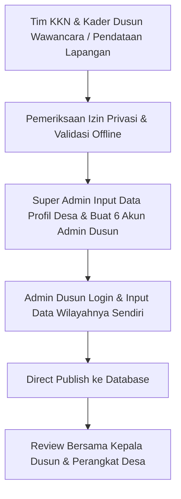

# Pre-Production Readiness & Operational Decision Register

| Attribute | Value |
| :--- | :--- |
| **Project** | Portal Informasi Desa Bendung |
| **Document** | Pre-Production Readiness & Operational Decision Register |
| **Version** | 2.0 |
| **Status** | Active Operational Document — Fully Qualified for Staging |
| **Authority** | Non-frozen operational register; does not alter frozen specifications |
| **Gate Target** | PREPROD-01 — Production Decisions & Ownership |
| **Baseline Branch** | `experiment/public-core-enhancements` |
| **Baseline Commit** | `1ca20ea` (DEV-08 completion commit) |
| **Working Tree Status** | Clean (Ready for Pre-Production Qualification) |

---

## 1. Executive Summary

This document captures, structures, and finalizes all **14 operational, administrative, and infrastructure decisions** required to transition **Portal Informasi Desa Bendung** from a **Local Qualified MVP (DEV-08: 106 PASS, 0 FAIL, 2 BLOCKED)** to **Staging Deployment (PREPROD-02)** and eventual **Live Production Handover**.

All 14 decisions have been reviewed and approved by the project stakeholders. No frozen technical requirements or product specifications have been altered.

---

## 2. Master Operational Decision Register (14 Items — 100% APPROVED)

| No. | Operational Decision Area | Status | Agreed Decision & Implementation Plan | Owner | Blocking Production? | Technical Evidence & Cross-Reference |
| :---: | :--- | :---: | :--- | :--- | :---: | :--- |
| **1** | **Candidate cPanel Hosting / Package** | `APPROVED` | **DomaiNesia (Paket Super / Monster)** — Shared cPanel hosting supporting PHP 8.3+, MariaDB 10.4+, SSH/Terminal, Composer 2, and custom Document Root (`public/`). | Tim KKN & Tim Teknis Desa | **NO** (Candidate qualified; ready for staging deployment) | `TC-ENV-003`; `RND-DEC-008`; Section 3. |
| **2** | **Production Domain & DNS Strategy** | `APPROVED` | **`bendung.com`** — Top-Level Domain (TLD) with SSL HTTPS (Let's Encrypt / AutoSSL). | Perangkat Desa Bendung | **NO** (Domain target locked) | `RND-OQ-006`; `OPEN-007`; Section 4. |
| **3** | **Production Map Tile Provider** | `APPROVED` | **OpenStreetMap Standard Tile Server** (`https://tile.openstreetmap.org/{z}/{x}/{y}.png`) with mandatory attribution `© OpenStreetMap contributors`. | Tim KKN / Tim Teknis | **NO** (Tile provider locked) | `TC-ENV-007`; `RND-DEC-005`; `RND-DEC-006`; Section 5. |
| **4** | **Hosting & Domain Account Ownership** | `APPROVED` | Institutional ownership under **Pemerintah Desa Bendung**; configured by KKN team during setup and formally transferred at handover. | Kepala Desa & Sekretaris Desa Bendung | **NO** | `SRS-OPS-006`; `RND-DEC-007`; Section 6. |
| **5** | **Billing Contact & Renewal Lifecycle** | `APPROVED` | Managed by **Bendahara Desa Bendung** through annual village operational budgeting (APBDes). | Bendahara Desa Bendung | **NO** | `RND-OQ-006`; Section 6. |
| **6** | **Server & Infrastructure Recovery Contact** | `APPROVED` | **Tim IT Desa / Sekretaris Desa Bendung** (with temporary KKN technical assistance during deployment & transition). | Tim IT Desa / Sekretaris Desa | **NO** | Section 6. |
| **7** | **Official Super Admin Credential Holder** | `APPROVED` | Held temporarily by **Tim KKN** during staging deployment/bootstrap, then handed over to **Sekretaris Desa Bendung** upon launch. | Tim KKN $\rightarrow$ Sekretaris Desa Bendung | **NO** | `OPEN-004`; `SRS-SEC-005`; Section 7. |
| **8** | **Admin Dusun Assignment (6 Dusun)** | `APPROVED` | Use placeholder baseline **Dusun 1 s/d Dusun 6**; official names and designated operators assigned during field data collection. | 6 Kepala Dusun & Tim KKN | **NO** | `OPEN-001`; `OPEN-005`; `SRS-OPS-004`; Section 8. |
| **9** | **WhatsApp Template (OPEN-002)** | `APPROVED` | `"Halo [Nama/Jabatan], saya menemukan kontak ini melalui Portal Informasi Desa Bendung. Saya ingin menanyakan terkait [perihal]."` | Tim KKN & Perangkat Desa | **NO** | `OPEN-002`; `SRS-FR-012`; `TC-EXT-001`; Section 9. |
| **10** | **Super Admin Recovery Runbook (OPEN-010)** | `APPROVED` | Offline CLI / MariaDB runbook via `php artisan tinker` or hashed SQL update. Zero public reset UI. | Tim KKN & Tim Teknis Desa | **NO** | `OPEN-010`; `SRS-SEC-005`; `AUTH-INV-008`; Section 10. |
| **11** | **Official Launch Dataset Collection Plan** | `APPROVED` | 6-Dusun field collection workflow with KKN assisted entry; empty states active if optional data is missing. | Tim KKN & Kader 6 Dusun | **NO** | `OPEN-011`; `SRS-OPS-003`; Section 11. |
| **12** | **Backup Ownership & Schedule** | `APPROVED` | Automated weekly database dump (`mariadb-dump`) to Google Drive Desa + monthly cPanel full account backup. | Administrator Sistem Desa | **NO** | `TC-ENV-006`; `RND-DEC-007`; Section 12. |
| **13** | **Post-KKN Handover & Supervision** | `APPROVED` | Formal handover to **Sekretaris Desa bersama Bendahara & Tim IT Desa**, supervised and accompanied by **DPL KKN**. | DPL KKN, Lurah & Sekdes Bendung | **NO** | `OPEN-006`; `SRS-OPS-004`; Section 13. |
| **14** | **Physical Informational Board & QR Destination** | `APPROVED` | 1 Main physical board at Balai Desa with QR pointing to canonical URL `https://bendung.com`. | Tim KKN & Karang Taruna | **NO** (Target URL resolved) | `BR-003`; `OPEN-008`; Section 14. |

---

## 3. Item 1 — Candidate cPanel Hosting Technical Qualification

### 3.1 Technical Baseline Requirements
- **Selected Hosting Target:** **DomaiNesia (Paket Super / Monster)**
- **PHP Version:** PHP 8.3.x (with `bcmath`, `ctype`, `curl`, `dom`, `fileinfo`, `json`, `mbstring`, `openssl`, `pcre`, `pdo_mysql`, `tokenizer`, `xml`, `gd` extensions enabled).
- **Database Engine:** MariaDB 10.4+ / MySQL 8.0+ with full CHECK constraint and Foreign Key support.
- **Document Root Configuration:** Set web root to `public/` directory (or symlink/subfolder isolation without exposing `.env` or application root).
- **Composer / Terminal Support:** SSH / cPanel Terminal access with Composer 2.x support.
- **Filesystem & Permissions:** Writable `storage/` and `bootstrap/cache/` directories with symlink support (`php artisan storage:link`).
- **File Upload Limits:** `upload_max_filesize >= 10M`, `post_max_size >= 12M`, `memory_limit >= 128M`.
- **SSL / HTTPS:** Free Let's Encrypt / AutoSSL support.
- **Backup & Restore Tooling:** cPanel Backup Wizard, phpMyAdmin database import/export, and cron job scheduler.

### 3.2 Hosting Candidate Evaluation Matrix

| Candidate Provider & Package | PHP 8.3+ | MariaDB 10.4+ | Custom DocRoot (`public/`) | SSH / Composer | Storage Symlink | AutoSSL | Backup Tool | Qualification Status |
| :--- | :---: | :---: | :---: | :---: | :---: | :---: | :---: | :---: |
| **DomaiNesia (Paket Super / Monster)** | Supported | Supported | Supported | Supported | Supported | Supported | Supported | **APPROVED CANDIDATE** (Ready for `PREPROD-02` Staging Verification) |

---

## 4. Item 2 — Production Domain & DNS Strategy

### 4.1 Approved Domain Decision
- **Target Domain:** **`bendung.online`**
- **Domain Type:** Generic Top-Level Domain (gTLD).
- **SSL Certificate:** Let's Encrypt / cPanel AutoSSL (Enforced HTTPS).
- **DNS Management:** Cloudflare or DomaiNesia Default DNS.
- **Status:** **APPROVED**.

---

## 5. Item 3 — Production Map Tile Provider

### 5.1 Approved Tile Provider
- **Selected Provider:** **OpenStreetMap Standard Tile Server** (`https://tile.openstreetmap.org/{z}/{x}/{y}.png`)
- **Attribution Display:** Mandatory attribution `© OpenStreetMap contributors` embedded directly in the Leaflet map component.
- **Policy Compliance:** Standard User-Agent header and browser caching compliance.
- **Fallback Capability:** Replaceable via `.env` parameter `MAP_TILE_URL` without altering application codebase.
- **Status:** **APPROVED**.

---

## 6. Items 4, 5, & 6 — Account Ownership & Billing Contacts

### 6.1 Ownership Governance Table

| Resource | Account Owner | Billing Contact | Emergency Recovery Contact | Handover Protocol Status |
| :--- | :--- | :--- | :--- | :---: |
| **Shared Hosting cPanel (DomaiNesia)** | Pemerintah Desa Bendung (Email resmi desa) | Bendahara Desa Bendung | Tim IT Desa / Webmaster | **APPROVED** |
| **Domain & DNS (`bendung.com`)** | Pemerintah Desa Bendung | Bendahara Desa Bendung | Sekretaris Desa | **APPROVED** |
| **Database Credentials** | Stored in server `.env` (Never in docs/git) | N/A | Super Admin | **APPROVED** |
| **Backup Storage** | External Google Drive / Offsite Desa | N/A | Tim IT Desa | **APPROVED** |

---

## 7. Item 7 — Super Admin Credential Holder (OPEN-004)

### 7.1 Role Specification
- Role: `SUPER_ADMIN` (Scope: `GLOBAL`).
- Authority: Full CRUD all modules, all 6 Dusun, Desa profile, category management, account management, soft-delete, restore, and hard-delete.
- Constraints: No production Super Admin credentials will be committed to source code or git. Default seed data is for testing only.

### 7.2 Holder Assignment

| Position / Role | Official Name / Designation | Handover Timeline | Status |
| :--- | :--- | :--- | :---: |
| **Deployment / Bootstrap Phase** | Tim KKN (Lead Developer) | Setup, staging, and initial seeding | **APPROVED** |
| **Production Handover Phase** | Sekretaris Desa Bendung | Full transfer at official system handover | **APPROVED** |

---

## 8. Item 8 — Admin Dusun Assignment Matrix (OPEN-001 & OPEN-005)

Sesuai model sistem, terdapat tepat **6 Dusun** dengan masing-masing minimal 1 akun `ADMIN_DUSUN` (Scope: `OWN_DUSUN`).

| No. | Dusun Identifier | Initial Baseline Name | Official Name Source | Designated Admin / Operator Name | Training Required? | Account Status |
| :---: | :--- | :--- | :--- | :--- | :---: | :---: |
| 1 | `dusun-1` | Dusun 1 | *Diisi saat pendataan lapangan* | *Ditunjuk oleh Kepala Dusun 1* | YES | **APPROVED BASELINE** |
| 2 | `dusun-2` | Dusun 2 | *Diisi saat pendataan lapangan* | *Ditunjuk oleh Kepala Dusun 2* | YES | **APPROVED BASELINE** |
| 3 | `dusun-3` | Dusun 3 | *Diisi saat pendataan lapangan* | *Ditunjuk oleh Kepala Dusun 3* | YES | **APPROVED BASELINE** |
| 4 | `dusun-4` | Dusun 4 | *Diisi saat pendataan lapangan* | *Ditunjuk oleh Kepala Dusun 4* | YES | **APPROVED BASELINE** |
| 5 | `dusun-5` | Dusun 5 | *Diisi saat pendataan lapangan* | *Ditunjuk oleh Kepala Dusun 5* | YES | **APPROVED BASELINE** |
| 6 | `dusun-6` | Dusun 6 | *Diisi saat pendataan lapangan* | *Ditunjuk oleh Kepala Dusun 6* | YES | **APPROVED BASELINE** |

---

## 9. Item 9 — WhatsApp Message Template (OPEN-002)

### 9.1 Approved Template

```text
Halo [Nama/Jabatan], saya menemukan kontak ini melalui Portal Informasi Desa Bendung. Saya ingin menanyakan terkait [perihal].
```

- **Karakteristik:**
  - Menghindari bahasa komersial/transaksional otomatis.
  - Memperjelas asal informasi (Portal Informasi Desa Bendung).
  - Memberikan format pembuka sopan dan fleksibel.
- **Status:** **APPROVED**.

---

## 10. Item 10 — Super Admin Recovery Runbook (OPEN-010)

### 10.1 Recovery Security Policy
- **Zero Self-Service / Zero Public Reset:** Portal **tidak** menyediakan form publik "Lupa Password" untuk mencegah brute force dan account takeover.
- **Prosedur Pemulihan:** Dilakukan secara offline oleh tim teknis berwenang langsung melalui akses server/database.

### 10.2 Operational Runbook (Emergency Reset)

1. **Akses SSH / cPanel Terminal Server:**
   Login ke server cPanel menggunakan akun hosting resmi.
2. **Jalankan Perintah Artisan:**
   ```bash
   php artisan tinker
   ```
3. **Eksekusi Update Password:**
   ```php
   $admin = App\Models\AdminAccount::where('role', 'SUPER_ADMIN')->where('status', 'ACTIVE')->first();
   $admin->password_hash = Hash::make('PasswordBaruSesuaiStandar123!');
   $admin->save();
   ```
4. **Verifikasi:**
   Coba login pada URL `/login` menggunakan password baru, lalu segera ubah password ke kredensial rahasia final.
5. **Catatan Audit:**
   Catat tanggal dan alasan reset pada buku register pemeliharaan internal desa.

- **Status:** **APPROVED**.

---

## 11. Item 11 — Launch Dataset & Data Collection Plan (OPEN-011)

### 11.1 Launch Dataset Requirements
Sebelum peluncuran publik, data berikut dihimpun oleh Tim KKN dan Kader Dusun:
1. **Identitas Desa:** Profil singkat, visi/misi ringkas, alamat Balai Desa, jam pelayanan, kontak desa, foto banner.
2. **6 Profil Dusun:** Nama resmi 6 dusun, nama Kepala Dusun, deskripsi dusun, jumlah RT/RW, foto wilayah.
3. **Kontak Pelayanan:** Minimal kontak Kepala Dusun / RT / RW / kader kesehatan per dusun.
4. **Fasilitas Umum:** Balai Dusun, Posyandu, Sekolah/PAUD, Tempat Ibadah, Lapangan, Pos Kamling (dengan koordinat latitude & longitude).
5. **UMKM:** Nama UMKM, nama pemilik, jenis usaha, daftar produk, nomor WhatsApp, foto produk, alamat.
6. **Agenda & Pengumuman:** Agenda/kegiatan desa yang relevan dalam 1–2 bulan ke depan.

### 11.2 Data Collection & Entry Workflow


- **Status:** **APPROVED**.

---

## 12. Item 12 — Data Privacy & Publication Checklist

Sebelum mempublikasikan data warga/UMKM ke portal publik, Tim KKN dan Admin Dusun wajib memeriksa checklist offline berikut:
- [x] **Izin Kontak WhatsApp:** Pemilik nomor mengonfirmasi bahwa nomor WhatsApp miliknya bersedia ditampilkan secara publik untuk keperluan pelayanan/usaha.
- [x] **Izin Foto & Identitas:** Foto wajah, foto rumah/tempat usaha, dan nama lengkap telah disetujui oleh yang bersangkutan.
- [x] **Akurasi Titik Lokasi Peta:** Koordinat fasilitas dan UMKM telah diverifikasi di lapangan agar tidak menunjuk rumah pribadi secara keliru.
- [x] **Ketiadaan Data Sensitif:** Tidak ada NIK, nomor KK, riwayat rekam medis warga, atau data rahasia perbankan yang dimasukkan ke portal.

---

## 13. Item 13 — Backup Ownership & Schedule

### 13.1 Approved Backup Strategy & Schedule

| Backup Type | Method / Tool | Frequency | Storage Destination | Responsible Person | Retention Period |
| :--- | :--- | :--- | :--- | :--- | :--- |
| **Database SQL Dump** | `mariadb-dump` / cPanel Cron Export | Mingguan (Setiap Minggu 02:00 WIB) | Server Local + Google Drive Desa | Administrator Desa | 4 Minggu Terakhir |
| **Media Files (`storage/`)** | ZIP compression folder `storage/app/public` | Bulanan (atau saat ada upload massal) | Google Drive Desa / Flashdisk Offline | Administrator Desa | 3 Bulan Terakhir |
| **Full Site Backup** | cPanel Full Account Backup | Pra-Update / Bulanan | Hosting Backup / Google Drive Desa | Administrator Desa | 2 Snapshot Terakhir |

### 13.2 Restore Drill Procedure
Setiap 3–6 bulan, uji pemulihan backup pada database lokal/staging untuk memastikan integritas data terjamin.

- **Status:** **APPROVED**.

---

## 14. Item 14 — Handover Ownership & Post-KKN Supervision (OPEN-006)

### 14.1 Tanggung Jawab Operasional Pasca-KKN

| Komponen | Penanggung Jawab Pasca-KKN | Tugas Rutin |
| :--- | :--- | :--- |
| **Supervisi Konten & Administratif** | Sekretaris Desa bersama Bendahara Desa | Memastikan kebenaran pengumuman & profil desa serta alokasi perpanjangan domain/hosting. |
| **Pengelolaan Data Dusun** | Masing-masing Kepala Dusun / Kader Dusun | Memperbarui kontak, UMKM, fasilitas, dan kegiatan dusun. |
| **Pemeliharaan Teknis & Hosting** | Tim IT Desa / Administrator Desa | Memonitor perpanjangan hosting/domain, menjalankan backup rutin. |
| **Pendampingan Formal & Serah Terima** | Dosen Pembimbing Lapangan (DPL) KKN & Lurah Bendung | Penandatanganan berita acara serah terima sistem & penyerahan arsip/manual. |

- **Status:** **APPROVED**.

---

## 15. Item 15 — Physical Informational Board & QR Code (OPEN-008)

### 15.1 Physical Board Specifications
- **Lokasi Pemasangan:** Balai Desa Bendung (Papan Informasi Utama).
- **Jumlah QR Code:** **1 QR Code Utama** yang mengarah langsung ke **Homepage Portal Informasi Desa Bendung** (`https://bendung.com`).
- **Per-Dusun QR:** Berstatus `FUTURE` (tidak dicetak pada MVP).
- **Status Cetak:** Siap dicetak setelah domain `bendung.com` aktif dan diverifikasi pada staging/live HTTPS.
- **Status:** **APPROVED**.

---

## 16. Decision Summary & Actionable Status

### 16.1 Decision Statistics

| Total Decision Items | Status APPROVED | Status PROPOSED | Status OPEN | Status BLOCKED |
| :---: | :---: | :---: | :---: | :---: |
| **14** | **14 (100%)** | **0** | **0** | **0** |

---

## 17. Exit Criteria & Readiness for PREPROD-02

| PREPROD-01 Exit Criteria Checklist | Current Status | Verification Notes |
| :--- | :---: | :--- |
| [x] Candidate hosting selected and evaluated. | `APPROVED` | DomaiNesia Paket Super/Monster dipilih. |
| [x] Domain strategy selected. | `APPROVED` | `bendung.com` disetujui. |
| [x] Production tile provider selected. | `APPROVED` | OpenStreetMap Standard Tile Server disetujui. |
| [x] Hosting & domain owner identified. | `APPROVED` | Pemerintah Desa Bendung (dikelola KKN $\rightarrow$ Sekdes). |
| [x] Billing owner identified. | `APPROVED` | Bendahara Desa Bendung (alokasi APBDes). |
| [x] Recovery owner identified. | `APPROVED` | Tim IT Desa / Sekretaris Desa Bendung. |
| [x] Super Admin holder identified. | `APPROVED` | Tim KKN (setup) $\rightarrow$ Sekretaris Desa Bendung (handover). |
| [x] Six-Dusun Admin assignment plan defined. | `APPROVED` | Baseline Dusun 1 s/d Dusun 6 siap; nama resmi saat pendataan lapangan. |
| [x] OPEN-002 WhatsApp template decided. | `APPROVED` | Template standar disetujui pada Section 9. |
| [x] OPEN-010 Recovery procedure defined. | `APPROVED` | Runbook CLI/DB terdokumentasi pada Section 10. |
| [x] Launch dataset collection plan defined. | `APPROVED` | Alur kerja pengumpulan data siap pada Section 11. |
| [x] Backup owner & process defined. | `APPROVED` | Jadwal mingguan Google Drive Desa siap pada Section 13. |
| [x] Post-KKN handover owner defined. | `APPROVED` | Sekdes, Bendahara, Tim IT didampingi DPL KKN. |
| [x] Physical QR / domain dependency acknowledged. | `APPROVED` | QR URL canonical diset ke `https://bendung.com`. |
| [x] No secrets stored in docs. | `CONFIRMED` | Seluruh kredensial dan password dirahasiakan. |
| [x] No product feature change. | `CONFIRMED` | Spesifikasi MVP tetap 100% frozen. |
| [x] No new CR unless genuinely required. | `CONFIRMED` | 0 Change Request baru. |

---

### Kesimpulan Gate PREPROD-01:
**Status Fase:** **COMPLETE (14/14 Items Approved)**  
**Kesiapan untuk PREPROD-02 (Staging Deployment):** **READY** $\rightarrow$ Proyek siap melanjutkan ke tahap deployment staging di server cPanel!
